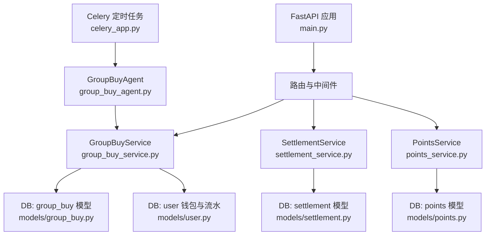
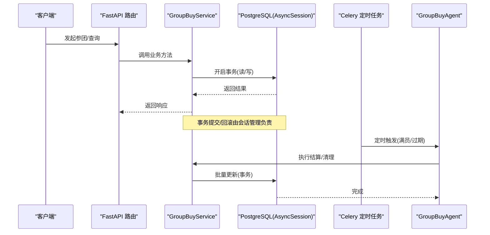
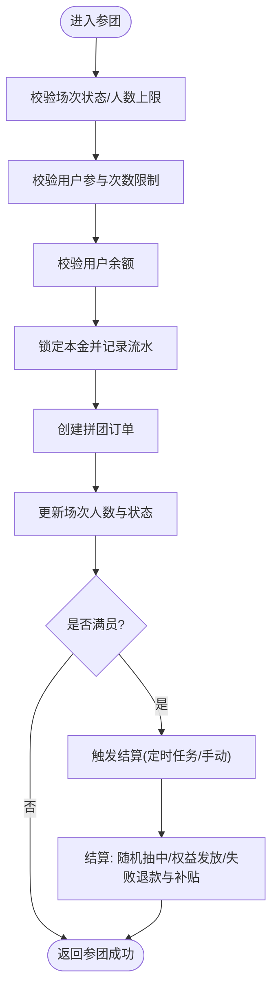
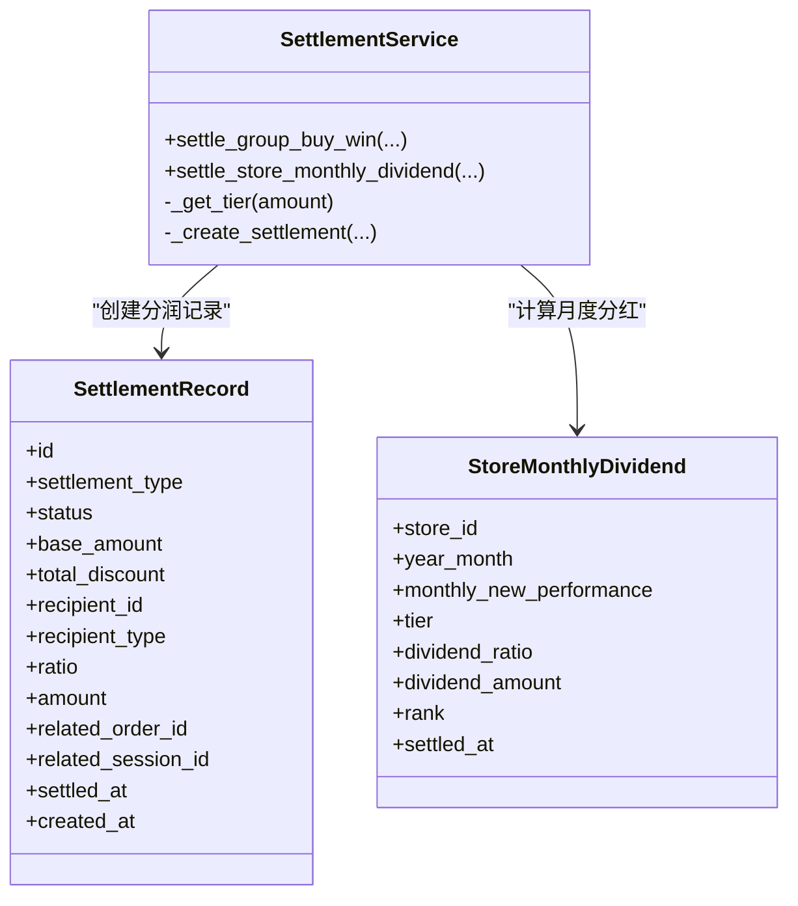
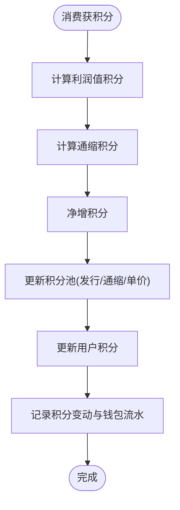
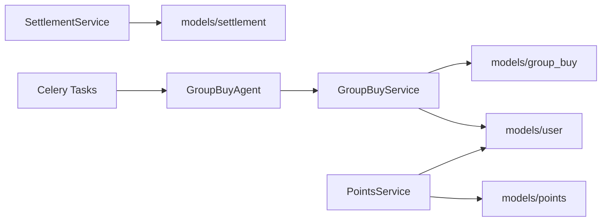

# 数据一致性保证

<cite>
**本文引用的文件**   
- [backend/app/main.py](file://backend/app/main.py)
- [backend/app/database.py](file://backend/app/database.py)
- [backend/app/config.py](file://backend/app/config.py)
- [backend/app/services/group_buy_service.py](file://backend/app/services/group_buy_service.py)
- [backend/app/models/group_buy.py](file://backend/app/models/group_buy.py)
- [backend/app/agents/group_buy_agent.py](file://backend/app/agents/group_buy_agent.py)
- [backend/app/tasks/celery_app.py](file://backend/app/tasks/celery_app.py)
- [backend/app/services/settlement_service.py](file://backend/app/services/settlement_service.py)
- [backend/app/models/settlement.py](file://backend/app/models/settlement.py)
- [backend/app/services/points_service.py](file://backend/app/services/points_service.py)
- [backend/app/models/points.py](file://backend/app/models/points.py)
- [backend/app/models/user.py](file://backend/app/models/user.py)
- [backend/app/api/v1/admin.py](file://backend/app/api/v1/admin.py)
</cite>

## 目录
1. [引言](#引言)
2. [项目结构](#项目结构)
3. [核心组件](#核心组件)
4. [架构总览](#架构总览)
5. [详细组件分析](#详细组件分析)
6. [依赖关系分析](#依赖关系分析)
7. [性能考量](#性能考量)
8. [故障恢复与补偿](#故障恢复与补偿)
9. [结论](#结论)
10. [附录](#附录)

## 引言
本文件面向AIxingmu系统的数据一致性保障，围绕分布式事务处理方案（Saga、TCC、最终一致性）、跨服务数据同步机制（事件溯源、CQRS、消息补偿）、数据库事务边界与隔离级别选择、数据冲突检测与解决、幂等性保证、数据校验机制，以及一致性架构图与故障恢复策略进行系统化说明。文档基于现有代码仓库中的拼团、分润、积分、任务调度与数据库会话管理等实现进行分析与扩展建议。

## 项目结构
后端采用FastAPI应用入口、SQLAlchemy异步会话管理、Celery定时任务编排、按领域划分的Service与Model分层。关键路径包括：
- 应用启动与会话生命周期管理
- 拼团业务服务（开团、参团、结算）
- 分润结算服务（多级分润、门店阶梯分红）
- 积分增值系统（发行、通缩、兑换）
- Celery定时任务（场次创建、满员结算、过期清理、周/月结算）

图表来源
- [backend/app/main.py:1-78](file://backend/app/main.py#L1-L78)
- [backend/app/services/group_buy_service.py:1-348](file://backend/app/services/group_buy_service.py#L1-L348)
- [backend/app/services/settlement_service.py:1-166](file://backend/app/services/settlement_service.py#L1-L166)
- [backend/app/services/points_service.py:1-180](file://backend/app/services/points_service.py#L1-L180)
- [backend/app/models/group_buy.py:1-158](file://backend/app/models/group_buy.py#L1-L158)
- [backend/app/models/settlement.py:1-70](file://backend/app/models/settlement.py#L1-L70)
- [backend/app/models/points.py:1-68](file://backend/app/models/points.py#L1-L68)
- [backend/app/models/user.py:1-93](file://backend/app/models/user.py#L1-L93)
- [backend/app/agents/group_buy_agent.py:1-66](file://backend/app/agents/group_buy_agent.py#L1-L66)
- [backend/app/tasks/celery_app.py:1-56](file://backend/app/tasks/celery_app.py#L1-L56)

章节来源
- [backend/app/main.py:1-78](file://backend/app/main.py#L1-L78)
- [backend/app/database.py:1-40](file://backend/app/database.py#L1-L40)
- [backend/app/config.py:1-145](file://backend/app/config.py#L1-L145)

## 核心组件
- 数据库会话与事务边界
  - 使用异步引擎与会话工厂，提供请求级会话注入；在异常时回滚，正常提交后关闭会话。
  - 当前未显式设置隔离级别，默认由PostgreSQL决定。
- 拼团服务
  - 场次创建、用户参团锁定本金、订单创建、人数更新、满员判定与结算。
  - 结算包含随机抽中、权益发放、失败退款与补贴、状态流转。
- 分润结算服务
  - 按角色记录分润明细，支持门店月度阶梯分红计算与排名更新。
- 积分增值服务
  - 全局积分池单例维护发行量、通缩量、单价；消费获得积分并触发通缩；支持积分兑换消费券。
- 定时任务编排
  - Celery Beat调度：每日创建场次、每小时检查满员结算、过期场次清理、周贡献值结算、日贡献值递减核算、月门店分红。

章节来源
- [backend/app/database.py:1-40](file://backend/app/database.py#L1-L40)
- [backend/app/services/group_buy_service.py:1-348](file://backend/app/services/group_buy_service.py#L1-L348)
- [backend/app/services/settlement_service.py:1-166](file://backend/app/services/settlement_service.py#L1-L166)
- [backend/app/services/points_service.py:1-180](file://backend/app/services/points_service.py#L1-L180)
- [backend/app/tasks/celery_app.py:1-56](file://backend/app/tasks/celery_app.py#L1-L56)

## 架构总览
整体一致性策略以“本地事务 + 最终一致性”为主：
- 本地事务：每个Service方法内对同一数据库的读写操作通过AsyncSession包裹，确保原子性与持久化。
- 最终一致性：通过Celery定时任务驱动批次处理（如满员结算、过期清理、周/月结算），结合幂等与重试保证结果收敛。
- 可扩展为Saga/TCC：在跨服务场景下，将长流程拆分为可补偿步骤或预占确认阶段，配合消息队列实现可靠推进。

图表来源
- [backend/app/main.py:1-78](file://backend/app/main.py#L1-L78)
- [backend/app/services/group_buy_service.py:1-348](file://backend/app/services/group_buy_service.py#L1-L348)
- [backend/app/agents/group_buy_agent.py:1-66](file://backend/app/agents/group_buy_agent.py#L1-L66)
- [backend/app/tasks/celery_app.py:1-56](file://backend/app/tasks/celery_app.py#L1-L56)
- [backend/app/database.py:1-40](file://backend/app/database.py#L1-L40)

## 详细组件分析

### 数据库事务边界与隔离级别
- 事务边界
  - 会话工厂在请求开始时创建，成功提交，异常回滚，最后关闭。所有Service方法应在该会话上下文中执行，避免跨会话拆分事务。
- 隔离级别
  - 当前未显式配置，依赖PostgreSQL默认隔离级别（通常为Read Committed）。对于高并发锁竞争热点（如场次人数、用户余额），建议评估是否需要Repeatable Read或Serializable，并结合行级锁与唯一索引控制冲突。
- 幂等与去重
  - 订单号、场次编号具备唯一约束，天然防止重复写入；建议在外部接入层增加请求ID幂等键，避免网络重试导致重复处理。

章节来源
- [backend/app/database.py:1-40](file://backend/app/database.py#L1-L40)
- [backend/app/models/group_buy.py:1-158](file://backend/app/models/group_buy.py#L1-L158)

### 拼团业务流程与一致性设计
- 参团流程
  - 校验场次状态与人数上限、用户参与次数限制、余额充足；锁定本金、创建订单、更新场次人数与状态；全部在同一事务内提交。
- 结算流程
  - 满员后随机抽取赢家，分配商品权益、贡献值、积分；失败用户退回本金并发放广告与推荐人补贴；更新订单与场次状态。
- 一致性要点
  - 使用唯一索引与状态机约束避免重复结算；
  - 通过UserWalletLog记录资产变动前后快照，便于审计与对账；
  - 结算逻辑集中封装，避免分散分支导致不一致。

图表来源
- [backend/app/services/group_buy_service.py:92-181](file://backend/app/services/group_buy_service.py#L92-L181)
- [backend/app/services/group_buy_service.py:183-321](file://backend/app/services/group_buy_service.py#L183-L321)
- [backend/app/models/group_buy.py:1-158](file://backend/app/models/group_buy.py#L1-L158)
- [backend/app/models/user.py:74-93](file://backend/app/models/user.py#L74-L93)

章节来源
- [backend/app/services/group_buy_service.py:1-348](file://backend/app/services/group_buy_service.py#L1-L348)
- [backend/app/models/group_buy.py:1-158](file://backend/app/models/group_buy.py#L1-L158)
- [backend/app/models/user.py:1-93](file://backend/app/models/user.py#L1-L93)

### 分润结算与门店阶梯分红
- 分润规则
  - 按100%分配模型记录各方分润（代理、门店、推荐门店等），每笔交易生成多条分润记录，统一PENDING状态等待后续处理。
- 门店月度分红
  - 根据当月业绩确定阶梯等级与比例，计算分红金额并更新排名与等级。
- 一致性要点
  - 分润记录与主交易关联，便于对账；
  - 使用索引优化查询与统计；
  - 建议引入幂等键与重试机制，确保分润记录不重复。

图表来源
- [backend/app/services/settlement_service.py:1-166](file://backend/app/services/settlement_service.py#L1-L166)
- [backend/app/models/settlement.py:1-70](file://backend/app/models/settlement.py#L1-L70)

章节来源
- [backend/app/services/settlement_service.py:1-166](file://backend/app/services/settlement_service.py#L1-L166)
- [backend/app/models/settlement.py:1-70](file://backend/app/models/settlement.py#L1-L70)

### 积分增值系统与通缩机制
- 积分池单例
  - 固定总发行量，累计发行量与通缩量，动态单价=累计总金额/累计通缩数量。
- 消费获积分
  - 新增利润值积分，同时按比例通缩，净增积分计入用户账户，并记录变动流水。
- 积分兑换消费券
  - 按当前单价折算，扣减用户积分并增加消费券余额，记录转换流水。
- 一致性要点
  - 使用唯一主键与索引保护全局池与用户积分变更；
  - 所有变更在同一事务内提交，确保池与用户账户一致。

图表来源
- [backend/app/services/points_service.py:1-180](file://backend/app/services/points_service.py#L1-L180)
- [backend/app/models/points.py:1-68](file://backend/app/models/points.py#L1-L68)
- [backend/app/models/user.py:74-93](file://backend/app/models/user.py#L74-L93)

章节来源
- [backend/app/services/points_service.py:1-180](file://backend/app/services/points_service.py#L1-L180)
- [backend/app/models/points.py:1-68](file://backend/app/models/points.py#L1-L68)
- [backend/app/models/user.py:1-93](file://backend/app/models/user.py#L1-L93)

### 定时任务与最终一致性
- 场次创建与结算
  - 每日9:50创建当日场次；每小时第5分钟检查已满场次并结算；23:00检查过期场次。
- 周/月结算
  - 周一凌晨2:00执行贡献值分红；每日凌晨3:00执行贡献值递减核算；每月1日凌晨1:00执行门店月度排名与分红。
- 一致性要点
  - 任务幂等：基于日期/月份维度去重；
  - 失败重试：Celery内置重试与死信队列；
  - 人工干预：提供管理接口手动触发结算。

章节来源
- [backend/app/tasks/celery_app.py:1-56](file://backend/app/tasks/celery_app.py#L1-L56)
- [backend/app/agents/group_buy_agent.py:1-66](file://backend/app/agents/group_buy_agent.py#L1-L66)
- [backend/app/api/v1/admin.py:1-40](file://backend/app/api/v1/admin.py#L1-L40)

## 依赖关系分析
- 模块耦合
  - GroupBuyService强依赖group_buy与user模型；SettlementService依赖settlement与store模型；PointsService依赖points与user模型。
- 外部依赖
  - PostgreSQL（异步连接池）、Celery（任务调度）、Redis（可选结果后端）。
- 潜在循环依赖
  - 当前未见循环导入；若未来引入跨服务消息总线，需通过事件解耦避免直接依赖。

图表来源
- [backend/app/services/group_buy_service.py:1-348](file://backend/app/services/group_buy_service.py#L1-L348)
- [backend/app/services/settlement_service.py:1-166](file://backend/app/services/settlement_service.py#L1-L166)
- [backend/app/services/points_service.py:1-180](file://backend/app/services/points_service.py#L1-L180)
- [backend/app/models/group_buy.py:1-158](file://backend/app/models/group_buy.py#L1-L158)
- [backend/app/models/settlement.py:1-70](file://backend/app/models/settlement.py#L1-L70)
- [backend/app/models/points.py:1-68](file://backend/app/models/points.py#L1-L68)
- [backend/app/models/user.py:1-93](file://backend/app/models/user.py#L1-L93)
- [backend/app/agents/group_buy_agent.py:1-66](file://backend/app/agents/group_buy_agent.py#L1-L66)
- [backend/app/tasks/celery_app.py:1-56](file://backend/app/tasks/celery_app.py#L1-L56)

章节来源
- [backend/app/services/group_buy_service.py:1-348](file://backend/app/services/group_buy_service.py#L1-L348)
- [backend/app/services/settlement_service.py:1-166](file://backend/app/services/settlement_service.py#L1-L166)
- [backend/app/services/points_service.py:1-180](file://backend/app/services/points_service.py#L1-L180)
- [backend/app/models/group_buy.py:1-158](file://backend/app/models/group_buy.py#L1-L158)
- [backend/app/models/settlement.py:1-70](file://backend/app/models/settlement.py#L1-L70)
- [backend/app/models/points.py:1-68](file://backend/app/models/points.py#L1-L68)
- [backend/app/models/user.py:1-93](file://backend/app/models/user.py#L1-L93)
- [backend/app/agents/group_buy_agent.py:1-66](file://backend/app/agents/group_buy_agent.py#L1-L66)
- [backend/app/tasks/celery_app.py:1-56](file://backend/app/tasks/celery_app.py#L1-L56)

## 性能考量
- 连接池与并发
  - 通过DATABASE_POOL_SIZE与max_overflow控制连接数，避免在高并发参团时阻塞。
- 索引与查询
  - 针对高频查询字段建立索引（如session时间范围、order状态、user资产类型），减少全表扫描。
- 批处理与事务粒度
  - 结算与分红采用批处理，合理划分事务大小，避免长事务锁竞争。
- 缓存与读多写少
  - 对静态配置与热点只读数据（如场次列表）引入缓存层，降低数据库压力。

[本节为通用指导，无需源码引用]

## 故障恢复与补偿
- 幂等性保证
  - 利用唯一约束（订单号、场次编号）与幂等键（请求ID）防止重复处理；
  - 任务侧基于日期/月份维度去重，避免重复结算。
- 重试与死信
  - Celery任务失败自动重试，超过阈值进入死信队列，人工介入排查。
- 补偿机制（Saga模式建议）
  - 将长流程拆分为多个步骤，每步可独立撤销；例如参团锁定成功后若后续权益发放失败，应触发补偿释放锁定资金。
- 预占确认（TCC模式建议）
  - 在资源占用前进行Try（预占），成功后Confirm（确认），失败则Cancel（取消）；适用于高并发锁竞争场景。
- 数据校验与对账
  - 通过UserWalletLog与分润记录进行对账，定期比对资产总量与分润总额，发现差异及时修复。

章节来源
- [backend/app/tasks/celery_app.py:1-56](file://backend/app/tasks/celery_app.py#L1-L56)
- [backend/app/models/user.py:74-93](file://backend/app/models/user.py#L74-L93)
- [backend/app/models/settlement.py:1-70](file://backend/app/models/settlement.py#L1-L70)

## 结论
AIxingmu系统在现有实现上已具备较强的本地事务与最终一致性基础：通过会话级事务、唯一约束与流水记录保障数据正确性，借助Celery定时任务实现批处理与延迟一致性。面向更复杂的分布式场景，建议引入Saga/TCC模式与消息队列，完善幂等、重试、补偿与对账机制，进一步提升系统的鲁棒性与可观测性。

[本节为总结，无需源码引用]

## 附录
- 一致性架构图（概念）

```mermaid
graph TB
subgraph "接入层"
API["FastAPI 路由"]
WS["WebSocket(可选)"]
end
subgraph "业务层"
GB["GroupBuyService"]
SS["SettlementService"]
PS["PointsService"]
end
subgraph "调度层"
CEL["Celery 任务"]
AG["GroupBuyAgent"]
end
subgraph "数据层"
PG["PostgreSQL(AsyncSession)"]
IDX["索引与约束"]
end
API --> GB
API --> SS
API --> PS
CEL --> AG
AG --> GB
GB --> PG
SS --> PG
PS --> PG
PG --> IDX
```

[此图为概念性示意，无需源码引用]