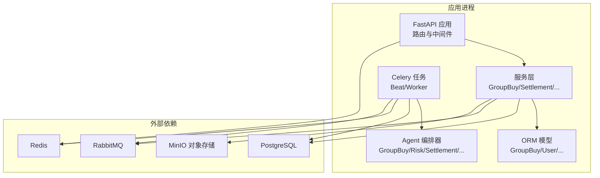
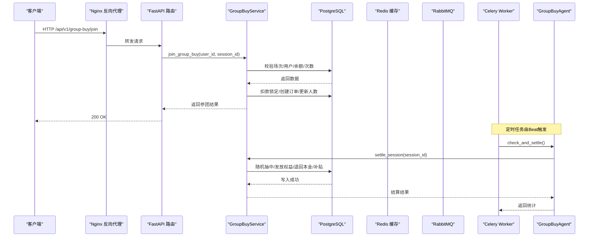
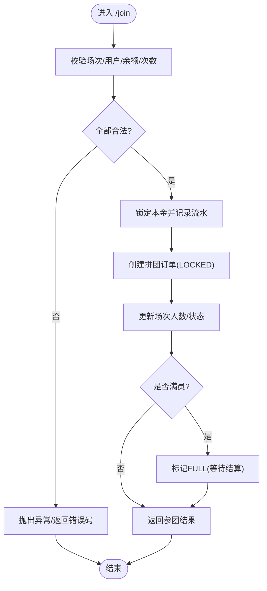
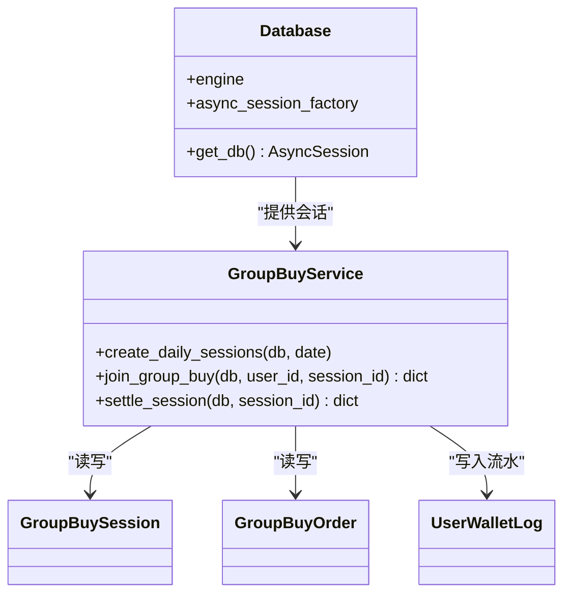
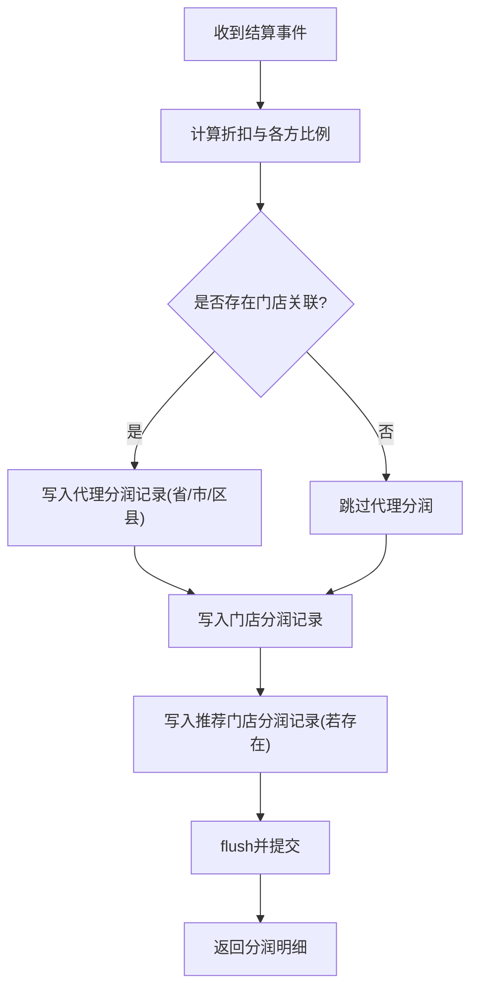
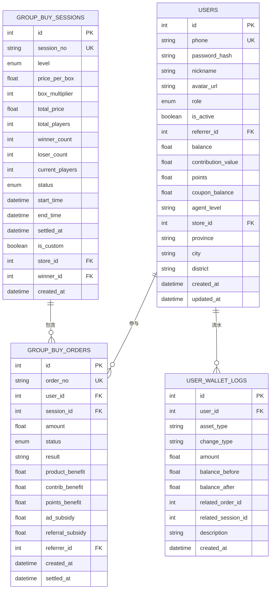
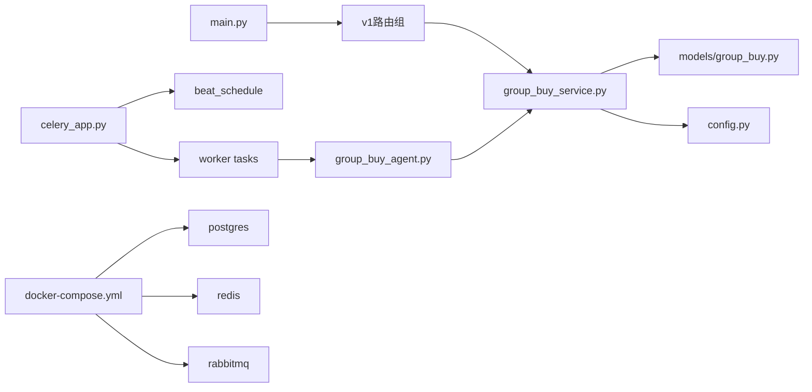
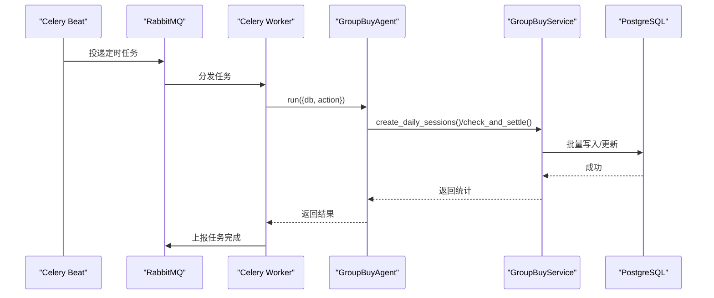
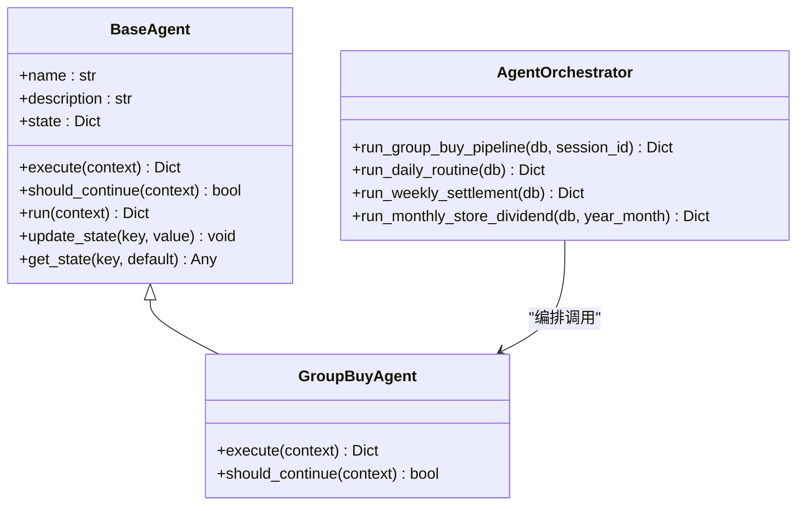

# 数据流设计

<cite>
**本文引用的文件**
- [backend/app/main.py](file://backend/app/main.py)
- [backend/app/database.py](file://backend/app/database.py)
- [backend/app/config.py](file://backend/app/config.py)
- [backend/app/api/v1/group_buy.py](file://backend/app/api/v1/group_buy.py)
- [backend/app/services/group_buy_service.py](file://backend/app/services/group_buy_service.py)
- [backend/app/models/group_buy.py](file://backend/app/models/group_buy.py)
- [backend/app/models/user.py](file://backend/app/models/user.py)
- [backend/app/agents/base_agent.py](file://backend/app/agents/base_agent.py)
- [backend/app/agents/group_buy_agent.py](file://backend/app/agents/group_buy_agent.py)
- [backend/app/agents/agent_orchestrator.py](file://backend/app/agents/agent_orchestrator.py)
- [backend/app/tasks/celery_app.py](file://backend/app/tasks/celery_app.py)
- [backend/app/tasks/group_buy_tasks.py](file://backend/app/tasks/group_buy_tasks.py)
- [backend/app/tasks/contribution_tasks.py](file://backend/app/tasks/contribution_tasks.py)
- [backend/app/services/settlement_service.py](file://backend/app/services/settlement_service.py)
- [docker-compose.yml](file://docker-compose.yml)
</cite>

## 目录
1. [引言](#引言)
2. [项目结构](#项目结构)
3. [核心组件](#核心组件)
4. [架构总览](#架构总览)
5. [详细组件分析](#详细组件分析)
6. [依赖关系分析](#依赖关系分析)
7. [性能与缓存策略](#性能与缓存策略)
8. [异步任务与调度](#异步任务与调度)
9. [AI Agent 数据流转](#ai-agent-数据流转)
10. [一致性、事务与备份恢复](#一致性事务与备份恢复)
11. [故障排查指南](#故障排查指南)
12. [结论](#结论)

## 引言
本文件面向AIxingmu系统的数据流设计，覆盖从HTTP请求到数据存储的完整链路，包括：
- HTTP请求处理链路（FastAPI路由→服务层→ORM会话）
- 业务逻辑处理流程（拼团开团、参团、结算、权益发放）
- 数据库操作与事务管理（异步Session、提交/回滚）
- 缓存策略（Redis配置与多级缓存建议、一致性保证、热点优化）
- 异步数据处理（Celery任务队列、定时调度、状态跟踪、失败重试）
- AI Agent系统数据流转（Agent编排、状态同步、结果聚合）
- 数据一致性、分布式事务与备份恢复策略
- 关键业务流程的数据流图与时序图

## 项目结构
后端采用分层架构：API层（FastAPI路由）、服务层（业务逻辑）、模型层（SQLAlchemy ORM）、任务层（Celery）、Agent层（LangGraph风格的状态机）。基础设施通过Docker Compose编排PostgreSQL、Redis、RabbitMQ、MinIO等。

图表来源
- [backend/app/main.py:1-59](file://backend/app/main.py#L1-L59)
- [backend/app/database.py:1-40](file://backend/app/database.py#L1-L40)
- [backend/app/tasks/celery_app.py:1-56](file://backend/app/tasks/celery_app.py#L1-L56)
- [docker-compose.yml:1-111](file://docker-compose.yml#L1-L111)

章节来源
- [backend/app/main.py:1-59](file://backend/app/main.py#L1-L59)
- [backend/app/database.py:1-40](file://backend/app/database.py#L1-L40)
- [backend/app/config.py:1-136](file://backend/app/config.py#L1-L136)
- [docker-compose.yml:1-111](file://docker-compose.yml#L1-L111)

## 核心组件
- FastAPI应用入口与生命周期管理：注册CORS、挂载路由、启动时建表、关闭释放资源。
- 数据库连接与会话：异步引擎与会话工厂，提供依赖注入的get_db，自动commit/rollback/close。
- 配置中心：集中化配置（DB、Redis、Celery、JWT、业务参数等）。
- 拼团API与服务：创建场次、参团、查询订单、结算等。
- 分润结算服务：四级代理+门店+推荐门店的分账记录与月度阶梯分红。
- Celery任务与调度：每日开团、满员结算、过期清理、贡献值核算、门店月度分红。
- AI Agent基类与编排器：统一执行接口、状态机、多Agent协作流水线。

章节来源
- [backend/app/main.py:14-59](file://backend/app/main.py#L14-L59)
- [backend/app/database.py:10-40](file://backend/app/database.py#L10-L40)
- [backend/app/config.py:16-41](file://backend/app/config.py#L16-L41)
- [backend/app/api/v1/group_buy.py:1-65](file://backend/app/api/v1/group_buy.py#L1-L65)
- [backend/app/services/group_buy_service.py:17-348](file://backend/app/services/group_buy_service.py#L17-L348)
- [backend/app/services/settlement_service.py:17-166](file://backend/app/services/settlement_service.py#L17-L166)
- [backend/app/tasks/celery_app.py:9-56](file://backend/app/tasks/celery_app.py#L9-L56)
- [backend/app/agents/base_agent.py:12-47](file://backend/app/agents/base_agent.py#L12-L47)
- [backend/app/agents/agent_orchestrator.py:18-94](file://backend/app/agents/agent_orchestrator.py#L18-L94)

## 架构总览
整体数据流遵循“请求→路由→服务→ORM→数据库”的主路径；异步任务由Celery Beat触发，Worker消费消息并调用Agent或服务完成批处理；Redis作为缓存与任务结果后端；RabbitMQ作为消息传输通道；MinIO用于对象存储。

图表来源
- [backend/app/api/v1/group_buy.py:26-38](file://backend/app/api/v1/group_buy.py#L26-L38)
- [backend/app/services/group_buy_service.py:93-181](file://backend/app/services/group_buy_service.py#L93-L181)
- [backend/app/services/group_buy_service.py:184-321](file://backend/app/services/group_buy_service.py#L184-L321)
- [backend/app/tasks/group_buy_tasks.py:30-40](file://backend/app/tasks/group_buy_tasks.py#L30-L40)
- [backend/app/agents/group_buy_agent.py:31-46](file://backend/app/agents/group_buy_agent.py#L31-L46)
- [docker-compose.yml:52-96](file://docker-compose.yml#L52-L96)

## 详细组件分析

### HTTP请求处理链路（以“参与拼团”为例）
- 路由层接收请求，解析入参，注入当前用户ID与数据库会话。
- 服务层执行业务规则：校验场次状态、人数上限、单组参与次数、用户余额。
- 在同一个数据库事务内完成：锁定本金、创建订单、更新场次人数与状态。
- 返回结构化响应给前端。

图表来源
- [backend/app/api/v1/group_buy.py:26-38](file://backend/app/api/v1/group_buy.py#L26-L38)
- [backend/app/services/group_buy_service.py:93-181](file://backend/app/services/group_buy_service.py#L93-L181)
- [backend/app/database.py:29-40](file://backend/app/database.py#L29-L40)

章节来源
- [backend/app/api/v1/group_buy.py:1-65](file://backend/app/api/v1/group_buy.py#L1-L65)
- [backend/app/services/group_buy_service.py:93-181](file://backend/app/services/group_buy_service.py#L93-L181)
- [backend/app/database.py:29-40](file://backend/app/database.py#L29-L40)

### 数据库操作与事务管理
- 使用异步引擎与会话工厂，依赖注入get_db确保每个请求拥有独立会话。
- 成功路径自动commit，异常路径自动rollback，finally关闭会话。
- 业务方法内部多次写操作（扣款、订单、流水、场次计数）在同一事务内提交，保障原子性。

图表来源
- [backend/app/database.py:10-40](file://backend/app/database.py#L10-L40)
- [backend/app/services/group_buy_service.py:27-59](file://backend/app/services/group_buy_service.py#L27-L59)
- [backend/app/services/group_buy_service.py:93-181](file://backend/app/services/group_buy_service.py#L93-L181)
- [backend/app/services/group_buy_service.py:184-321](file://backend/app/services/group_buy_service.py#L184-L321)
- [backend/app/models/group_buy.py:42-131](file://backend/app/models/group_buy.py#L42-L131)
- [backend/app/models/user.py:74-93](file://backend/app/models/user.py#L74-L93)

章节来源
- [backend/app/database.py:10-40](file://backend/app/database.py#L10-L40)
- [backend/app/services/group_buy_service.py:93-181](file://backend/app/services/group_buy_service.py#L93-L181)
- [backend/app/models/group_buy.py:42-131](file://backend/app/models/group_buy.py#L42-L131)
- [backend/app/models/user.py:74-93](file://backend/app/models/user.py#L74-L93)

### 分润结算与月度分红
- 分润按100%分配模型记录各方份额（代理、门店、推荐门店），生成结算记录。
- 门店月度阶梯分红依据当月业绩区间计算比例与金额，并更新排名与等级。

图表来源
- [backend/app/services/settlement_service.py:20-85](file://backend/app/services/settlement_service.py#L20-L85)
- [backend/app/services/settlement_service.py:87-133](file://backend/app/services/settlement_service.py#L87-L133)

章节来源
- [backend/app/services/settlement_service.py:17-166](file://backend/app/services/settlement_service.py#L17-L166)

### 数据模型概览

图表来源
- [backend/app/models/group_buy.py:42-158](file://backend/app/models/group_buy.py#L42-L158)
- [backend/app/models/user.py:26-93](file://backend/app/models/user.py#L26-L93)

章节来源
- [backend/app/models/group_buy.py:42-158](file://backend/app/models/group_buy.py#L42-L158)
- [backend/app/models/user.py:26-93](file://backend/app/models/user.py#L26-L93)

## 依赖关系分析
- 应用入口依赖配置与数据库初始化，注册各业务路由。
- 服务层依赖模型与配置常量，封装复杂业务规则。
- 任务层依赖Celery应用与调度配置，周期性触发Agent或服务方法。
- Docker Compose定义服务间依赖与健康检查，确保启动顺序。

图表来源
- [backend/app/main.py:44-53](file://backend/app/main.py#L44-L53)
- [backend/app/tasks/celery_app.py:24-55](file://backend/app/tasks/celery_app.py#L24-L55)
- [docker-compose.yml:52-96](file://docker-compose.yml#L52-L96)

章节来源
- [backend/app/main.py:44-53](file://backend/app/main.py#L44-L53)
- [backend/app/tasks/celery_app.py:24-55](file://backend/app/tasks/celery_app.py#L24-L55)
- [docker-compose.yml:52-96](file://docker-compose.yml#L52-L96)

## 性能与缓存策略
- 现状与能力
  - 配置中包含Redis URL与Celery结果后端，表明具备缓存与任务结果存储能力。
  - 当前代码未显式实现缓存读写逻辑，建议在热点读路径引入Redis缓存。
- 建议的多级缓存设计
  - L1本地内存缓存（进程内）：用于极热且短TTL的只读数据（如场次列表、基础配置）。
  - L2 Redis缓存：用于高频读取的会话详情、用户钱包快照、排行榜等。
  - 一致性策略：Cache-Aside模式，先更新DB再删除缓存；对强一致场景采用双写+版本号或延迟双删。
  - 热点优化：防击穿（互斥锁/布隆过滤器）、防穿透（空值缓存）、防雪崩（随机TTL抖动）。
- 与现有集成点
  - Celery结果后端使用Redis，便于任务状态查询与幂等控制。
  - 可结合Redis做分布式锁，保障并发下的场次人数与余额变更安全。

章节来源
- [backend/app/config.py:21-26](file://backend/app/config.py#L21-L26)
- [backend/app/tasks/celery_app.py:9-21](file://backend/app/tasks/celery_app.py#L9-L21)

## 异步任务与调度
- 调度器
  - Celery Beat按crontab定义周期任务：每日创建场次、每小时检查结算、每日检查过期、每周贡献值结算、每月门店分红。
- 任务执行
  - Worker在异步环境中运行协程，获取数据库会话，调用Agent或服务完成批处理，最后提交事务。
- 状态跟踪与重试
  - 任务结果写入Redis，可通过任务ID查询状态。
  - 建议为关键任务设置重试策略（指数退避、最大重试次数），并对幂等性进行保障（基于session_id/order_no去重）。

图表来源
- [backend/app/tasks/celery_app.py:24-55](file://backend/app/tasks/celery_app.py#L24-L55)
- [backend/app/tasks/group_buy_tasks.py:17-27](file://backend/app/tasks/group_buy_tasks.py#L17-L27)
- [backend/app/tasks/group_buy_tasks.py:30-40](file://backend/app/tasks/group_buy_tasks.py#L30-L40)
- [backend/app/agents/group_buy_agent.py:21-46](file://backend/app/agents/group_buy_agent.py#L21-L46)
- [backend/app/services/group_buy_service.py:27-59](file://backend/app/services/group_buy_service.py#L27-L59)
- [backend/app/services/group_buy_service.py:184-321](file://backend/app/services/group_buy_service.py#L184-L321)

章节来源
- [backend/app/tasks/celery_app.py:9-56](file://backend/app/tasks/celery_app.py#L9-L56)
- [backend/app/tasks/group_buy_tasks.py:1-54](file://backend/app/tasks/group_buy_tasks.py#L1-L54)
- [backend/app/tasks/contribution_tasks.py:1-29](file://backend/app/tasks/contribution_tasks.py#L1-L29)

## AI Agent 数据流转
- 基类与状态机
  - BaseAgent定义统一的execute/should_continue/run接口，维护state字典用于上下文传递。
- 编排器
  - AgentOrchestrator协调风控、结算、权益、运营、团队、风险等多Agent协作，形成流水线。
- 拼团Agent
  - GroupBuyAgent根据action执行创建场次、检查结算、过期清理等操作，调用服务层完成持久化。

图表来源
- [backend/app/agents/base_agent.py:12-47](file://backend/app/agents/base_agent.py#L12-L47)
- [backend/app/agents/group_buy_agent.py:15-67](file://backend/app/agents/group_buy_agent.py#L15-L67)
- [backend/app/agents/agent_orchestrator.py:18-94](file://backend/app/agents/agent_orchestrator.py#L18-L94)

章节来源
- [backend/app/agents/base_agent.py:12-47](file://backend/app/agents/base_agent.py#L12-L47)
- [backend/app/agents/group_buy_agent.py:15-67](file://backend/app/agents/group_buy_agent.py#L15-L67)
- [backend/app/agents/agent_orchestrator.py:18-94](file://backend/app/agents/agent_orchestrator.py#L18-L94)

## 一致性、事务与备份恢复
- 一致性保证
  - 同一请求内的多步写操作在单个AsyncSession事务中提交，异常自动回滚。
  - 对于跨服务/跨库的最终一致性，建议引入补偿事务与幂等键（order_no/session_no）。
- 分布式事务
  - 当前未实现XA/TCC等分布式事务框架；可采用Saga模式或基于消息的最终一致性。
- 备份与恢复
  - PostgreSQL卷持久化，建议定期pg_dump或启用WAL归档；Redis持久化开启AOF/RDB；MinIO对象存储版本化与跨区域复制。
  - 灾难恢复演练：定期验证备份可用性与恢复时间目标（RTO/RPO）。

章节来源
- [backend/app/database.py:29-40](file://backend/app/database.py#L29-L40)
- [docker-compose.yml:1-111](file://docker-compose.yml#L1-L111)

## 故障排查指南
- 常见问题定位
  - 参团失败：检查场次状态、人数上限、用户余额与单组参与次数限制。
  - 结算异常：核对FULL场次订单数量与状态，确认权益发放与本金退回逻辑。
  - 任务未执行：确认Beat/Worker运行状态、RabbitMQ连通性、任务名与模块路径。
- 日志与追踪
  - 利用Agent与服务的logger输出关键步骤；为任务添加唯一trace_id以便跨组件追踪。
- 快速自检清单
  - 健康检查端点是否正常返回。
  - 数据库连接池与超时配置是否合理。
  - Redis与RabbitMQ端口可达，权限正确。

章节来源
- [backend/app/api/v1/group_buy.py:26-38](file://backend/app/api/v1/group_buy.py#L26-L38)
- [backend/app/services/group_buy_service.py:184-321](file://backend/app/services/group_buy_service.py#L184-L321)
- [backend/app/tasks/group_buy_tasks.py:30-40](file://backend/app/tasks/group_buy_tasks.py#L30-L40)

## 结论
AIxingmu系统以FastAPI为核心，结合SQLAlchemy异步会话、Celery异步调度与Agent编排，构建了可扩展的数据处理流水线。通过明确的事务边界与幂等设计，可在高并发场景下保障数据一致性。后续建议完善Redis多级缓存与一致性策略，增强任务重试与监控告警，提升系统韧性与可观测性。