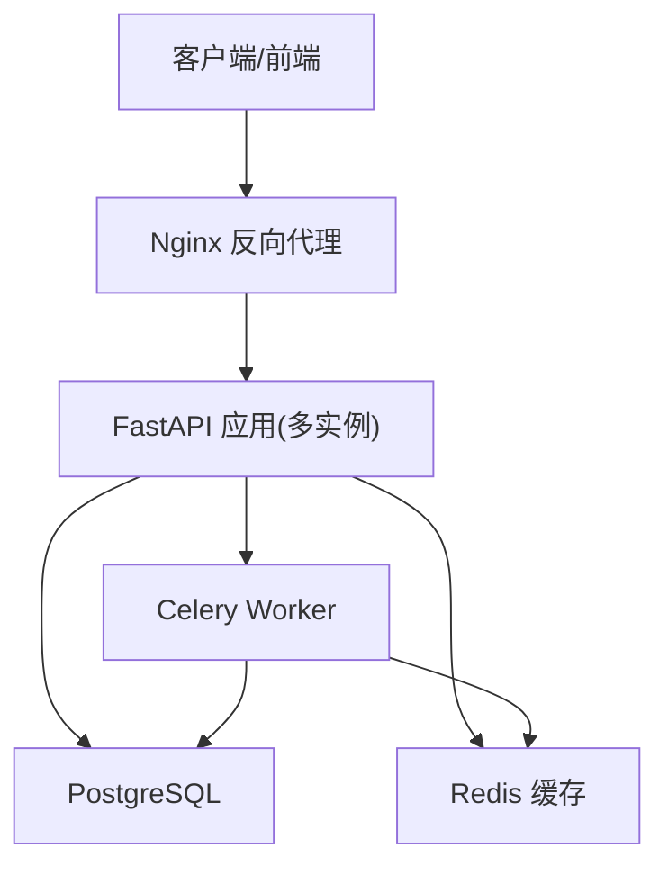
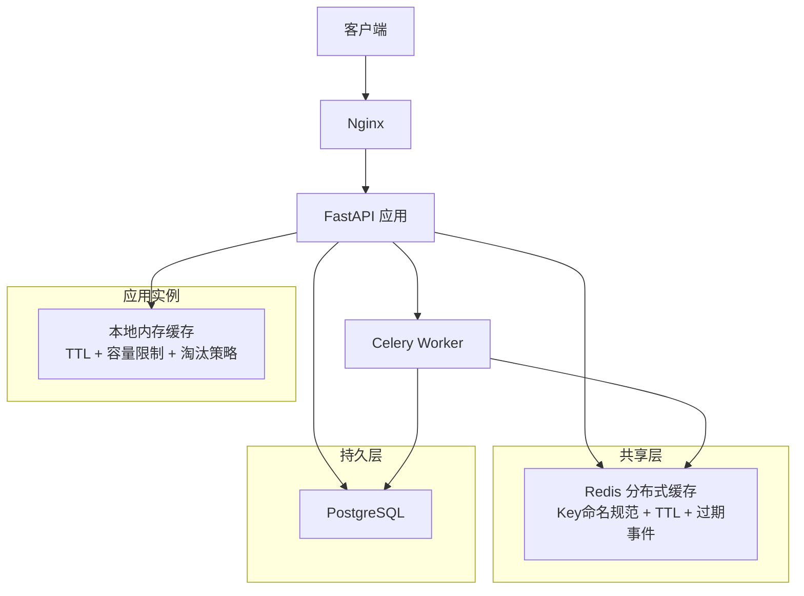
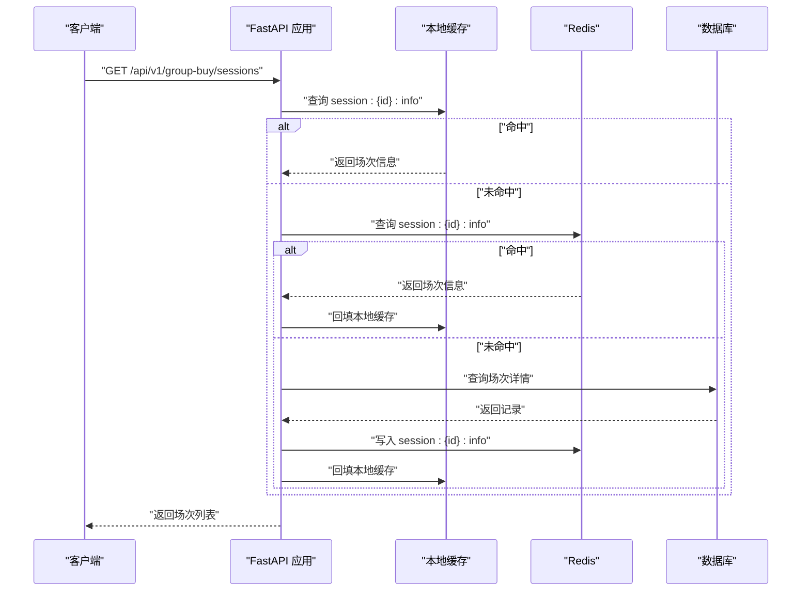
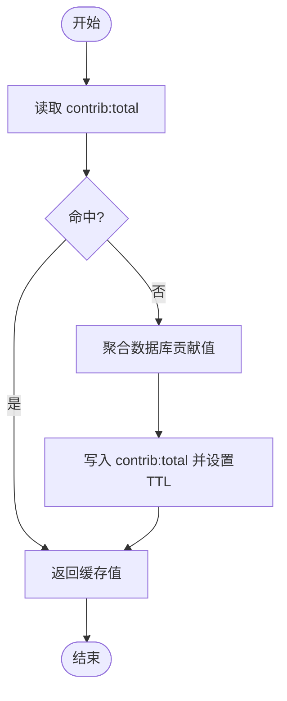
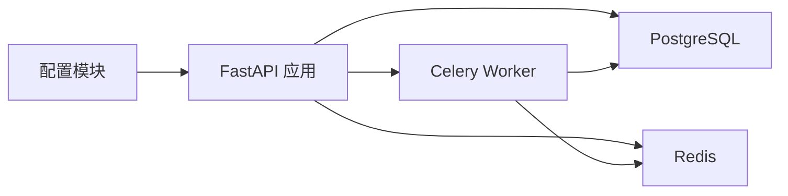

# 缓存策略设计

<cite>
**本文引用的文件**   
- [backend/app/config.py](file://backend/app/config.py)
- [docker-compose.yml](file://docker-compose.yml)
- [nginx.conf](file://nginx.conf)
- [backend/app/database.py](file://backend/app/database.py)
- [backend/app/api/v1/group_buy.py](file://backend/app/api/v1/group_buy.py)
- [backend/app/services/group_buy_service.py](file://backend/app/services/group_buy_service.py)
- [backend/app/models/group_buy.py](file://backend/app/models/group_buy.py)
- [backend/app/api/v1/contribution.py](file://backend/app/api/v1/contribution.py)
- [backend/app/services/contribution_service.py](file://backend/app/services/contribution_service.py)
- [backend/app/models/contribution.py](file://backend/app/models/contribution.py)
- [backend/app/tasks/contribution_tasks.py](file://backend/app/tasks/contribution_tasks.py)
</cite>

## 目录
1. [引言](#引言)
2. [项目结构](#项目结构)
3. [核心组件](#核心组件)
4. [架构总览](#架构总览)
5. [详细组件分析](#详细组件分析)
6. [依赖分析](#依赖分析)
7. [性能考虑](#性能考虑)
8. [故障排查指南](#故障排查指南)
9. [结论](#结论)
10. [附录](#附录)

## 引言
本设计文档面向AIxingmu系统，提出一套可落地的Redis多级缓存方案，覆盖本地内存缓存与Redis分布式缓存的层级设计、一致性保证机制（更新策略、失效模式、热点保护）、关键业务场景（用户会话、拼团状态、贡献值计算）的差异化策略，以及命中率优化、内存监控与预热策略。同时提供架构图与性能调优指南，帮助在现有后端服务基础上平滑引入缓存层，提升高并发下的吞吐与稳定性。

## 项目结构
当前后端采用FastAPI + SQLAlchemy异步数据库访问，使用Celery进行定时任务处理；基础设施通过Docker Compose编排PostgreSQL、Redis、RabbitMQ、MinIO与Nginx。配置中已包含Redis连接信息，具备引入缓存层的先决条件。

**图表来源**
- [docker-compose.yml:21-28](file://docker-compose.yml#L21-L28)
- [docker-compose.yml:52-71](file://docker-compose.yml#L52-L71)
- [docker-compose.yml:72-85](file://docker-compose.yml#L72-L85)
- [nginx.conf:1-38](file://nginx.conf#L1-L38)

**章节来源**
- [backend/app/config.py:21-26](file://backend/app/config.py#L21-L26)
- [docker-compose.yml:21-28](file://docker-compose.yml#L21-L28)
- [docker-compose.yml:52-71](file://docker-compose.yml#L52-L71)
- [docker-compose.yml:72-85](file://docker-compose.yml#L72-L85)
- [nginx.conf:1-38](file://nginx.conf#L1-L38)

## 核心组件
- 配置中心：集中管理Redis连接、Celery结果后端等参数，便于多环境切换与灰度发布。
- 数据持久层：基于SQLAlchemy异步引擎与会话工厂，确保读写路径清晰。
- 业务服务层：拼团服务、贡献值服务等核心逻辑，是缓存接入的关键点。
- 任务调度：Celery Beat/Worker用于周期性结算与统计，适合将聚合指标写入缓存。
- 网关层：Nginx负责请求转发，为后续接入CDN或边缘缓存预留能力。

**章节来源**
- [backend/app/config.py:8-26](file://backend/app/config.py#L8-L26)
- [backend/app/database.py:10-21](file://backend/app/database.py#L10-L21)
- [backend/app/services/group_buy_service.py:17-348](file://backend/app/services/group_buy_service.py#L17-348)
- [backend/app/services/contribution_service.py:16-261](file://backend/app/services/contribution_service.py#L16-261)
- [backend/app/tasks/contribution_tasks.py:1-28](file://backend/app/tasks/contribution_tasks.py#L1-L28)

## 架构总览
下图展示两级缓存的整体架构：进程内本地缓存（L1）与Redis分布式缓存（L2），并标注了典型读/写路径与一致性策略。

**图表来源**
- [docker-compose.yml:52-71](file://docker-compose.yml#L52-L71)
- [docker-compose.yml:72-85](file://docker-compose.yml#L72-L85)
- [backend/app/config.py:21-26](file://backend/app/config.py#L21-L26)

## 详细组件分析

### 1) 拼团状态缓存（热点场次、参与人数、订单计数）
- 目标：降低对场次表的高频读取压力，避免“满员判定”和“参与次数校验”造成数据库热点。
- 缓存键建议：
  - session:{id}:info → 场次基础信息（级别、价格、时间、状态、剩余名额）
  - session:{id}:count → 当前参与人数/锁定订单数
  - user:{uid}:session:{id}:orders → 用户在单场内的订单计数
- 更新策略：
  - 参团成功：原子递增参与人数与用户订单计数；若达到阈值则标记场次为满员。
  - 结算完成：清理相关计数与临时状态，保留结果快照供查询。
- 失效模式：
  - 短TTL（如30-60秒）+ 主动失效（参团/结算后删除）。
  - 针对“场次详情”可采用“延迟双删”或“版本号”方式保障最终一致。
- 热点保护：
  - 本地缓存优先命中，未命中再查Redis；对同一场次的并发参团采用分布式锁或Lua脚本原子操作。
- 与代码映射：
  - 场次创建/自定义开团、参团流程、满员判定与结算均涉及高频读写，适合引入上述缓存。

**图表来源**
- [backend/app/api/v1/group_buy.py:15-23](file://backend/app/api/v1/group_buy.py#L15-L23)
- [backend/app/services/group_buy_service.py:324-333](file://backend/app/services/group_buy_service.py#L324-L333)
- [backend/app/models/group_buy.py:42-86](file://backend/app/models/group_buy.py#L42-L86)

**章节来源**
- [backend/app/api/v1/group_buy.py:15-23](file://backend/app/api/v1/group_buy.py#L15-L23)
- [backend/app/services/group_buy_service.py:92-181](file://backend/app/services/group_buy_service.py#L92-L181)
- [backend/app/services/group_buy_service.py:183-321](file://backend/app/services/group_buy_service.py#L183-L321)
- [backend/app/models/group_buy.py:42-131](file://backend/app/models/group_buy.py#L42-L131)

### 2) 贡献值计算缓存（全网总贡献值、周度结算指标）
- 目标：减少全表聚合带来的CPU与I/O开销，加速“我的贡献值”、“全网总贡献值”等接口响应。
- 缓存键建议：
  - contrib:total → 全网剩余贡献值总和
  - contrib:user:{uid} → 用户贡献值明细摘要（最近N条、累计值）
  - contrib:weekly:{week} → 本周结算汇总（消费券发放总量、参与人数）
- 更新策略：
  - 交易产生贡献值时，增量更新contrib:total与用户摘要。
  - 每周一由Celery触发结算，批量写入contrib:weekly:{week}并刷新相关指标。
- 失效模式：
  - 按周维度设置较长TTL（如7天），结算完成后刷新对应周键。
- 热点保护：
  - 对“全网总贡献值”采用计数器+定期持久化到DB的策略，避免频繁聚合。

**图表来源**
- [backend/app/services/contribution_service.py:252-260](file://backend/app/services/contribution_service.py#L252-L260)
- [backend/app/api/v1/contribution.py:22-26](file://backend/app/api/v1/contribution.py#L22-L26)
- [backend/app/tasks/contribution_tasks.py:15-28](file://backend/app/tasks/contribution_tasks.py#L15-L28)

**章节来源**
- [backend/app/services/contribution_service.py:16-143](file://backend/app/services/contribution_service.py#L16-L143)
- [backend/app/services/contribution_service.py:162-240](file://backend/app/services/contribution_service.py#L162-L240)
- [backend/app/api/v1/contribution.py:12-19](file://backend/app/api/v1/contribution.py#L12-L19)
- [backend/app/api/v1/contribution.py:22-26](file://backend/app/api/v1/contribution.py#L22-L26)
- [backend/app/tasks/contribution_tasks.py:15-28](file://backend/app/tasks/contribution_tasks.py#L15-L28)

### 3) 用户会话缓存（JWT黑名单/白名单、登录态）
- 目标：快速校验登录态、拦截高风险用户，降低鉴权链路对数据库的压力。
- 缓存键建议：
  - auth:token:{jti} → 令牌元数据（过期时间、用户ID、设备指纹）
  - auth:blacklist:{user_id} → 黑名单标记与原因
- 更新策略：
  - 登录成功后写入令牌元数据；登出或异常时删除。
  - 风控命中后将用户加入黑名单，设置合理TTL。
- 失效模式：
  - 令牌级TTL与黑名单短期TTL结合；支持主动失效。
- 热点保护：
  - 鉴权路径走本地缓存+Redis二级，避免每次请求都落库。

[本节为概念性说明，不直接分析具体文件]

### 4) 积分池与排行榜缓存（可选）
- 目标：加速“积分池状态”、“门店排名”等读多写少场景。
- 缓存键建议：
  - points:pool → 积分池全局状态
  - store:rank:{period} → 周期门店排行TopN
- 更新策略：
  - 消费/兑换后增量更新；排行榜定时刷新。
- 失效模式：
  - 短TTL配合主动失效；排行榜按周期重建。

[本节为概念性说明，不直接分析具体文件]

## 依赖分析
- 外部依赖：
  - Redis：作为分布式缓存与Celery结果后端，需区分不同DB索引以避免冲突。
  - PostgreSQL：主存储，承担强一致性与复杂查询职责。
  - RabbitMQ：消息队列，支撑异步任务。
- 内部耦合：
  - 配置模块集中暴露Redis URL，便于统一注入。
  - 数据库会话工厂提供异步Session，所有服务层通过依赖注入获取。
  - Celery任务与业务服务解耦，适合执行批处理与指标聚合。

**图表来源**
- [backend/app/config.py:21-26](file://backend/app/config.py#L21-L26)
- [backend/app/database.py:10-21](file://backend/app/database.py#L10-L21)
- [docker-compose.yml:52-85](file://docker-compose.yml#L52-L85)

**章节来源**
- [backend/app/config.py:21-26](file://backend/app/config.py#L21-L26)
- [backend/app/database.py:10-21](file://backend/app/database.py#L10-L21)
- [docker-compose.yml:52-85](file://docker-compose.yml#L52-L85)

## 性能考虑
- 命中率优化
  - 分层命中：L1本地缓存优先，未命中再查L2；对热点键设置更长TTL与更大容量。
  - 预取与预热：在低峰期预热热门场次信息与贡献值指标，降低冷启动抖动。
  - 批量读取：对列表类接口采用分页+缓存聚合，减少重复计算。
- 内存使用监控
  - 本地缓存：限制最大条目数与单键大小，采用LRU/LFU淘汰策略；监控内存占用与淘汰率。
  - Redis：监控used_memory、keyspace_hits/misses、evicted_keys、慢查询；按业务划分DB索引。
- 缓存预热策略
  - 每日固定场次在开团前预热“场次信息”与“剩余名额”。
  - 每周结算后预热“周度指标”与“排行榜”。
- 一致性保障
  - 写扩散：更新DB后立即更新/删除缓存；必要时采用延迟双删。
  - 版本号：为热点对象维护版本号，避免脏读。
  - 幂等：参团与结算路径需幂等，防止重复写入导致不一致。
- 限流与降级
  - 对热点接口实施令牌桶/漏桶限流；当Redis不可用时自动降级至直连DB并告警。

[本节为通用指导，不直接分析具体文件]

## 故障排查指南
- 常见问题定位
  - 缓存穿透：空结果也缓存短TTL；布隆过滤器拦截非法键。
  - 缓存击穿：热点键加互斥锁或设置永不过期+后台刷新。
  - 缓存雪崩：随机化TTL，错峰刷新；启用本地缓存兜底。
  - 一致性异常：检查写路径是否遵循“先更DB后删缓存”，核对版本号与延迟双删。
- 监控与告警
  - 指标：命中率、延迟P99/P999、错误率、内存使用、淘汰率、慢查询。
  - 告警：命中率骤降、内存超限、大量超时、Redis节点不可用。
- 回滚与恢复
  - 一键关闭缓存开关，流量回退至DB；逐步恢复并观察指标。
  - 对异常数据进行补偿任务，重放关键事件修复缓存。

[本节为通用指导，不直接分析具体文件]

## 结论
通过在FastAPI应用中引入本地内存缓存与Redis分布式缓存的两级架构，并结合合理的键设计、更新与失效策略、热点保护与监控体系，可显著提升AIxingmu在高并发场景下的性能与可用性。建议在上线前完成压测与灰度验证，逐步扩大缓存覆盖范围，持续优化命中率与资源利用率。

[本节为总结性内容，不直接分析具体文件]

## 附录
- 键命名规范建议
  - 业务域_实体_标识_字段：如 group_buy_session_{id}_info、contrib_total、auth_token_{jti}
- 缓存TTL建议
  - 会话类：与令牌有效期一致
  - 拼团状态：30-120秒，结算后主动失效
  - 贡献值指标：按周维度，7天TTL
- 安全与隔离
  - 不同业务使用不同Redis DB索引，避免相互影响
  - 敏感数据不落缓存或加密存储

[本节为补充说明，不直接分析具体文件]