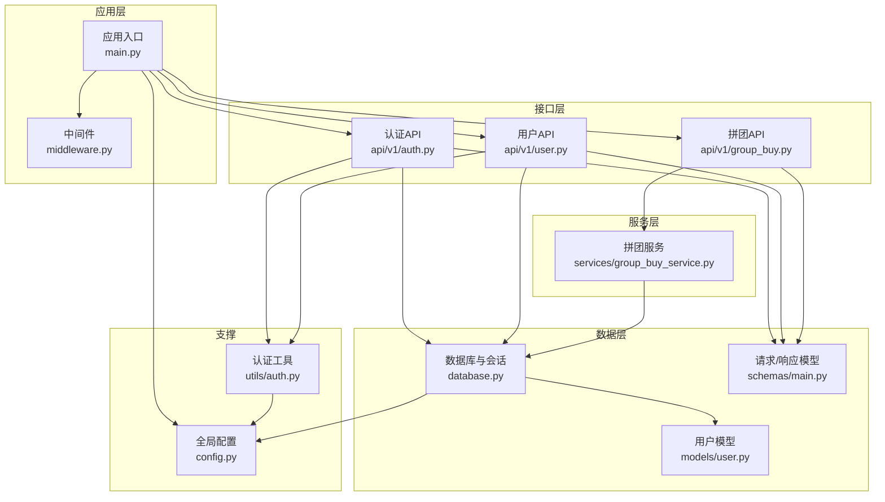
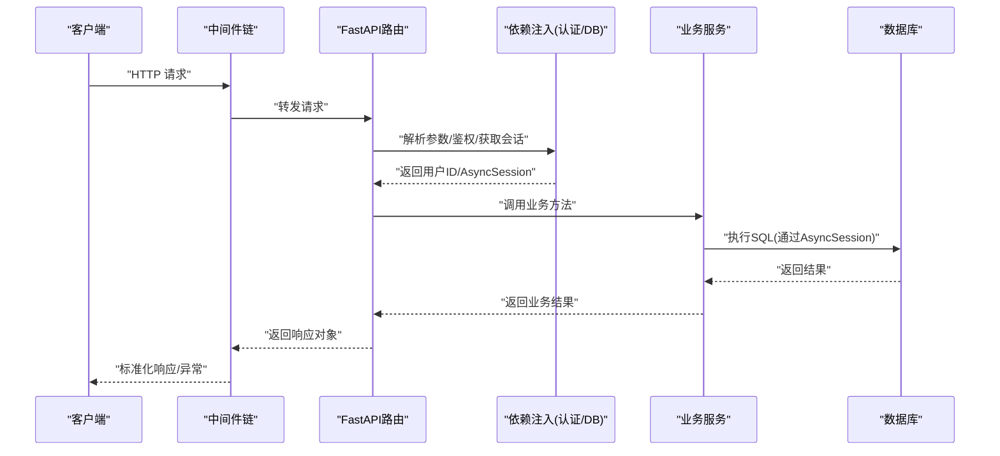
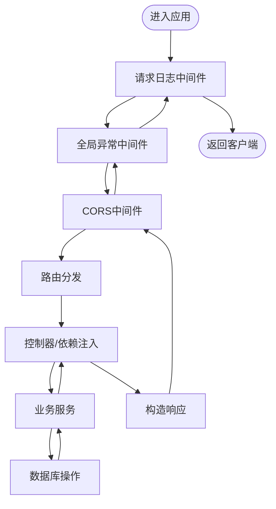
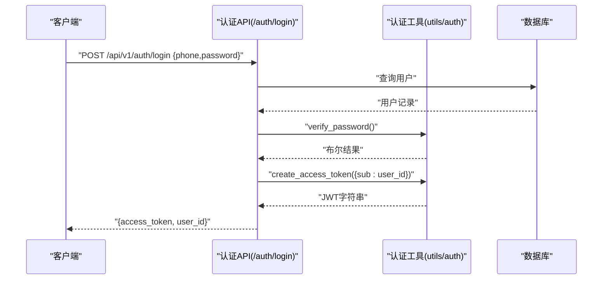
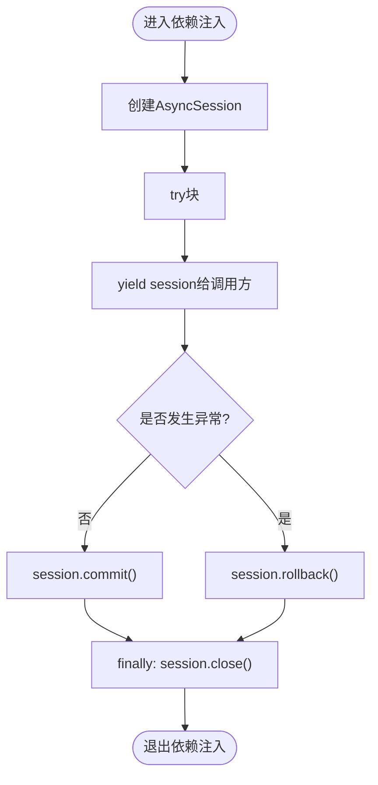
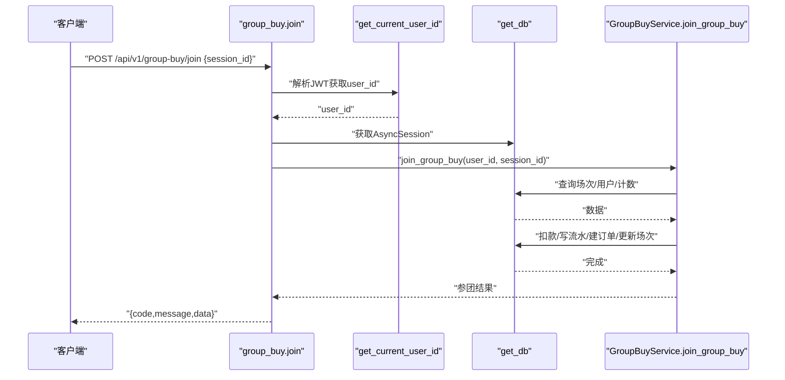
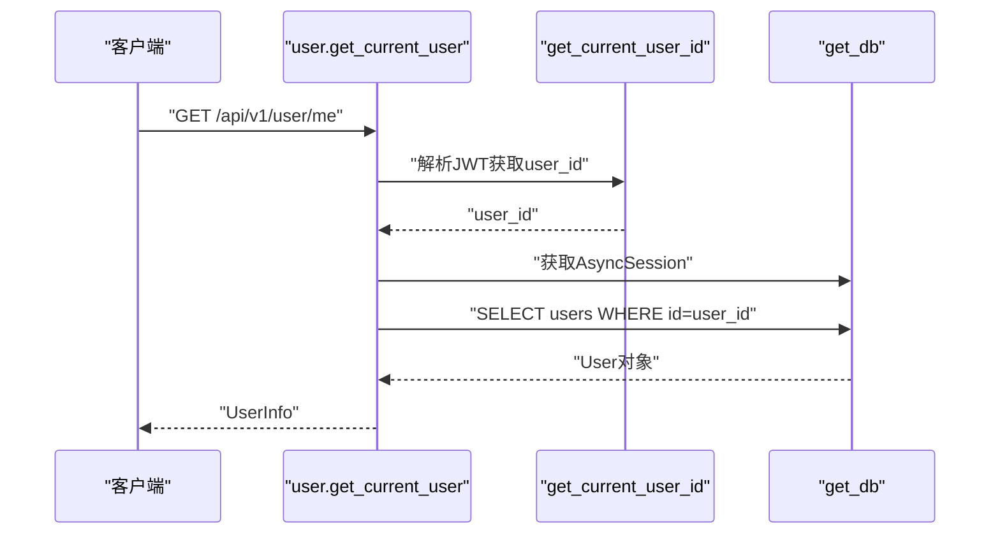
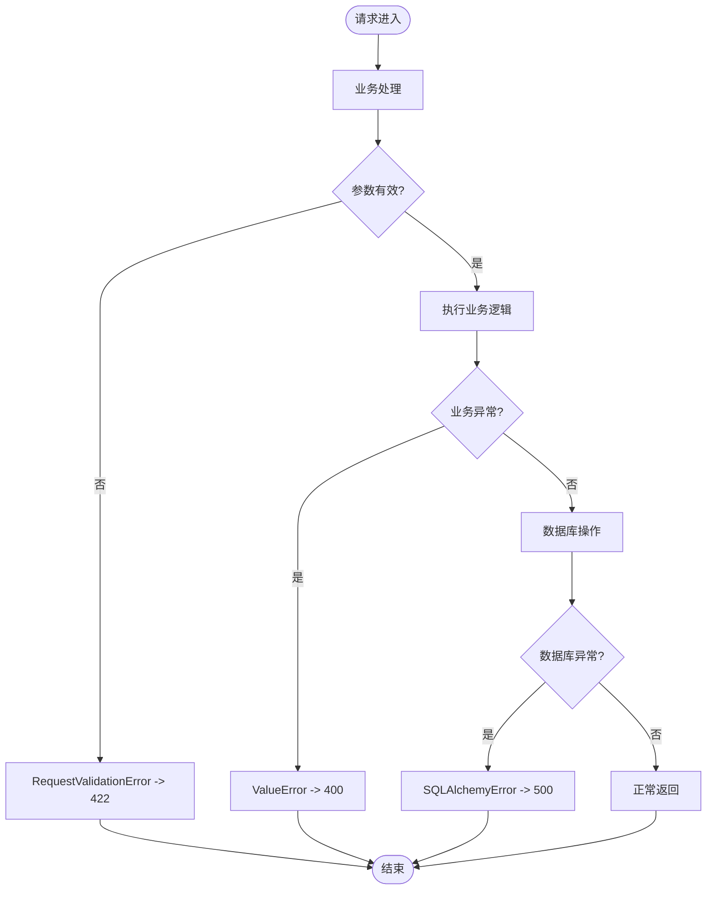
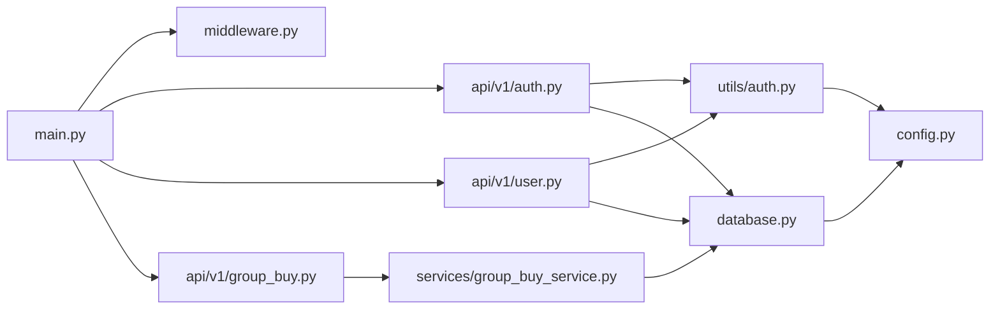

# 请求处理流程

<cite>
**本文引用的文件**   
- [backend/app/main.py](file://backend/app/main.py)
- [backend/app/middleware.py](file://backend/app/middleware.py)
- [backend/app/database.py](file://backend/app/database.py)
- [backend/app/config.py](file://backend/app/config.py)
- [backend/app/utils/auth.py](file://backend/app/utils/auth.py)
- [backend/app/api/v1/auth.py](file://backend/app/api/v1/auth.py)
- [backend/app/api/v1/user.py](file://backend/app/api/v1/user.py)
- [backend/app/api/v1/group_buy.py](file://backend/app/api/v1/group_buy.py)
- [backend/app/services/group_buy_service.py](file://backend/app/services/group_buy_service.py)
- [backend/app/models/user.py](file://backend/app/models/user.py)
- [backend/app/schemas/main.py](file://backend/app/schemas/main.py)
</cite>

## 目录
1. [简介](#简介)
2. [项目结构](#项目结构)
3. [核心组件](#核心组件)
4. [架构总览](#架构总览)
5. [详细组件分析](#详细组件分析)
6. [依赖关系分析](#依赖关系分析)
7. [性能考虑](#性能考虑)
8. [故障排查指南](#故障排查指南)
9. [结论](#结论)
10. [附录](#附录)

## 简介
本文件面向AIxingmu系统，系统化梳理HTTP请求从接收到响应的完整处理链路，覆盖FastAPI路由解析、中间件链、认证鉴权、数据库会话与事务管理、错误处理与异常传播路径，并给出请求生命周期图、关键数据转换节点说明、性能优化建议与最佳实践。读者无需深入源码即可理解整体机制与扩展点。

## 项目结构
后端采用分层组织：入口应用与中间件位于顶层模块；API路由按领域划分在api/v1下；业务逻辑集中在services；数据模型在models；请求/响应Schema在schemas；配置集中于config；数据库连接与会话在database；认证工具在utils。

图表来源 
- [backend/app/main.py:35-75](file://backend/app/main.py#L35-L75)
- [backend/app/middleware.py:15-121](file://backend/app/middleware.py#L15-L121)
- [backend/app/database.py:10-40](file://backend/app/database.py#L10-L40)
- [backend/app/config.py:8-34](file://backend/app/config.py#L8-L34)
- [backend/app/utils/auth.py:1-50](file://backend/app/utils/auth.py#L1-L50)
- [backend/app/api/v1/auth.py:1-43](file://backend/app/api/v1/auth.py#L1-L43)
- [backend/app/api/v1/user.py:1-37](file://backend/app/api/v1/user.py#L1-L37)
- [backend/app/api/v1/group_buy.py:1-65](file://backend/app/api/v1/group_buy.py#L1-L65)
- [backend/app/services/group_buy_service.py:17-348](file://backend/app/services/group_buy_service.py#L17-L348)
- [backend/app/models/user.py:26-93](file://backend/app/models/user.py#L26-L93)
- [backend/app/schemas/main.py:10-46](file://backend/app/schemas/main.py#L10-L46)

章节来源
- [backend/app/main.py:35-75](file://backend/app/main.py#L35-L75)
- [backend/app/middleware.py:15-121](file://backend/app/middleware.py#L15-L121)
- [backend/app/database.py:10-40](file://backend/app/database.py#L10-L40)
- [backend/app/config.py:8-34](file://backend/app/config.py#L8-L34)

## 核心组件
- 应用入口与生命周期
  - 注册中间件（日志、全局异常、CORS）
  - 挂载各域路由（认证、用户、商品、拼团、贡献值、积分、消费券、门店、管理后台、WebSocket）
  - 健康检查端点
- 中间件链
  - 请求日志中间件：记录方法、URL、客户端IP、状态码、耗时
  - 全局异常中间件：统一捕获验证错误、数据库错误、业务错误、权限错误与未处理异常，返回标准JSON
  - CORS中间件：允许跨域访问（生产建议使用内置CORSMiddleware）
- 认证鉴权
  - JWT令牌签发与校验
  - 基于HTTP Bearer的依赖注入获取当前用户ID
- 数据库与会话
  - 异步引擎与连接池参数
  - 异步会话工厂
  - FastAPI依赖注入get_db：自动提交或回滚，确保资源释放
- 业务服务
  - 拼团服务：场次创建、参团、结算、查询等核心流程
- 数据模型与Schema
  - 用户模型及钱包流水模型
  - 统一的请求/响应Pydantic模型

章节来源
- [backend/app/main.py:44-75](file://backend/app/main.py#L44-L75)
- [backend/app/middleware.py:15-121](file://backend/app/middleware.py#L15-L121)
- [backend/app/utils/auth.py:1-50](file://backend/app/utils/auth.py#L1-L50)
- [backend/app/database.py:10-40](file://backend/app/database.py#L10-L40)
- [backend/app/services/group_buy_service.py:17-348](file://backend/app/services/group_buy_service.py#L17-L348)
- [backend/app/models/user.py:26-93](file://backend/app/models/user.py#L26-L93)
- [backend/app/schemas/main.py:10-46](file://backend/app/schemas/main.py#L10-L46)

## 架构总览
下图展示一次典型受保护请求的处理路径：客户端→中间件链→路由解析→依赖注入（认证+DB会话）→控制器→服务层→数据库→响应返回。

图表来源 
- [backend/app/main.py:44-75](file://backend/app/main.py#L44-L75)
- [backend/app/middleware.py:15-121](file://backend/app/middleware.py#L15-L121)
- [backend/app/utils/auth.py:39-50](file://backend/app/utils/auth.py#L39-L50)
- [backend/app/database.py:29-40](file://backend/app/database.py#L29-L40)
- [backend/app/api/v1/group_buy.py:26-38](file://backend/app/api/v1/group_buy.py#L26-L38)
- [backend/app/services/group_buy_service.py:93-181](file://backend/app/services/group_buy_service.py#L93-L181)

## 详细组件分析

### 请求生命周期与中间件链
- 中间件顺序（添加顺序即外层到内层）
  - 请求日志中间件（最先执行，最后退出）
  - 全局异常中间件（包裹业务处理，统一捕获异常）
  - CORS中间件（设置跨域头）
- 每个中间件职责
  - 请求日志：记录入出栈信息、耗时
  - 全局异常：将不同异常映射为统一JSON格式，附带code/message/detail
  - CORS：设置Access-Control相关响应头

图表来源 
- [backend/app/main.py:44-56](file://backend/app/main.py#L44-L56)
- [backend/app/middleware.py:15-121](file://backend/app/middleware.py#L15-L121)

章节来源
- [backend/app/main.py:44-56](file://backend/app/main.py#L44-L56)
- [backend/app/middleware.py:15-121](file://backend/app/middleware.py#L15-L121)

### 认证与鉴权流程
- 登录/注册
  - 注册：校验手机号唯一性→写入用户→生成JWT→返回token与user_id
  - 登录：校验手机号与密码→生成JWT→返回token与user_id
- 鉴权
  - 使用HTTPBearer依赖注入，从Authorization头提取Token
  - 解码JWT，校验签名与过期时间，提取sub作为用户ID
  - 非法或缺失Token抛出401

图表来源 
- [backend/app/api/v1/auth.py:34-43](file://backend/app/api/v1/auth.py#L34-L43)
- [backend/app/utils/auth.py:24-36](file://backend/app/utils/auth.py#L24-L36)
- [backend/app/models/user.py:26-57](file://backend/app/models/user.py#L26-L57)

章节来源
- [backend/app/api/v1/auth.py:14-43](file://backend/app/api/v1/auth.py#L14-L43)
- [backend/app/utils/auth.py:1-50](file://backend/app/utils/auth.py#L1-L50)
- [backend/app/models/user.py:26-57](file://backend/app/models/user.py#L26-L57)

### 数据库会话管理与事务
- 连接池与引擎
  - 异步引擎由配置项DATABASE_URL、DATABASE_POOL_SIZE、DATABASE_MAX_OVERFLOW控制
  - echo开关用于调试输出SQL
- 会话工厂
  - expire_on_commit=False避免提交后对象失效
- get_db依赖注入
  - 使用async with创建会话
  - try/except中commit或rollback
  - finally关闭会话，确保资源回收
- 事务边界
  - 默认以请求为单位的事务：成功提交，异常回滚
  - 复杂业务可在服务层显式使用engine.begin()进行更细粒度控制

图表来源 
- [backend/app/database.py:10-21](file://backend/app/database.py#L10-L21)
- [backend/app/database.py:29-40](file://backend/app/database.py#L29-L40)

章节来源
- [backend/app/database.py:10-40](file://backend/app/database.py#L10-L40)
- [backend/app/config.py:16-19](file://backend/app/config.py#L16-L19)

### 拼团参团请求处理链路
- 路由层
  - POST /api/v1/group-buy/join
  - 依赖注入：当前用户ID、AsyncSession
  - 调用服务层join_group_buy
- 服务层
  - 校验场次存在与状态
  - 校验单组参与次数上限
  - 校验余额充足
  - 锁定本金、创建订单、更新场次人数与状态
  - 返回参团结果
- 异常处理
  - 业务异常ValueError被路由层转为HTTPException(400)
  - 全局异常中间件兜底其他异常

图表来源 
- [backend/app/api/v1/group_buy.py:26-38](file://backend/app/api/v1/group_buy.py#L26-L38)
- [backend/app/utils/auth.py:39-50](file://backend/app/utils/auth.py#L39-L50)
- [backend/app/database.py:29-40](file://backend/app/database.py#L29-L40)
- [backend/app/services/group_buy_service.py:93-181](file://backend/app/services/group_buy_service.py#L93-L181)

章节来源
- [backend/app/api/v1/group_buy.py:26-38](file://backend/app/api/v1/group_buy.py#L26-L38)
- [backend/app/services/group_buy_service.py:93-181](file://backend/app/services/group_buy_service.py#L93-L181)

### 用户信息查询请求处理链路
- GET /api/v1/user/me
- 依赖注入：当前用户ID、AsyncSession
- 查询用户表并返回UserInfo

图表来源 
- [backend/app/api/v1/user.py:14-21](file://backend/app/api/v1/user.py#L14-L21)
- [backend/app/utils/auth.py:39-50](file://backend/app/utils/auth.py#L39-L50)
- [backend/app/database.py:29-40](file://backend/app/database.py#L29-L40)
- [backend/app/schemas/main.py:26-39](file://backend/app/schemas/main.py#L26-L39)

章节来源
- [backend/app/api/v1/user.py:14-21](file://backend/app/api/v1/user.py#L14-L21)
- [backend/app/schemas/main.py:26-39](file://backend/app/schemas/main.py#L26-L39)

### 错误处理与异常传播
- 分类与映射
  - 请求参数验证失败：422，包含detail数组
  - 数据库错误：500，message为“数据库操作失败”
  - 业务逻辑错误：400，message为具体错误信息
  - 权限不足：403
  - 未处理异常：500，包含堆栈信息
- 传播路径
  - 控制器抛出HTTPException会被中间件直接返回
  - 服务层抛出ValueError会在路由层转换为HTTPException(400)
  - 其他异常由全局异常中间件捕获并标准化

图表来源 
- [backend/app/middleware.py:15-79](file://backend/app/middleware.py#L15-L79)
- [backend/app/api/v1/group_buy.py:33-37](file://backend/app/api/v1/group_buy.py#L33-L37)

章节来源
- [backend/app/middleware.py:15-79](file://backend/app/middleware.py#L15-L79)
- [backend/app/api/v1/group_buy.py:33-37](file://backend/app/api/v1/group_buy.py#L33-L37)

## 依赖关系分析
- 模块耦合
  - main.py聚合中间件与路由，低耦合高内聚
  - api层仅依赖utils/auth与database依赖注入，不直接持有连接
  - services专注业务规则，通过AsyncSession与数据库交互
- 外部依赖
  - SQLAlchemy异步驱动与连接池
  - Pydantic用于请求/响应校验
  - jose/passlib用于JWT与密码哈希
  - FastAPI内置CORS中间件（推荐在生产环境启用）

图表来源 
- [backend/app/main.py:44-75](file://backend/app/main.py#L44-L75)
- [backend/app/middleware.py:15-121](file://backend/app/middleware.py#L15-L121)
- [backend/app/database.py:10-40](file://backend/app/database.py#L10-L40)
- [backend/app/config.py:8-34](file://backend/app/config.py#L8-L34)
- [backend/app/utils/auth.py:1-50](file://backend/app/utils/auth.py#L1-L50)
- [backend/app/api/v1/auth.py:1-43](file://backend/app/api/v1/auth.py#L1-L43)
- [backend/app/api/v1/user.py:1-37](file://backend/app/api/v1/user.py#L1-L37)
- [backend/app/api/v1/group_buy.py:1-65](file://backend/app/api/v1/group_buy.py#L1-L65)
- [backend/app/services/group_buy_service.py:17-348](file://backend/app/services/group_buy_service.py#L17-L348)

章节来源
- [backend/app/main.py:44-75](file://backend/app/main.py#L44-L75)
- [backend/app/database.py:10-40](file://backend/app/database.py#L10-L40)
- [backend/app/config.py:8-34](file://backend/app/config.py#L8-L34)

## 性能考虑
- 连接池与并发
  - 合理设置DATABASE_POOL_SIZE与DATABASE_MAX_OVERFLOW，结合QPS与慢查询评估
  - 开启echo仅在开发环境，生产关闭以减少IO开销
- 会话与事务
  - 保持短事务，避免长事务占用连接
  - 批量写入时合并flush/commit减少往返
- 认证与缓存
  - 对热点用户信息可引入Redis缓存，降低DB压力
  - Token校验尽量无状态，必要时增加黑名单缓存
- I/O与序列化
  - 使用response_model减少手动序列化成本
  - 大列表分页查询，限制limit/offset范围
- 监控与指标
  - 利用中间件X-Process-Time与日志统计P95/P99延迟
  - 关注慢SQL与锁等待，定期优化索引

[本节为通用指导，不直接分析具体文件]

## 故障排查指南
- 常见问题定位
  - 422参数错误：查看请求体字段是否符合Schema定义
  - 401未授权：检查Authorization头是否携带正确Bearer Token
  - 400业务错误：根据detail定位具体业务校验失败原因
  - 500数据库错误：检查连接池、网络连通性与SQL语句
- 日志与追踪
  - 使用请求日志中间件输出的方法、URL、IP、状态码、耗时快速定位
  - 全局异常中间件会记录异常类型与消息，便于检索
- 数据库问题
  - 确认连接池耗尽：观察连接数与最大溢出
  - 检查事务回滚：确认异常分支是否正确触发rollback
  - 慢查询优化：结合索引与查询条件调整

章节来源
- [backend/app/middleware.py:15-121](file://backend/app/middleware.py#L15-L121)
- [backend/app/database.py:29-40](file://backend/app/database.py#L29-L40)

## 结论
AIxingmu的请求处理链路清晰分层：中间件负责横切关注点，路由层负责协议与参数绑定，服务层承载业务规则，数据库层提供持久化能力。通过统一的异常处理与标准化的响应格式，系统在可观测性、健壮性与可扩展性方面具备良好基础。后续可按性能与稳定性目标持续优化连接池、缓存策略与查询路径。

[本节为总结，不直接分析具体文件]

## 附录
- 关键端点参考
  - 认证：POST /api/v1/auth/register、POST /api/v1/auth/login
  - 用户：GET /api/v1/user/me、GET /api/v1/user/wallet
  - 拼团：GET /api/v1/group-buy/sessions、POST /api/v1/group-buy/join、GET /api/v1/group-buy/orders、GET /api/v1/group-buy/sessions/{session_id}
- 配置项要点
  - DATABASE_URL、DATABASE_POOL_SIZE、DATABASE_MAX_OVERFLOW
  - SECRET_KEY、ALGORITHM、ACCESS_TOKEN_EXPIRE_MINUTES
  - CORS_ORIGINS

章节来源
- [backend/app/api/v1/auth.py:14-43](file://backend/app/api/v1/auth.py#L14-L43)
- [backend/app/api/v1/user.py:14-37](file://backend/app/api/v1/user.py#L14-L37)
- [backend/app/api/v1/group_buy.py:15-65](file://backend/app/api/v1/group_buy.py#L15-L65)
- [backend/app/config.py:16-34](file://backend/app/config.py#L16-L34)