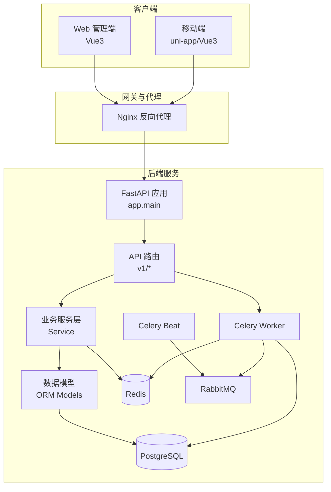
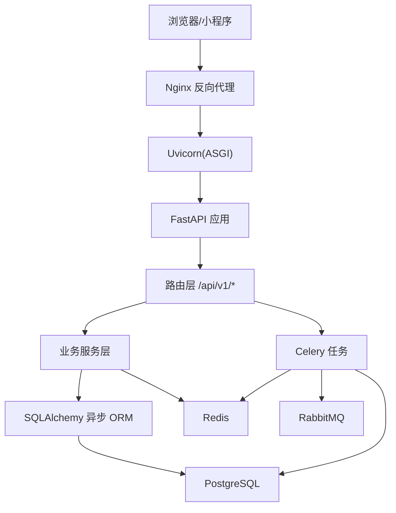
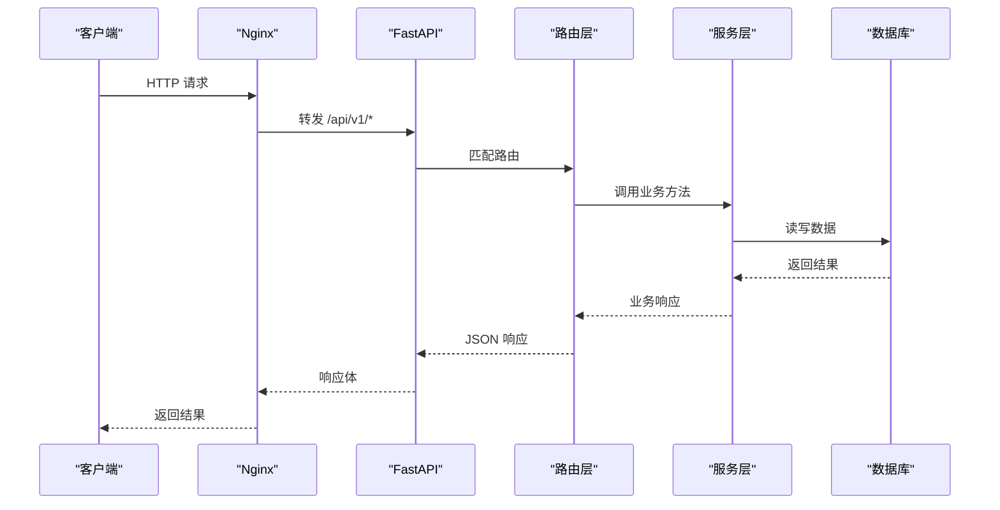
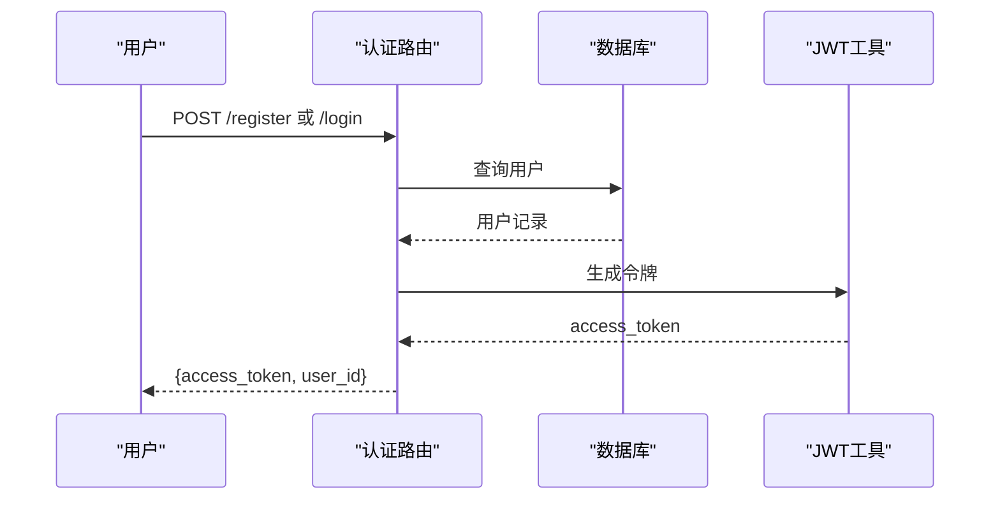
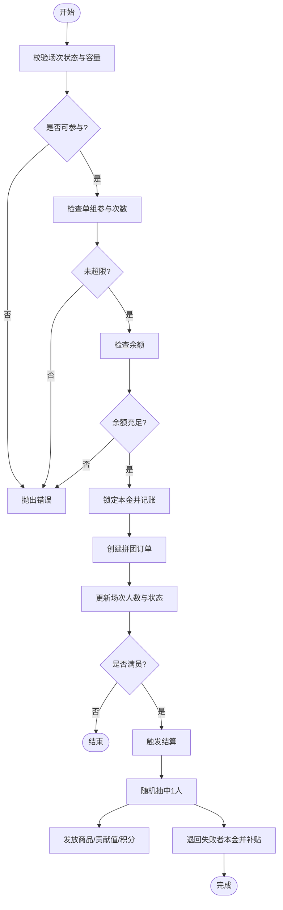
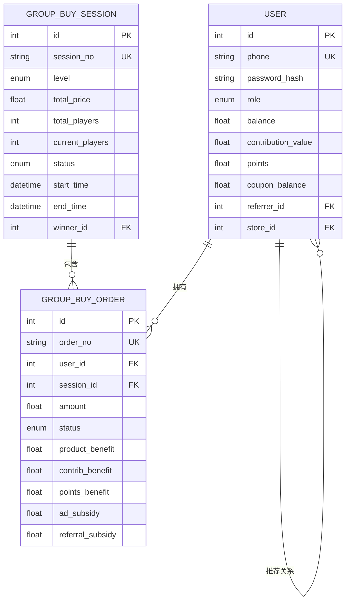
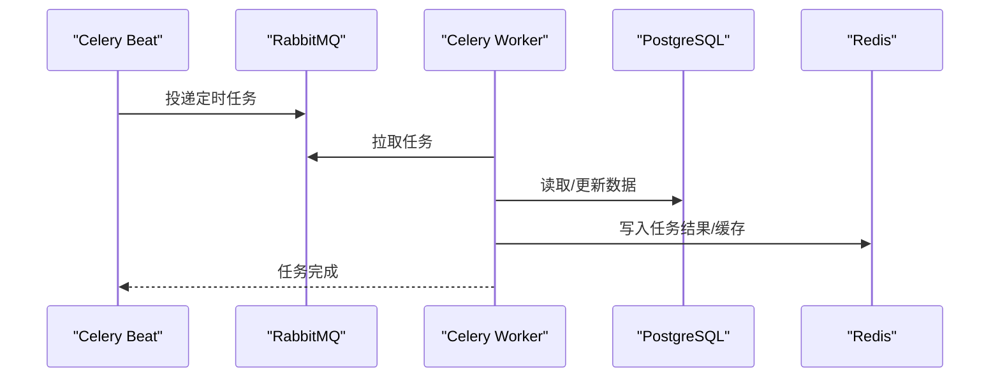
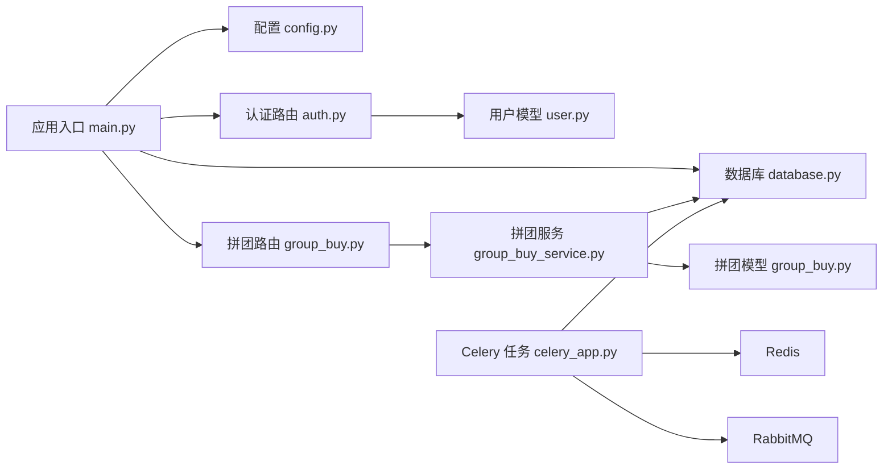

# 整体架构概览

<cite>
**本文引用的文件**   
- [backend/app/main.py](file://backend/app/main.py)
- [backend/app/config.py](file://backend/app/config.py)
- [backend/app/database.py](file://backend/app/database.py)
- [backend/app/api/v1/auth.py](file://backend/app/api/v1/auth.py)
- [backend/app/api/v1/group_buy.py](file://backend/app/api/v1/group_buy.py)
- [backend/app/services/group_buy_service.py](file://backend/app/services/group_buy_service.py)
- [backend/app/models/user.py](file://backend/app/models/user.py)
- [backend/app/models/group_buy.py](file://backend/app/models/group_buy.py)
- [backend/app/tasks/celery_app.py](file://backend/app/tasks/celery_app.py)
- [docker-compose.yml](file://docker-compose.yml)
- [nginx.conf](file://nginx.conf)
- [backend/Dockerfile](file://backend/Dockerfile)
- [frontend/web-admin/src/main.ts](file://frontend/web-admin/src/main.ts)
- [frontend/mobile-app/main.js](file://frontend/mobile-app/main.js)
</cite>

## 目录
1. [引言](#引言)
2. [项目结构](#项目结构)
3. [核心组件](#核心组件)
4. [架构总览](#架构总览)
5. [详细组件分析](#详细组件分析)
6. [依赖关系分析](#依赖关系分析)
7. [性能与可扩展性](#性能与可扩展性)
8. [安全架构设计](#安全架构设计)
9. [故障排查指南](#故障排查指南)
10. [结论](#结论)

## 引言
本文件为 AIxingmu 系统的整体架构概览，面向产品、研发与运维读者。系统采用前后端分离的微服务化组织方式，后端基于 Python FastAPI 提供异步 API，前端包含 Web 管理端与移动端；数据层使用 PostgreSQL 持久化，Redis 作为缓存与任务结果存储，RabbitMQ 作为消息中间件，Celery 负责异步与定时任务，Nginx 作为反向代理与静态资源入口。整体遵循分层架构：应用层（路由/鉴权）、业务服务层（领域逻辑）、数据访问层（ORM/会话），并通过容器化编排实现高可用与水平扩展。

## 项目结构
- 后端
  - 应用入口与生命周期管理：FastAPI 应用初始化、CORS、路由注册、健康检查
  - 配置中心：集中式 Settings，涵盖数据库、缓存、队列、JWT、业务常量等
  - 数据访问：异步 SQLAlchemy 引擎与会话工厂、Base 模型基类、依赖注入 get_db
  - 接口层：按域划分 v1 路由（认证、用户、商品、拼团、贡献值、积分、消费券、门店、管理）
  - 服务层：各业务域 Service（如拼团服务）封装复杂流程与一致性约束
  - 模型层：SQLAlchemy ORM 模型（用户、拼团场次/订单、统计等）
  - 任务层：Celery 应用与定时调度（创建场次、结算、分红、核算等）
- 前端
  - Web 管理端：Vue3 + Pinia + ElementPlus 构建后台管理界面
  - 移动端：uni-app/Vue3 兼容入口，统一对外暴露 API 调用
- 基础设施
  - Docker Compose 编排：PostgreSQL、Redis、RabbitMQ、MinIO、后端、Celery Worker/Beat、Nginx
  - Nginx 反向代理：API 转发、WebSocket 预留、静态资源托管

图表来源
- [backend/app/main.py:1-59](file://backend/app/main.py#L1-L59)
- [docker-compose.yml:1-111](file://docker-compose.yml#L1-L111)
- [nginx.conf:1-39](file://nginx.conf#L1-L39)

章节来源
- [backend/app/main.py:1-59](file://backend/app/main.py#L1-L59)
- [docker-compose.yml:1-111](file://docker-compose.yml#L1-L111)
- [nginx.conf:1-39](file://nginx.conf#L1-L39)

## 核心组件
- 应用层（FastAPI）
  - 职责：请求接入、鉴权中间件、CORS、路由分发、健康检查、文档生成
  - 关键入口：应用启动/关闭生命周期、路由前缀 /api/v1
- 业务服务层（Service）
  - 职责：领域规则、事务边界、跨表一致性、并发控制、补偿与幂等策略
  - 示例：拼团服务负责开团、参团、满员判定、结算与权益发放
- 数据访问层（DAO/ORM）
  - 职责：异步会话管理、连接池、模型映射、索引优化
  - 关键能力：get_db 依赖注入、事务提交/回滚、批量写入
- 任务与调度（Celery）
  - 职责：异步处理、定时任务、解耦耗时操作
  - 典型任务：每日创建场次、每小时结算、周度分红、月度排名
- 基础设施
  - 数据库：PostgreSQL 持久化
  - 缓存：Redis 会话/缓存/任务结果
  - 消息：RabbitMQ 任务队列
  - 对象存储：MinIO（配置项存在，用于图片/文件）
  - 网关：Nginx 反向代理与静态资源

章节来源
- [backend/app/main.py:1-59](file://backend/app/main.py#L1-L59)
- [backend/app/database.py:1-40](file://backend/app/database.py#L1-L40)
- [backend/app/services/group_buy_service.py:1-348](file://backend/app/services/group_buy_service.py#L1-L348)
- [backend/app/tasks/celery_app.py:1-56](file://backend/app/tasks/celery_app.py#L1-L56)
- [backend/app/config.py:1-136](file://backend/app/config.py#L1-L136)

## 架构总览
系统采用“网关+微服务进程”的轻量微服务形态：Nginx 作为统一入口，将 API 请求转发至多个 FastAPI 实例（通过 docker-compose 或 K8s 扩展），Celery Worker 横向扩展以应对峰值任务量。数据层由 PostgreSQL 提供强一致事务保障，Redis 承担热点缓存与任务结果，RabbitMQ 提供可靠消息传递。

图表来源
- [nginx.conf:1-39](file://nginx.conf#L1-L39)
- [backend/app/main.py:1-59](file://backend/app/main.py#L1-L59)
- [backend/app/database.py:1-40](file://backend/app/database.py#L1-L40)
- [backend/app/tasks/celery_app.py:1-56](file://backend/app/tasks/celery_app.py#L1-L56)
- [docker-compose.yml:1-111](file://docker-compose.yml#L1-L111)

## 详细组件分析

### 应用层（FastAPI）
- 应用生命周期：启动时建表（开发环境），关闭时释放引擎
- CORS 配置：允许跨域来源
- 路由注册：/api/v1 下按域划分路由（auth、user、product、group-buy、contribution、points、coupon、store、admin）
- 健康检查：/health 返回服务状态

图表来源
- [backend/app/main.py:1-59](file://backend/app/main.py#L1-L59)
- [nginx.conf:1-39](file://nginx.conf#L1-L39)

章节来源
- [backend/app/main.py:1-59](file://backend/app/main.py#L1-L59)

### 认证模块
- 注册/登录：校验手机号唯一性、密码哈希验证、签发 JWT
- 依赖注入：从请求上下文获取当前用户 ID，用于受保护接口

图表来源
- [backend/app/api/v1/auth.py:1-43](file://backend/app/api/v1/auth.py#L1-L43)
- [backend/app/models/user.py:1-93](file://backend/app/models/user.py#L1-L93)

章节来源
- [backend/app/api/v1/auth.py:1-43](file://backend/app/api/v1/auth.py#L1-L43)
- [backend/app/models/user.py:1-93](file://backend/app/models/user.py#L1-L93)

### 拼团核心流程（参团与结算）
- 参团流程：校验场次状态/人数上限、单组参与次数限制、余额充足性、锁定本金、创建订单、更新场次人数与状态
- 结算流程：满员后随机抽取 1 人拼中，其余失败；对拼中用户发放商品权益、贡献值、积分；对失败用户退回本金并补贴广告与推荐人

图表来源
- [backend/app/services/group_buy_service.py:1-348](file://backend/app/services/group_buy_service.py#L1-L348)
- [backend/app/models/group_buy.py:1-158](file://backend/app/models/group_buy.py#L1-L158)
- [backend/app/models/user.py:1-93](file://backend/app/models/user.py#L1-L93)

章节来源
- [backend/app/services/group_buy_service.py:1-348](file://backend/app/services/group_buy_service.py#L1-L348)
- [backend/app/models/group_buy.py:1-158](file://backend/app/models/group_buy.py#L1-L158)
- [backend/app/models/user.py:1-93](file://backend/app/models/user.py#L1-L93)

### 数据模型与关系
- 用户与钱包：用户角色、推荐关系、四大资产（余额、贡献值、积分、消费券）、钱包流水
- 拼团实体：场次（级别、价格、人数、时间窗、状态）、订单（金额、状态、权益/补贴明细）、每日统计

图表来源
- [backend/app/models/user.py:1-93](file://backend/app/models/user.py#L1-L93)
- [backend/app/models/group_buy.py:1-158](file://backend/app/models/group_buy.py#L1-L158)

章节来源
- [backend/app/models/user.py:1-93](file://backend/app/models/user.py#L1-L93)
- [backend/app/models/group_buy.py:1-158](file://backend/app/models/group_buy.py#L1-L158)

### 任务与调度（Celery）
- 定时任务：每日创建场次、每小时检查并结算已满场次、过期场次清理、周度贡献值分红、日度贡献值递减核算、月度门店排名与分红
- 执行模型：Beat 调度器按 crontab 触发任务，Worker 消费队列执行，结果落库/缓存

图表来源
- [backend/app/tasks/celery_app.py:1-56](file://backend/app/tasks/celery_app.py#L1-L56)
- [docker-compose.yml:1-111](file://docker-compose.yml#L1-L111)

章节来源
- [backend/app/tasks/celery_app.py:1-56](file://backend/app/tasks/celery_app.py#L1-L56)

### 前端工程
- Web 管理端：Vue3 + Pinia + ElementPlus，提供后台管理能力
- 移动端：uni-app/Vue3 兼容入口，统一对外调用后端 API

章节来源
- [frontend/web-admin/src/main.ts:1-13](file://frontend/web-admin/src/main.ts#L1-L13)
- [frontend/mobile-app/main.js:1-18](file://frontend/mobile-app/main.js#L1-L18)

## 依赖关系分析
- 应用层依赖：路由依赖服务层，服务层依赖模型与配置
- 外部依赖：数据库、缓存、消息队列、对象存储
- 部署依赖：Docker 镜像、Compose 编排、Nginx 反向代理

图表来源
- [backend/app/main.py:1-59](file://backend/app/main.py#L1-L59)
- [backend/app/config.py:1-136](file://backend/app/config.py#L1-L136)
- [backend/app/database.py:1-40](file://backend/app/database.py#L1-L40)
- [backend/app/api/v1/auth.py:1-43](file://backend/app/api/v1/auth.py#L1-L43)
- [backend/app/api/v1/group_buy.py:1-65](file://backend/app/api/v1/group_buy.py#L1-L65)
- [backend/app/services/group_buy_service.py:1-348](file://backend/app/services/group_buy_service.py#L1-L348)
- [backend/app/models/user.py:1-93](file://backend/app/models/user.py#L1-L93)
- [backend/app/models/group_buy.py:1-158](file://backend/app/models/group_buy.py#L1-L158)
- [backend/app/tasks/celery_app.py:1-56](file://backend/app/tasks/celery_app.py#L1-L56)

章节来源
- [backend/app/main.py:1-59](file://backend/app/main.py#L1-L59)
- [backend/app/config.py:1-136](file://backend/app/config.py#L1-L136)
- [backend/app/database.py:1-40](file://backend/app/database.py#L1-L40)
- [backend/app/api/v1/group_buy.py:1-65](file://backend/app/api/v1/group_buy.py#L1-L65)
- [backend/app/services/group_buy_service.py:1-348](file://backend/app/services/group_buy_service.py#L1-L348)
- [backend/app/tasks/celery_app.py:1-56](file://backend/app/tasks/celery_app.py#L1-L56)

## 性能与可扩展性
- 异步 I/O：FastAPI + asyncpg 提升并发处理能力
- 连接池：数据库连接池大小与溢出参数可调，避免连接风暴
- 缓存与队列：Redis 降低热点读压力，RabbitMQ 削峰填谷
- 水平扩展：多副本 FastAPI 实例 + Nginx 负载均衡；Celery Worker 按需扩容
- 静态资源：Nginx 直接托管前端静态资源，减少后端负载
- 容器化：Docker 镜像标准化，Compose/K8s 一键编排与弹性伸缩

章节来源
- [backend/app/database.py:1-40](file://backend/app/database.py#L1-L40)
- [backend/app/config.py:1-136](file://backend/app/config.py#L1-L136)
- [docker-compose.yml:1-111](file://docker-compose.yml#L1-L111)
- [nginx.conf:1-39](file://nginx.conf#L1-L39)
- [backend/Dockerfile:1-13](file://backend/Dockerfile#L1-L13)

## 安全架构设计
- 认证与授权：JWT 签发与校验，敏感接口通过依赖注入获取当前用户 ID
- 密码安全：密码哈希存储，避免明文
- 网络安全：Nginx 统一入口，支持 HTTPS 终止（生产建议启用）
- 跨域控制：CORS 白名单配置，限制来源
- 输入校验：Pydantic 模型校验，防止非法输入
- 审计与追踪：钱包流水记录关键资产变动，便于审计与回溯

章节来源
- [backend/app/api/v1/auth.py:1-43](file://backend/app/api/v1/auth.py#L1-L43)
- [backend/app/main.py:1-59](file://backend/app/main.py#L1-L59)
- [backend/app/models/user.py:1-93](file://backend/app/models/user.py#L1-L93)

## 故障排查指南
- 健康检查：访问 /health 确认服务存活
- 数据库连通：检查 DATABASE_URL、连接池参数、端口可达性
- 缓存/队列：确认 Redis/RabbitMQ 运行状态与网络可达
- 任务执行：查看 Celery Worker 日志与 Beat 调度记录
- 反向代理：核对 Nginx 配置与 upstream 指向
- 容器编排：检查 docker-compose 服务依赖与健康检查

章节来源
- [backend/app/main.py:1-59](file://backend/app/main.py#L1-L59)
- [docker-compose.yml:1-111](file://docker-compose.yml#L1-L111)
- [nginx.conf:1-39](file://nginx.conf#L1-L39)
- [backend/app/tasks/celery_app.py:1-56](file://backend/app/tasks/celery_app.py#L1-L56)

## 结论
AIxingmu 系统以 FastAPI 为核心，结合异步 ORM、Redis、RabbitMQ 与 Celery，构建了高并发、可扩展的后端平台；前后端分离与容器化编排提升了交付效率与运维稳定性。通过清晰的分层设计与严格的业务规则（如拼团结算与权益发放），系统在功能完整性与性能之间取得平衡。后续可在生产环境引入 HTTPS、限流熔断、链路追踪与更细粒度的权限控制，进一步提升安全性与可观测性。