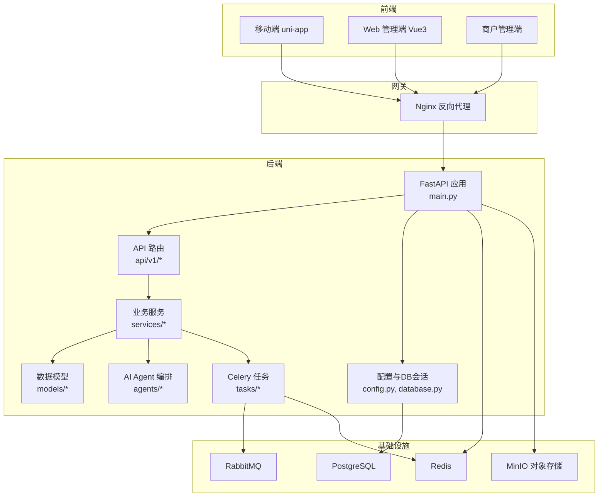
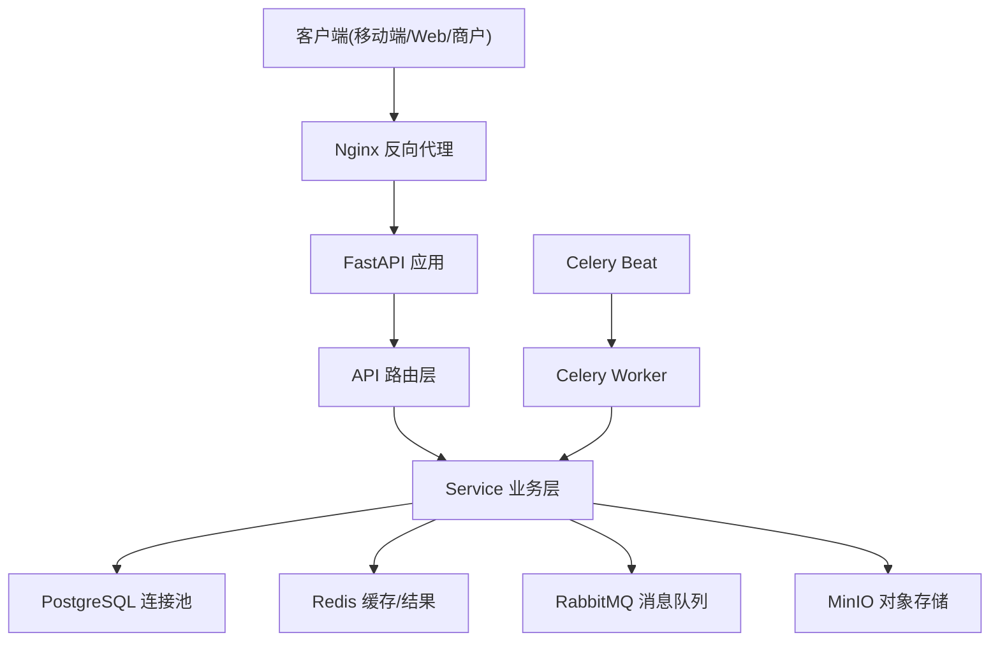
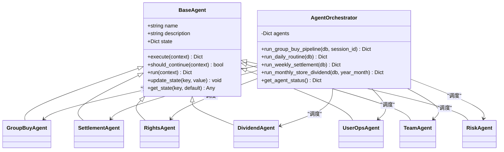
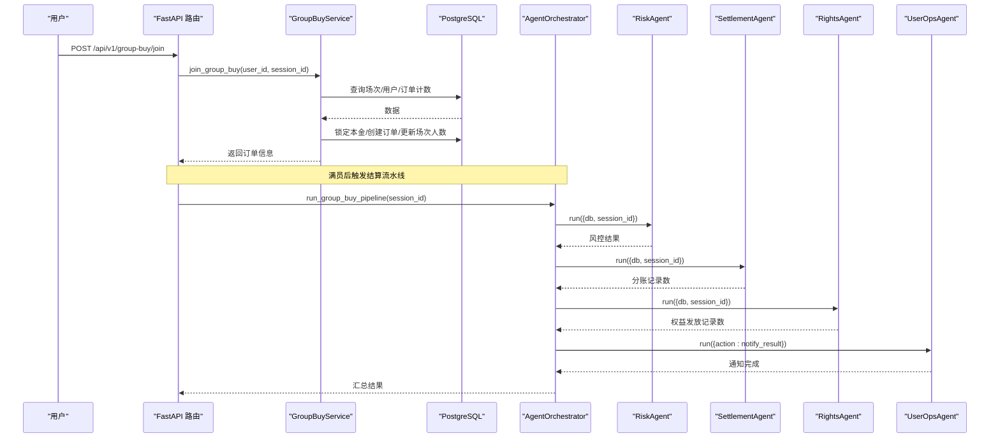
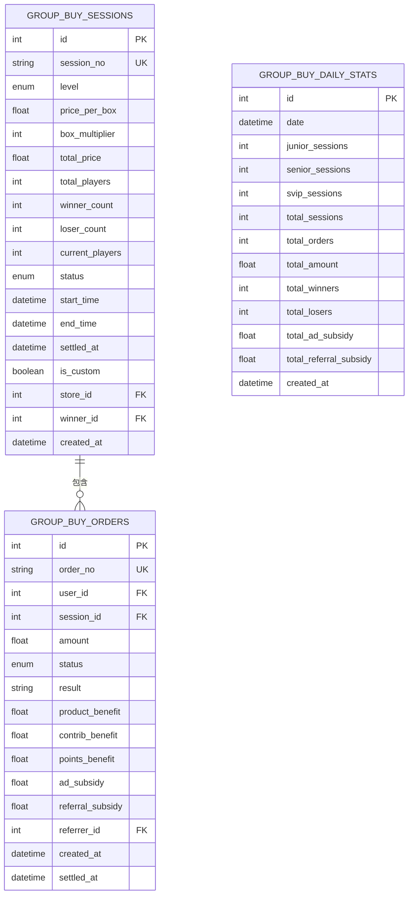
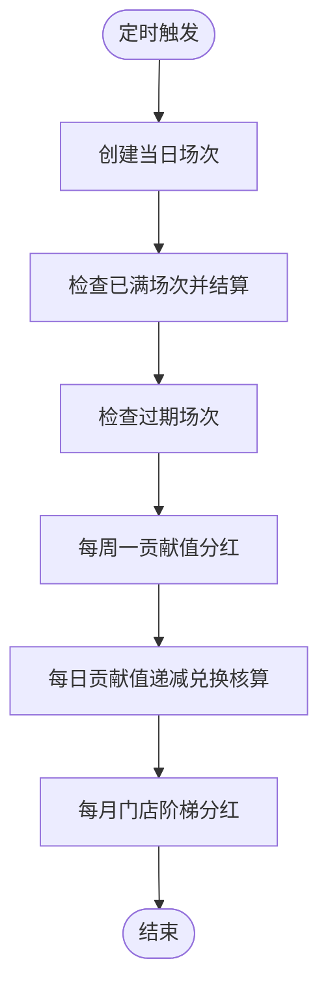
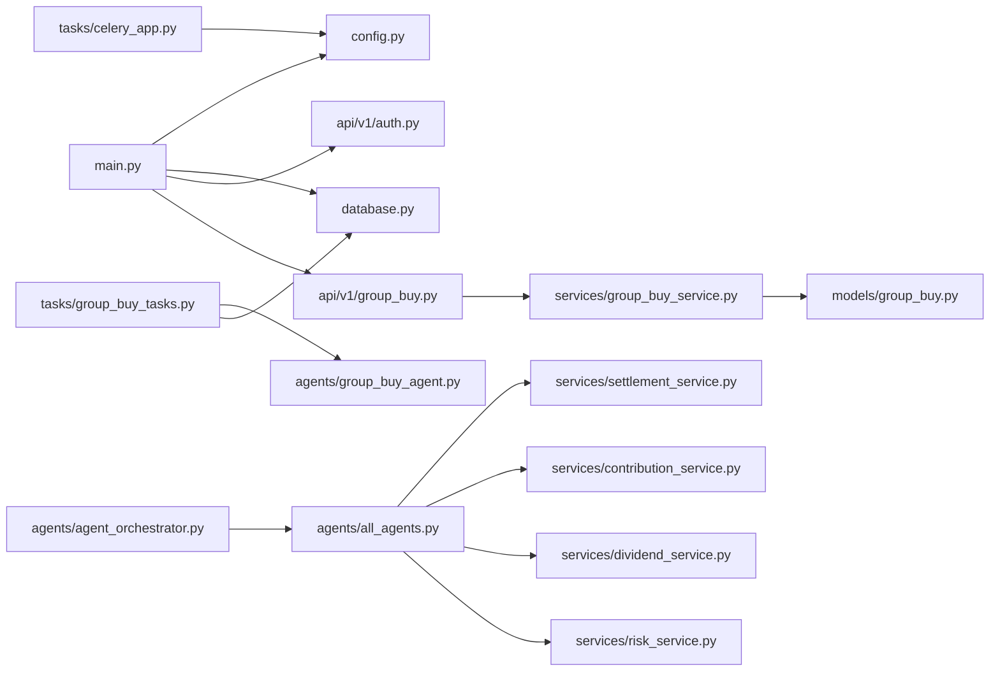

# 系统架构设计

<cite>
**本文引用的文件列表**
- [backend/app/main.py](file://backend/app/main.py)
- [backend/app/config.py](file://backend/app/config.py)
- [backend/app/database.py](file://backend/app/database.py)
- [backend/app/agents/agent_orchestrator.py](file://backend/app/agents/agent_orchestrator.py)
- [backend/app/agents/base_agent.py](file://backend/app/agents/base_agent.py)
- [backend/app/agents/all_agents.py](file://backend/app/agents/all_agents.py)
- [backend/app/agents/group_buy_agent.py](file://backend/app/agents/group_buy_agent.py)
- [backend/app/api/v1/auth.py](file://backend/app/api/v1/auth.py)
- [backend/app/services/group_buy_service.py](file://backend/app/services/group_buy_service.py)
- [backend/app/models/group_buy.py](file://backend/app/models/group_buy.py)
- [backend/app/schemas/main.py](file://backend/app/schemas/main.py)
- [backend/app/tasks/celery_app.py](file://backend/app/tasks/celery_app.py)
- [backend/app/tasks/group_buy_tasks.py](file://backend/app/tasks/group_buy_tasks.py)
- [docker-compose.yml](file://docker-compose.yml)
- [nginx.conf](file://nginx.conf)
</cite>

## 目录
1. [引言](#引言)
2. [项目结构](#项目结构)
3. [核心组件](#核心组件)
4. [架构总览](#架构总览)
5. [详细组件分析](#详细组件分析)
6. [依赖关系分析](#依赖关系分析)
7. [性能与扩展性](#性能与扩展性)
8. [故障排查指南](#故障排查指南)
9. [结论](#结论)
10. [附录](#附录)

## 引言
本文件为AIxingmu系统的全面架构设计文档，面向前后端分离的微服务化后端（FastAPI）与多前端（移动端、Web管理端、商户管理端）。系统采用分层架构（API层-Service层-Model层），结合Celery异步任务队列、PostgreSQL数据库连接池、Redis缓存与RabbitMQ消息中间件，构建高可用、可扩展的电商+拼团生态平台。同时，系统内置AI Agent编排体系，通过AgentOrchestrator调度器协调7大专业Agent完成风控、结算、权益发放、用户运营、团队分红等复杂业务流。

## 项目结构
后端采用模块化组织：
- API层：按领域划分路由模块（认证、用户、商品、拼团、贡献值、积分、消费券、门店、管理后台）
- Service层：封装核心业务逻辑（拼团、分账、权益、分红、风控、门店等）
- Model层：SQLAlchemy数据模型定义
- Agents层：基于基类抽象的AI Agent集合及编排器
- Tasks层：Celery定时任务与异步任务
- 配置与基础设施：统一配置、数据库会话、应用生命周期

图表来源
- [backend/app/main.py:1-59](file://backend/app/main.py#L1-L59)
- [backend/app/config.py:1-136](file://backend/app/config.py#L1-L136)
- [backend/app/database.py:1-40](file://backend/app/database.py#L1-L40)
- [docker-compose.yml:1-111](file://docker-compose.yml#L1-L111)
- [nginx.conf:1-39](file://nginx.conf#L1-L39)

章节来源
- [backend/app/main.py:1-59](file://backend/app/main.py#L1-L59)
- [backend/app/config.py:1-136](file://backend/app/config.py#L1-L136)
- [backend/app/database.py:1-40](file://backend/app/database.py#L1-L40)
- [docker-compose.yml:1-111](file://docker-compose.yml#L1-L111)
- [nginx.conf:1-39](file://nginx.conf#L1-L39)

## 核心组件
- FastAPI应用与生命周期管理：在启动时创建数据库表（开发阶段），关闭时释放引擎资源；注册CORS与路由；提供健康检查接口。
- 配置中心：集中管理数据库、Redis、Celery、JWT、MinIO、拼团规则、贡献值与积分策略等。
- 数据库连接池：使用asyncpg异步引擎与session工厂，提供依赖注入的会话获取方法。
- AI Agent编排器：维护7个Agent实例，编排“风控→结算→权益→通知”流水线以及日常/周度/月度任务。
- Celery任务与调度：定义每日/每小时/每周/每月定时任务，驱动Agent执行。
- 分层API-Service-Model：API仅做参数校验与路由转发，Service承载业务计算与事务边界，Model定义持久化结构。

章节来源
- [backend/app/main.py:14-59](file://backend/app/main.py#L14-L59)
- [backend/app/config.py:1-136](file://backend/app/config.py#L1-L136)
- [backend/app/database.py:10-40](file://backend/app/database.py#L10-L40)
- [backend/app/agents/agent_orchestrator.py:18-94](file://backend/app/agents/agent_orchestrator.py#L18-L94)
- [backend/app/tasks/celery_app.py:1-56](file://backend/app/tasks/celery_app.py#L1-L56)

## 架构总览
系统采用前后端分离与微服务化部署模式。Nginx作为统一入口，将请求转发至FastAPI服务；FastAPI通过依赖注入获取数据库会话，调用Service层执行业务逻辑；关键耗时操作交由Celery Worker异步处理，Beat负责定时调度；数据落库PostgreSQL，缓存与结果存储使用Redis，消息传递使用RabbitMQ；静态资源与对象存储由Nginx与MinIO承担。

图表来源
- [nginx.conf:1-39](file://nginx.conf#L1-L39)
- [backend/app/main.py:25-53](file://backend/app/main.py#L25-L53)
- [backend/app/database.py:10-21](file://backend/app/database.py#L10-L21)
- [backend/app/tasks/celery_app.py:9-21](file://backend/app/tasks/celery_app.py#L9-L21)
- [docker-compose.yml:52-96](file://docker-compose.yml#L52-L96)

## 详细组件分析

### FastAPI应用生命周期与路由注册
- 生命周期：启动时通过engine.begin创建所有表（开发环境），运行期暴露OpenAPI文档与Redoc；关闭时dispose引擎释放连接。
- CORS：允许跨域访问，便于多前端协作。
- 路由：按领域前缀注册认证、用户、商品、拼团、贡献值、积分、消费券、门店、管理后台等路由。
- 健康检查：/health返回服务状态与应用名称。

章节来源
- [backend/app/main.py:14-59](file://backend/app/main.py#L14-L59)

### 配置与基础设施
- 应用基础：名称、调试开关、API前缀。
- 数据库：URL、连接池大小与溢出上限。
- Redis：缓存与Celery结果后端。
- Celery：Broker与结果后端。
- JWT：密钥、算法、过期时间。
- MinIO：对象存储端点与桶名。
- 拼团固定参数：定价、倍数、场次人数、时间段、单组限购数量。
- 贡献值分配比例、整体让利比例、线下四级分润比例、拼团用户权益比例、平台收支分配、贡献值递减兑换规则、积分总量与通缩比例、门店阶梯分红阈值与比例。
- AI Agent：LLM API Key、Base、Model。

章节来源
- [backend/app/config.py:1-136](file://backend/app/config.py#L1-L136)

### 数据库连接与会话管理
- 使用asyncpg异步引擎创建连接池，支持并发读写。
- 提供async_session_factory用于生成AsyncSession。
- get_db依赖注入：自动提交或回滚，确保异常安全与资源释放。

章节来源
- [backend/app/database.py:10-40](file://backend/app/database.py#L10-L40)

### AI Agent编排与职责划分
- 基类BaseAgent：定义execute与should_continue抽象方法，提供run包装流程与日志记录。
- 7大Agent：
  - GroupBuyAgent：场次创建、过期检查、满员结算。
  - SettlementAgent：订单完成后按固定比例计算各方收益并写入结算记录。
  - RightsAgent：根据拼团结果计算并发放贡献值/积分/消费券。
  - DividendAgent：每周一触发全网分红与贡献值递减兑换。
  - UserOpsAgent：智能推送、规则解答、用户激活。
  - TeamAgent：统计四级团队业绩、排名与阶梯分红。
  - RiskAgent：实时监控限购、异常操作、违规开团并拦截。
- AgentOrchestrator：维护Agent字典，编排“风控→结算→权益→通知”流水线，并提供每日例行、每周一结算、月度门店分红等方法。

图表来源
- [backend/app/agents/base_agent.py:12-47](file://backend/app/agents/base_agent.py#L12-L47)
- [backend/app/agents/all_agents.py:7-114](file://backend/app/agents/all_agents.py#L7-L114)
- [backend/app/agents/agent_orchestrator.py:18-94](file://backend/app/agents/agent_orchestrator.py#L18-L94)

章节来源
- [backend/app/agents/base_agent.py:12-47](file://backend/app/agents/base_agent.py#L12-L47)
- [backend/app/agents/all_agents.py:1-114](file://backend/app/agents/all_agents.py#L1-L114)
- [backend/app/agents/agent_orchestrator.py:18-94](file://backend/app/agents/agent_orchestrator.py#L18-L94)

### 拼团业务流程与数据流
- 场次创建：每日9:50创建当日场次（每小时1场，三大板块并行）。
- 参团：校验场次状态、单组参与次数、余额充足后锁定本金并创建订单。
- 满员判定：达到31人后进入FULL状态等待结算。
- 结算：随机抽取1人拼中，其余30人失败；拼中用户获得商品权益、贡献值、积分；失败用户退回本金并获得广告补贴与推荐人补贴。
- 权益发放：通过RightsAgent调用贡献值服务生成贡献值记录。
- 分账：通过SettlementAgent按固定比例计算各方收益并写入结算记录。
- 通知：UserOpsAgent进行结果通知与用户激活。

图表来源
- [backend/app/api/v1/auth.py:14-43](file://backend/app/api/v1/auth.py#L14-L43)
- [backend/app/services/group_buy_service.py:93-321](file://backend/app/services/group_buy_service.py#L93-L321)
- [backend/app/agents/agent_orchestrator.py:32-52](file://backend/app/agents/agent_orchestrator.py#L32-L52)
- [backend/app/agents/all_agents.py:7-114](file://backend/app/agents/all_agents.py#L7-L114)

章节来源
- [backend/app/services/group_buy_service.py:28-348](file://backend/app/services/group_buy_service.py#L28-L348)
- [backend/app/agents/agent_orchestrator.py:32-85](file://backend/app/agents/agent_orchestrator.py#L32-L85)
- [backend/app/agents/all_agents.py:7-114](file://backend/app/agents/all_agents.py#L7-L114)

### 数据模型与约束
- 场次表：包含级别、价格、人数、状态、时间、是否自定义开团、拼中用户ID等字段，建立索引优化查询。
- 订单表：关联用户与场次，记录金额、状态、结果、权益与补贴明细、推荐人信息，建立复合索引提升查询效率。
- 每日统计表：聚合各级别场次、交易量、补贴支出等指标。

图表来源
- [backend/app/models/group_buy.py:42-158](file://backend/app/models/group_buy.py#L42-L158)

章节来源
- [backend/app/models/group_buy.py:1-158](file://backend/app/models/group_buy.py#L1-L158)

### 认证与鉴权
- 注册：校验手机号唯一性，哈希密码，创建用户并返回JWT。
- 登录：校验手机号与密码，签发JWT。
- 依赖注入：通过get_db获取数据库会话，保证事务一致性。

章节来源
- [backend/app/api/v1/auth.py:14-43](file://backend/app/api/v1/auth.py#L14-L43)
- [backend/app/database.py:29-40](file://backend/app/database.py#L29-L40)

### 异步任务与定时调度
- Celery应用：配置broker与结果后端，设置时区与序列化格式。
- 定时任务：
  - 每日9:50创建当日场次
  - 每小时第5分钟检查并结算已满场次
  - 每日23:00检查过期场次
  - 每周一凌晨2:00执行贡献值分红
  - 每日凌晨3:00执行贡献值递减兑换核算
  - 每月1日凌晨1:00执行门店月度排名与分红
- 任务实现：在同步Celery任务中运行异步代码，使用事件循环桥接。

图表来源
- [backend/app/tasks/celery_app.py:24-55](file://backend/app/tasks/celery_app.py#L24-L55)
- [backend/app/tasks/group_buy_tasks.py:17-54](file://backend/app/tasks/group_buy_tasks.py#L17-L54)

章节来源
- [backend/app/tasks/celery_app.py:1-56](file://backend/app/tasks/celery_app.py#L1-L56)
- [backend/app/tasks/group_buy_tasks.py:1-54](file://backend/app/tasks/group_buy_tasks.py#L1-L54)

### 网关与部署拓扑
- Nginx：统一端口80暴露，/api/代理到后端，预留WebSocket与静态资源路径。
- Docker Compose：编排PostgreSQL、Redis、RabbitMQ、MinIO、后端服务、Celery Worker与Beat、Nginx，声明依赖与健康检查。

章节来源
- [nginx.conf:1-39](file://nginx.conf#L1-L39)
- [docker-compose.yml:1-111](file://docker-compose.yml#L1-L111)

## 依赖关系分析
- 组件耦合：
  - API层依赖Service层，Service层依赖Model层与外部基础设施（DB、Redis、RabbitMQ、MinIO）。
  - Agent编排器依赖各Agent实现，Agent内部调用Service层完成具体业务。
  - Celery任务通过事件循环桥接异步代码，复用Service与Agent能力。
- 直接依赖：
  - main.py → config.py、database.py、api/v1/*
  - agent_orchestrator.py → all_agents.py、group_buy_agent.py
  - celery_app.py → config.py
  - group_buy_tasks.py → group_buy_agent.py、database.py
- 潜在循环：
  - 当前未见明显循环导入；建议保持Agent与Service单向依赖。

图表来源
- [backend/app/main.py:25-53](file://backend/app/main.py#L25-L53)
- [backend/app/agents/agent_orchestrator.py:22-30](file://backend/app/agents/agent_orchestrator.py#L22-L30)
- [backend/app/agents/all_agents.py:7-114](file://backend/app/agents/all_agents.py#L7-L114)
- [backend/app/tasks/celery_app.py:9-21](file://backend/app/tasks/celery_app.py#L9-L21)
- [backend/app/tasks/group_buy_tasks.py:17-54](file://backend/app/tasks/group_buy_tasks.py#L17-L54)

章节来源
- [backend/app/main.py:25-53](file://backend/app/main.py#L25-L53)
- [backend/app/agents/agent_orchestrator.py:22-30](file://backend/app/agents/agent_orchestrator.py#L22-L30)
- [backend/app/agents/all_agents.py:7-114](file://backend/app/agents/all_agents.py#L7-L114)
- [backend/app/tasks/celery_app.py:9-21](file://backend/app/tasks/celery_app.py#L9-L21)
- [backend/app/tasks/group_buy_tasks.py:17-54](file://backend/app/tasks/group_buy_tasks.py#L17-L54)

## 性能与扩展性
- 数据库连接池：通过pool_size与max_overflow控制并发连接，避免连接耗尽；生产环境建议使用Alembic迁移替代启动建表。
- 异步I/O：FastAPI与asyncpg组合提升吞吐；Celery Worker独立进程处理耗时任务，降低主线程阻塞。
- 缓存策略：Redis用于热点数据缓存与任务结果存储；建议在Service层增加读路径缓存与写失效策略。
- 消息队列：RabbitMQ解耦任务生产者与消费者，提高系统弹性与容错。
- 水平扩展：多实例部署后端与Worker，Nginx负载均衡；按业务拆分微服务（如支付、风控、通知）可进一步提升隔离性与扩展性。
- 存储优化：MinIO用于图片与附件；对高频读取场景可引入CDN加速。

[本节为通用指导，不直接分析具体文件]

## 故障排查指南
- 健康检查：访问/health确认服务状态与名称。
- 数据库连接：检查DATABASE_URL、连接池参数与PostgreSQL健康状态。
- Redis/RabbitMQ：确认端口连通性与凭据配置，查看Celery Worker日志。
- 任务失败：检查Celery Beat调度与Worker消费情况，定位任务异常堆栈。
- 权限与鉴权：验证JWT密钥与过期时间，确认CORS配置满足前端域名。
- 对象存储：核对MinIO端点、凭据与桶名，测试上传下载。

章节来源
- [backend/app/main.py:56-59](file://backend/app/main.py#L56-L59)
- [backend/app/config.py:16-41](file://backend/app/config.py#L16-L41)
- [docker-compose.yml:52-96](file://docker-compose.yml#L52-L96)

## 结论
AIxingmu系统以FastAPI为核心，结合分层架构与AI Agent编排，构建了高内聚、低耦合的后端体系。通过Celery异步任务与RabbitMQ消息队列，系统具备良好扩展性与稳定性；PostgreSQL与Redis的组合保障数据一致性与高性能访问；Nginx与Docker Compose简化部署与运维。未来可在微服务拆分、缓存策略细化、监控告警完善等方面持续演进。

[本节为总结，不直接分析具体文件]

## 附录
- API版本前缀：/api/v1
- OpenAPI文档：/api/docs
- Redoc文档：/api/redoc
- 健康检查：/health

章节来源
- [backend/app/main.py:25-59](file://backend/app/main.py#L25-L59)