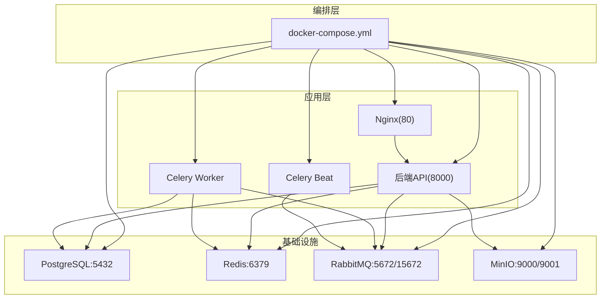
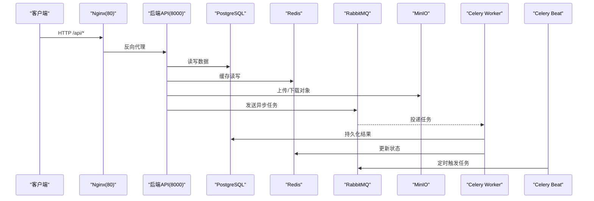
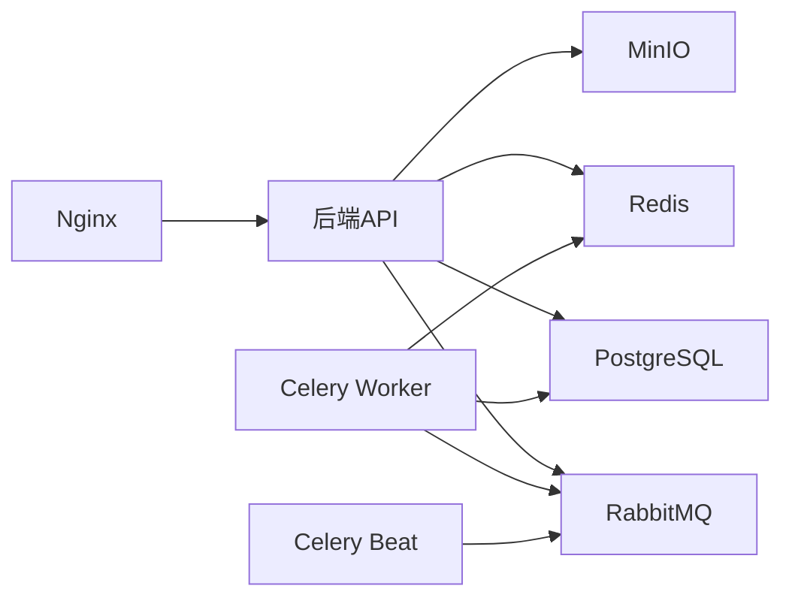

# Docker容器化部署

<cite>
**本文引用的文件**
- [docker-compose.yml](file://docker-compose.yml)
- [backend/Dockerfile](file://backend/Dockerfile)
- [nginx.conf](file://nginx.conf)
- [backend/app/config.py](file://backend/app/config.py)
- [backend/requirements.txt](file://backend/requirements.txt)
- [backend/app/main.py](file://backend/app/main.py)
- [backend/app/database.py](file://backend/app/database.py)
- [backend/app/tasks/celery_app.py](file://backend/app/tasks/celery_app.py)
</cite>

## 目录
1. [简介](#简介)
2. [项目结构](#项目结构)
3. [核心组件](#核心组件)
4. [架构总览](#架构总览)
5. [详细组件分析](#详细组件分析)
6. [依赖关系分析](#依赖关系分析)
7. [性能与优化](#性能与优化)
8. [故障排查指南](#故障排查指南)
9. [结论](#结论)
10. [附录](#附录)

## 简介
本文件面向AIxingmu项目的Docker容器化部署，围绕docker-compose编排、后端API服务、Celery Worker与Beat、Nginx反向代理以及PostgreSQL、Redis、RabbitMQ、MinIO等基础设施进行系统化说明。文档同时给出镜像构建优化策略、数据持久化方案、网络与环境变量管理、健康检查设置，以及生产环境最佳实践（资源限制、安全加固、日志收集）。

## 项目结构
仓库采用前后端分离与多服务编排：
- 后端Python应用位于backend目录，包含FastAPI入口、数据库连接、配置、任务调度与业务模块。
- docker-compose.yml统一编排所有服务（数据库、缓存、消息队列、对象存储、后端、Worker、Beat、Nginx）。
- nginx.conf提供反向代理与静态资源预留位置。

图表来源
- [docker-compose.yml:1-111](file://docker-compose.yml#L1-L111)
- [nginx.conf:1-39](file://nginx.conf#L1-L39)

章节来源
- [docker-compose.yml:1-111](file://docker-compose.yml#L1-L111)
- [nginx.conf:1-39](file://nginx.conf#L1-L39)

## 核心组件
- 数据库：PostgreSQL 16-alpine，暴露5432端口，卷挂载pgdata持久化，内置健康检查。
- 缓存：Redis 7-alpine，暴露6379端口，卷挂载redisdata持久化。
- 消息队列：RabbitMQ 3-management-alpine，暴露5672与15672端口，默认用户guest/guest。
- 对象存储：MinIO，暴露9000（API）与9001（控制台），卷挂载miniodata持久化。
- 后端API：基于FastAPI+Uvicorn，暴露8000端口，依赖PG/Redis/RabbitMQ启动顺序。
- Celery Worker：消费RabbitMQ任务，结果写入Redis。
- Celery Beat：定时调度任务到RabbitMQ。
- Nginx：反向代理将/api/转发至后端，预留WebSocket与静态资源路径。

章节来源
- [docker-compose.yml:1-111](file://docker-compose.yml#L1-L111)
- [backend/app/main.py:1-59](file://backend/app/main.py#L1-L59)
- [backend/app/database.py:1-40](file://backend/app/database.py#L1-L40)
- [backend/app/tasks/celery_app.py:1-56](file://backend/app/tasks/celery_app.py#L1-L56)
- [nginx.conf:1-39](file://nginx.conf#L1-L39)

## 架构总览
下图展示请求从Nginx进入，经后端API处理，访问数据库、缓存、消息队列与对象存储的完整链路；同时体现Celery Worker与Beat的任务执行流程。

图表来源
- [nginx.conf:1-39](file://nginx.conf#L1-L39)
- [docker-compose.yml:1-111](file://docker-compose.yml#L1-L111)
- [backend/app/main.py:1-59](file://backend/app/main.py#L1-L59)
- [backend/app/database.py:1-40](file://backend/app/database.py#L1-L40)
- [backend/app/tasks/celery_app.py:1-56](file://backend/app/tasks/celery_app.py#L1-L56)

## 详细组件分析

### 服务编排与网络
- 服务定义：在docker-compose中声明postgres、redis、rabbitmq、minio、backend、celery-worker、celery-beat、nginx等服务。
- 端口映射：对外暴露80(Nginx)、5432(Postgres)、6379(Redis)、5672/15672(RabbitMQ)、9000/9001(MinIO)、8000(后端)。
- 依赖与启动顺序：
  - backend依赖postgres健康、redis与rabbitmq已启动。
  - celery-worker依赖backend、rabbitmq、redis。
  - celery-beat依赖backend、rabbitmq。
  - nginx依赖backend。
- 内部通信：通过Compose默认bridge网络，使用服务名作为主机名（如postgres、redis、rabbitmq、minio）。

章节来源
- [docker-compose.yml:1-111](file://docker-compose.yml#L1-L111)

### 数据持久化与备份
- 卷挂载：
  - pgdata:/var/lib/postgresql/data
  - redisdata:/data
  - miniodata:/data
- 建议备份策略：
  - PostgreSQL：定期pg_dump或逻辑备份工具导出SQL；结合宿主机定时任务或外部备份系统。
  - Redis：启用AOF/RDB持久化并定期拷贝dump.rdb或aof文件。
  - MinIO：对miniodata目录进行快照或对象级备份（如rclone同步至异地存储）。

章节来源
- [docker-compose.yml:1-111](file://docker-compose.yml#L1-L111)

### 环境变量与配置管理
- 应用配置集中读取自app/config.py，支持从.env或环境变量注入。
- 关键环境变量：
  - DATABASE_URL、REDIS_URL、CELERY_BROKER_URL、CELERY_RESULT_BACKEND
  - MINIO_ENDPOINT、MINIO_ACCESS_KEY、MINIO_SECRET_KEY、MINIO_BUCKET
  - SECRET_KEY、CORS_ORIGINS等
- 在docker-compose中为各服务注入对应环境变量，确保运行时连通性与鉴权一致。

章节来源
- [backend/app/config.py:1-136](file://backend/app/config.py#L1-L136)
- [docker-compose.yml:1-111](file://docker-compose.yml#L1-L111)

### 健康检查与就绪探针
- PostgreSQL：使用pg_isready命令进行健康检查。
- 后端API：提供/health端点返回服务状态。
- 建议：
  - 在生产环境中增加readiness/liveness探针（若使用Kubernetes或编排平台支持）。
  - 对Redis、RabbitMQ、MinIO可补充自定义健康检查脚本。

章节来源
- [docker-compose.yml:1-111](file://docker-compose.yml#L1-L111)
- [backend/app/main.py:1-59](file://backend/app/main.py#L1-L59)

### 反向代理与路由
- Nginx将/api/路径代理至后端8000端口，并传递Host、X-Real-IP、X-Forwarded-For、X-Forwarded-Proto头。
- 预留/ws/用于WebSocket升级。
- 预留/用于前端静态资源托管。

章节来源
- [nginx.conf:1-39](file://nginx.conf#L1-L39)

### 后端API服务
- 入口：FastAPI应用，注册多个业务路由前缀/api/v1。
- 生命周期：启动时创建数据库表（开发阶段），关闭时释放引擎。
- CORS：允许跨域来源列表。
- 健康检查：/health返回服务名称与状态。

章节来源
- [backend/app/main.py:1-59](file://backend/app/main.py#L1-L59)

### 数据库连接与会话管理
- 使用asyncpg与SQLAlchemy异步引擎，池大小与溢出参数由配置控制。
- 提供get_db依赖注入函数，自动提交/回滚与关闭会话。

章节来源
- [backend/app/database.py:1-40](file://backend/app/database.py#L1-L40)

### Celery Worker与Beat
- Worker：消费RabbitMQ中的任务，结果写入Redis。
- Beat：按crontab调度任务，包括每日拼团场次创建、结算、过期检查、贡献值分红与兑换核算、门店月度排名与分红等。
- 时区：Asia/Shanghai，UTC开关与序列化格式均为JSON。

章节来源
- [backend/app/tasks/celery_app.py:1-56](file://backend/app/tasks/celery_app.py#L1-L56)
- [docker-compose.yml:1-111](file://docker-compose.yml#L1-L111)

### 镜像构建与运行
- 基础镜像：python:3.11-slim。
- 工作目录：/app。
- 依赖安装：复制requirements.txt并安装，使用国内源加速。
- 应用代码：复制整个backend目录。
- 暴露端口：8000。
- 启动命令：uvicorn app.main:app，监听0.0.0.0:8000，开启reload（开发模式）。

章节来源
- [backend/Dockerfile:1-13](file://backend/Dockerfile#L1-L13)
- [backend/requirements.txt:1-34](file://backend/requirements.txt#L1-34)

## 依赖关系分析
- 服务间依赖：
  - backend -> postgres(健康), redis, rabbitmq
  - celery-worker -> backend, rabbitmq, redis
  - celery-beat -> backend, rabbitmq
  - nginx -> backend
- 运行时依赖：
  - 后端依赖数据库连接池、Redis缓存、RabbitMQ消息通道、MinIO对象存储。
  - Celery依赖RabbitMQ与Redis。

图表来源
- [docker-compose.yml:1-111](file://docker-compose.yml#L1-L111)

章节来源
- [docker-compose.yml:1-111](file://docker-compose.yml#L1-L111)

## 性能与优化

### 镜像构建优化策略
- 多阶段构建：
  - 第一阶段：安装编译型依赖（如cryptography、bcrypt等），生成wheel缓存。
  - 第二阶段：仅复制运行时所需二进制与依赖，减小最终镜像体积。
- 依赖缓存：
  - 先COPY requirements.txt并安装，利用Docker层缓存避免重复安装。
  - 使用国内镜像源提升拉取速度。
- 层优化：
  - 合并RUN指令减少层数。
  - 清理pip缓存与临时文件。
  - 使用.dockerignore排除无关文件（测试、文档、本地配置等）。
- 安全基线：
  - 选择更小的基础镜像（如slim或distroless变体）。
  - 非root用户运行应用。

章节来源
- [backend/Dockerfile:1-13](file://backend/Dockerfile#L1-L13)
- [backend/requirements.txt:1-34](file://backend/requirements.txt#L1-34)

### 数据持久化与高可用
- 卷挂载：
  - 为PostgreSQL、Redis、MinIO分别挂载独立卷，保障重启不丢数据。
- 备份策略：
  - 定期导出数据库与对象存储快照。
  - 将备份文件迁移至异地存储或云盘。
- 高可用建议：
  - 数据库主从或集群（如PostgreSQL Patroni）。
  - Redis哨兵或集群模式。
  - RabbitMQ镜像队列或集群。
  - MinIO分布式部署。

章节来源
- [docker-compose.yml:1-111](file://docker-compose.yml#L1-L111)

### 容器网络与域名解析
- 默认bridge网络下，服务名即DNS名称（如postgres、redis、rabbitmq、minio）。
- 如需跨主机或复杂拓扑，可使用自定义网络并指定子网与网关。

章节来源
- [docker-compose.yml:1-111](file://docker-compose.yml#L1-L111)

### 环境变量管理
- 使用docker-compose的环境变量注入方式统一管理敏感信息。
- 生产环境建议使用密钥管理系统（如Vault、云平台Secrets）注入，避免硬编码。

章节来源
- [backend/app/config.py:1-136](file://backend/app/config.py#L1-L136)
- [docker-compose.yml:1-111](file://docker-compose.yml#L1-L111)

### 健康检查与监控
- 服务健康：
  - PostgreSQL使用pg_isready。
  - 后端提供/health端点。
- 监控建议：
  - 集成Prometheus/Grafana采集指标。
  - 记录结构化日志并集中收集（ELK/Loki）。

章节来源
- [docker-compose.yml:1-111](file://docker-compose.yml#L1-L111)
- [backend/app/main.py:1-59](file://backend/app/main.py#L1-L59)

### 生产环境最佳实践
- 资源限制：
  - 为每个服务设置CPU与内存上限，防止单点资源争用。
- 安全配置：
  - 修改默认口令（RabbitMQ、MinIO、PostgreSQL）。
  - 最小权限原则，仅开放必要端口。
  - 启用TLS终止于Nginx，后端仅内网通信。
- 日志收集：
  - 使用json格式输出，统一采集到日志系统。
  - 按服务与级别分级存储，便于检索与告警。

章节来源
- [docker-compose.yml:1-111](file://docker-compose.yml#L1-L111)
- [nginx.conf:1-39](file://nginx.conf#L1-L39)

## 故障排查指南
- 数据库连接失败：
  - 检查DATABASE_URL是否正确，确认PostgreSQL服务健康与端口可达。
  - 查看后端日志与数据库错误日志定位认证或网络问题。
- Redis不可用：
  - 确认REDIS_URL与端口，检查Redis服务是否启动与密码配置。
- RabbitMQ连接异常：
  - 核对CELERY_BROKER_URL与用户凭据，确认5672端口开放。
  - 使用15672管理界面检查队列与消费者状态。
- MinIO访问失败：
  - 校验MINIO_ENDPOINT、ACCESS_KEY、SECRET_KEY与桶名。
  - 通过9001控制台验证桶与对象是否存在。
- 任务未执行：
  - 检查Celery Worker与Beat是否启动，查看其日志。
  - 确认beat_schedule任务名与任务模块路径一致。
- 反向代理问题：
  - 检查Nginx配置与upstream指向，确认后端8000端口可访问。
  - 查看Nginx错误日志与后端响应码。

章节来源
- [docker-compose.yml:1-111](file://docker-compose.yml#L1-L111)
- [backend/app/tasks/celery_app.py:1-56](file://backend/app/tasks/celery_app.py#L1-L56)
- [nginx.conf:1-39](file://nginx.conf#L1-L39)

## 结论
本项目通过docker-compose实现了完整的微服务编排，涵盖数据库、缓存、消息队列、对象存储与应用服务。配合Nginx反向代理与健康检查，具备较好的开发与测试体验。生产环境需重点完善镜像构建优化、数据持久化与备份、安全加固、资源限制与日志监控，以确保稳定性与可维护性。

## 附录

### 常用命令参考
- 启动所有服务：docker compose up -d
- 查看服务状态：docker compose ps
- 查看服务日志：docker compose logs -f <service_name>
- 停止并清理：docker compose down -v（谨慎删除卷）

章节来源
- [docker-compose.yml:1-111](file://docker-compose.yml#L1-L111)