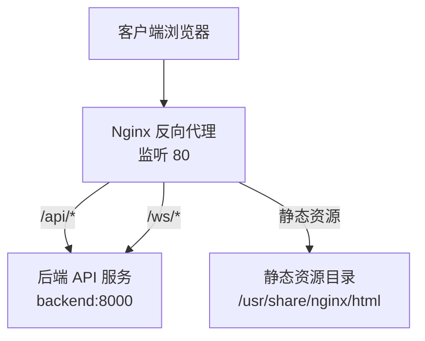
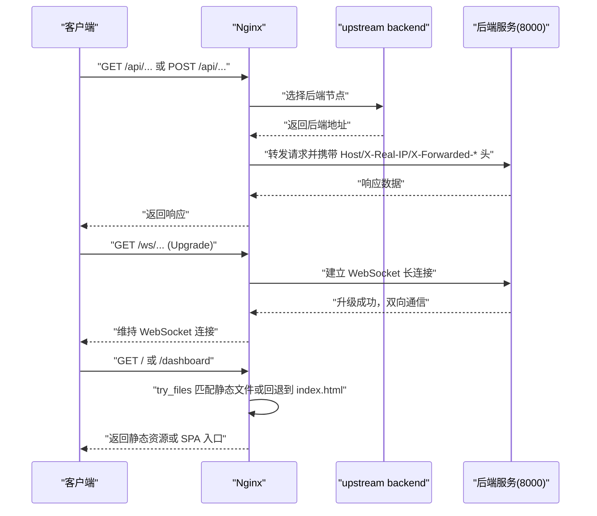
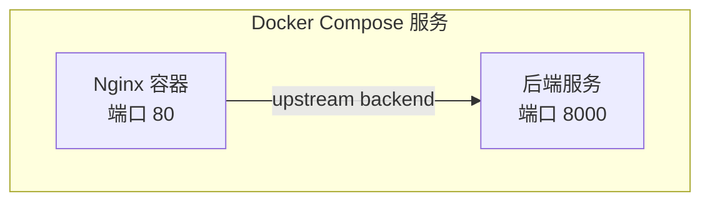

# Nginx反向代理配置

<cite>
**本文引用的文件**   
- [nginx.conf](file://nginx.conf)
- [docker-compose.yml](file://docker-compose.yml)
- [web-admin 路由配置](file://frontend/web-admin/src/router/index.ts)
- [merchant-admin 路由配置](file://frontend/merchant-admin/src/router/index.ts)
</cite>

## 目录
1. [简介](#简介)
2. [项目结构](#项目结构)
3. [核心组件](#核心组件)
4. [架构总览](#架构总览)
5. [详细组件分析](#详细组件分析)
6. [依赖关系分析](#依赖关系分析)
7. [性能考虑](#性能考虑)
8. [故障排查指南](#故障排查指南)
9. [结论](#结论)
10. [附录](#附录)

## 简介
本文件为 AIxingmu 项目的 Nginx 反向代理配置文档，基于仓库中的 nginx.conf 与 docker-compose.yml 进行解析与扩展说明。内容涵盖：
- 静态资源服务、API 请求转发、WebSocket 支持
- SSL 证书配置（建议方案）
- 负载均衡策略、请求限流、缓存配置（建议方案）
- 前端应用路由部署（Vue3 管理后台与移动端）
- Gzip 压缩、HTTP/2 支持、安全头配置（建议方案）
- 日志格式、访问日志轮转、错误页面定制（建议方案）
- 性能调优参数（worker 进程数、连接池大小、缓冲区等，建议方案）

## 项目结构
当前与 Nginx 相关的核心文件：
- nginx.conf：Nginx 主配置文件，包含事件模型、HTTP 块、上游后端、Server 块及 location 规则
- docker-compose.yml：编排 Nginx 容器，映射端口 80，挂载 nginx.conf 到容器内路径
- 前端路由：web-admin 与 merchant-admin 使用 history 模式，需要 Nginx 将未知路径回退到 index.html

图示来源
- [nginx.conf:5-38](file://nginx.conf#L5-L38)
- [docker-compose.yml:97-106](file://docker-compose.yml#L97-L106)

章节来源
- [nginx.conf:1-38](file://nginx.conf#L1-L38)
- [docker-compose.yml:97-106](file://docker-compose.yml#L97-L106)

## 核心组件
- 事件模型与连接上限
  - events.worker_connections：单 worker 最大并发连接数
- HTTP 模块
  - upstream backend：定义后端服务集群（当前仅一个节点）
  - server：监听端口与域名
  - location /api/：API 反向代理，设置必要请求头
  - location /ws/：WebSocket 代理，启用 Upgrade 与 Connection 头
  - location /：静态资源根目录与 SPA 回退规则
- Docker 集成
  - 通过 volumes 将宿主机 nginx.conf 以只读方式挂载至容器
  - 暴露 80 端口供外部访问

章节来源
- [nginx.conf:1-38](file://nginx.conf#L1-L38)
- [docker-compose.yml:97-106](file://docker-compose.yml#L97-L106)

## 架构总览
下图展示了从客户端到后端的完整请求链路，以及静态资源与 WebSocket 的分支处理。

图示来源
- [nginx.conf:14-36](file://nginx.conf#L14-L36)

## 详细组件分析

### API 反向代理
- 作用：将 /api/ 前缀的请求转发到后端服务
- 关键行为：
  - proxy_pass 指向 upstream backend
  - 传递 Host、X-Real-IP、X-Forwarded-For、X-Forwarded-Proto 等头部，便于后端识别真实客户端信息与协议
- 适用场景：RESTful API、GraphQL、文件上传等

章节来源
- [nginx.conf:14-21](file://nginx.conf#L14-L21)

### WebSocket 代理
- 作用：支持 /ws/ 前缀的 WebSocket 长连接
- 关键行为：
  - 设置 HTTP/1.1 版本
  - 透传 Upgrade 与 Connection 头完成协议升级
- 适用场景：实时消息、在线协作、推送通知

章节来源
- [nginx.conf:23-29](file://nginx.conf#L23-L29)

### 静态资源与 SPA 路由
- 作用：提供静态资源并支持 Vue Router History 模式
- 关键行为：
  - root 指定静态资源根目录
  - index 指定默认首页
  - try_files 优先匹配实际文件/目录，不存在则回退到 /index.html
- 前端路由要求：
  - web-admin 与 merchant-admin 均使用 createWebHistory()，需 Nginx 回退到 index.html

章节来源
- [nginx.conf:31-36](file://nginx.conf#L31-L36)
- [web-admin 路由配置:22-25](file://frontend/web-admin/src/router/index.ts#L22-L25)
- [merchant-admin 路由配置:23-26](file://frontend/merchant-admin/src/router/index.ts#L23-L26)

### 负载均衡策略
- 现状：upstream backend 仅包含单一后端节点
- 扩展建议：
  - 添加多个后端实例以实现水平扩展
  - 可配置权重、健康检查、失败重试等策略（按业务需求）

章节来源
- [nginx.conf:5-8](file://nginx.conf#L5-L8)

### SSL 证书配置（建议方案）
- 目标：启用 HTTPS，强制重定向 HTTP 到 HTTPS
- 建议要点：
  - 在独立的 server 块中监听 443，配置 ssl_certificate 与 ssl_certificate_key
  - 在 80 端口的 server 块中对所有非 /api/ 与 /ws/ 的请求执行 301 重定向到 https://
  - 开启现代 TLS 套件与 HSTS（根据合规与安全策略）

[本节为概念性建议，不直接分析具体代码文件]

### 请求限流（建议方案）
- 目标：防止恶意刷接口与突发流量冲击
- 建议要点：
  - 使用 limit_req_zone 定义共享内存区域与速率限制
  - 在 location /api/ 中使用 limit_req 对特定路径限速
  - 结合 limit_conn_zone 限制每 IP 的连接数

[本节为概念性建议，不直接分析具体代码文件]

### 缓存配置（建议方案）
- 目标：提升静态资源与部分 API 的响应速度
- 建议要点：
  - 针对静态资源（js/css/img）设置 long-lived Cache-Control 与 ETag
  - 对只读 API 使用 proxy_cache 与 key 控制缓存粒度
  - 注意区分开发环境与生产环境的缓存策略

[本节为概念性建议，不直接分析具体代码文件]

### Gzip 压缩（建议方案）
- 目标：减少传输体积，提升加载速度
- 建议要点：
  - 启用 gzip 并配置压缩级别与最小长度
  - 对常见文本类型（text/html, application/json, text/css, application/javascript）启用压缩
  - 谨慎对图片等已压缩资源重复压缩

[本节为概念性建议，不直接分析具体代码文件]

### HTTP/2 支持（建议方案）
- 目标：在多路复用、头部压缩等方面提升性能
- 建议要点：
  - 在 443 端口启用 http2
  - 配合现代 TLS 与合适的 cipher suites
  - 注意浏览器兼容性与降级策略

[本节为概念性建议，不直接分析具体代码文件]

### 安全头配置（建议方案）
- 目标：增强站点安全性
- 建议要点：
  - 设置 X-Frame-Options、X-Content-Type-Options、Referrer-Policy、Permissions-Policy 等
  - 启用 Strict-Transport-Security（HSTS）
  - 过滤危险请求方法与敏感路径访问

[本节为概念性建议，不直接分析具体代码文件]

### 日志格式与轮转（建议方案）
- 目标：便于问题定位与审计
- 建议要点：
  - 自定义 log_format 记录关键信息（请求时间、上游耗时、状态码、UA 等）
  - 使用 access_log 与 error_log 输出到不同文件
  - 结合系统工具（如 logrotate）实现日志轮转与保留策略

[本节为概念性建议，不直接分析具体代码文件]

### 错误页面定制（建议方案）
- 目标：提升用户体验与品牌一致性
- 建议要点：
  - 配置 404、502、503、504 等错误页
  - 对于 SPA，除 /api/ 与 /ws/ 外，其他错误尽量回退到 index.html 或由前端统一处理

[本节为概念性建议，不直接分析具体代码文件]

### 前端应用部署与路由适配
- 管理后台（web-admin）
  - 使用 history 模式，需 Nginx 将未知路径回退到 index.html
  - 构建产物放置于 /usr/share/nginx/html 下
- 门店管理（merchant-admin）
  - 同样使用 history 模式，部署方式同上
- 移动端应用（uni-app）
  - 若采用 H5 发布，构建产物同样放入静态目录并由 Nginx 托管

章节来源
- [web-admin 路由配置:22-25](file://frontend/web-admin/src/router/index.ts#L22-L25)
- [merchant-admin 路由配置:23-26](file://frontend/merchant-admin/src/router/index.ts#L23-L26)
- [nginx.conf:31-36](file://nginx.conf#L31-L36)

## 依赖关系分析
Nginx 与后端服务的依赖关系由 docker-compose 编排，Nginx 通过 upstream 名称解析到后端容器。

图示来源
- [docker-compose.yml:97-106](file://docker-compose.yml#L97-L106)
- [docker-compose.yml:52-71](file://docker-compose.yml#L52-L71)
- [nginx.conf:5-8](file://nginx.conf#L5-L8)

章节来源
- [docker-compose.yml:97-106](file://docker-compose.yml#L97-L106)
- [docker-compose.yml:52-71](file://docker-compose.yml#L52-L71)
- [nginx.conf:5-8](file://nginx.conf#L5-L8)

## 性能考虑
以下为通用优化建议，可根据实际负载与硬件条件调整：
- worker 进程数：通常设置为 CPU 核心数或 2×核心数
- worker_connections：适当提高以应对高并发
- keepalive 连接：在后端与 Nginx 之间启用 keepalive 以减少握手开销
- 缓冲区与超时：合理设置 proxy_buffer_size、proxy_buffers、proxy_read_timeout 等
- 静态资源：启用缓存与压缩，使用 CDN 加速
- 日志：生产环境降低日志级别，避免频繁 I/O 影响性能

[本节为通用指导，不直接分析具体代码文件]

## 故障排查指南
- 无法访问后端 API
  - 检查 upstream 名称与后端服务是否可达
  - 确认 docker-compose 中后端服务端口与容器名一致
  - 查看 Nginx 错误日志与后端服务日志
- WebSocket 连接失败
  - 确认 /ws/ location 是否正确配置 Upgrade 与 Connection 头
  - 检查后端是否支持 WebSocket 且路径匹配
- SPA 刷新 404
  - 确认 try_files 规则生效，确保回退到 index.html
  - 检查静态资源目录挂载与权限
- 性能瓶颈
  - 监控 Nginx 状态与后端 QPS、延迟
  - 评估 worker_connections 与后端连接池是否不足

章节来源
- [nginx.conf:14-36](file://nginx.conf#L14-L36)
- [docker-compose.yml:97-106](file://docker-compose.yml#L97-L106)

## 结论
当前 nginx.conf 提供了基础的 API 反向代理、WebSocket 支持与 SPA 静态资源托管能力，并通过 docker-compose 完成容器化编排。建议在现有基础上逐步引入 SSL、限流、缓存、Gzip、HTTP/2、安全头、日志与错误页等增强特性，以满足生产环境的安全与性能要求。

## 附录
- 相关前端路由文件路径参考：
  - [web-admin 路由配置](file://frontend/web-admin/src/router/index.ts)
  - [merchant-admin 路由配置](file://frontend/merchant-admin/src/router/index.ts)