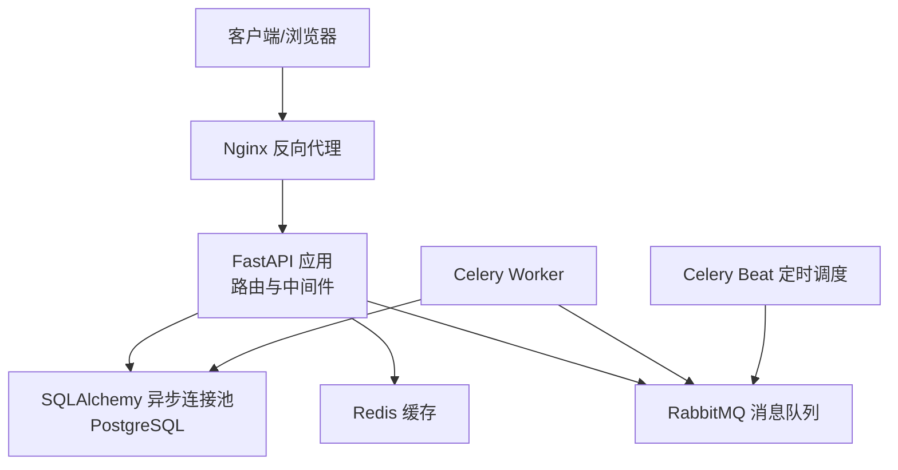
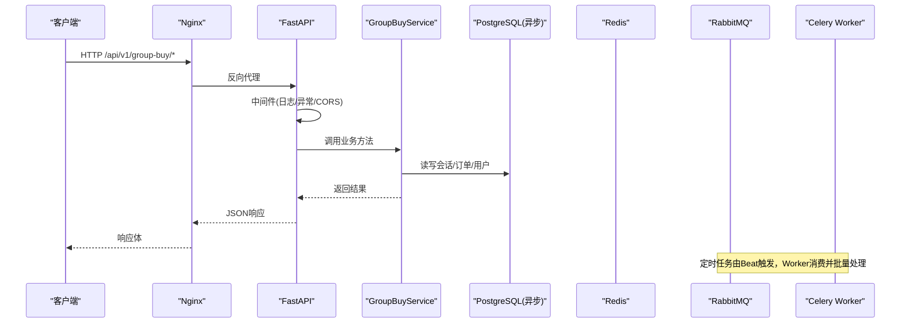
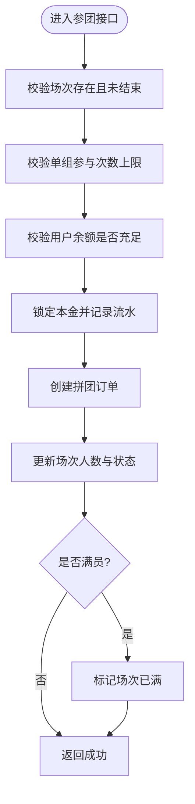
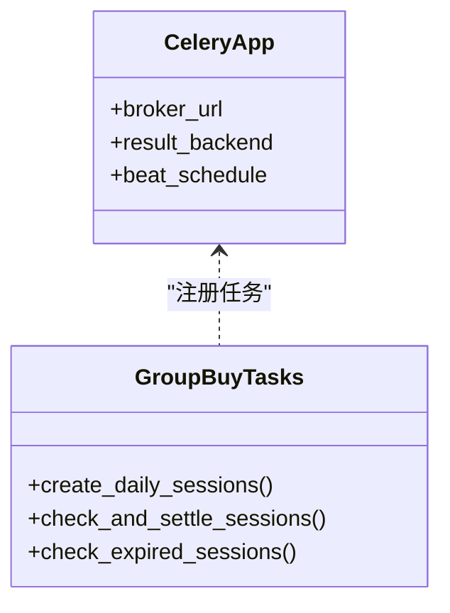
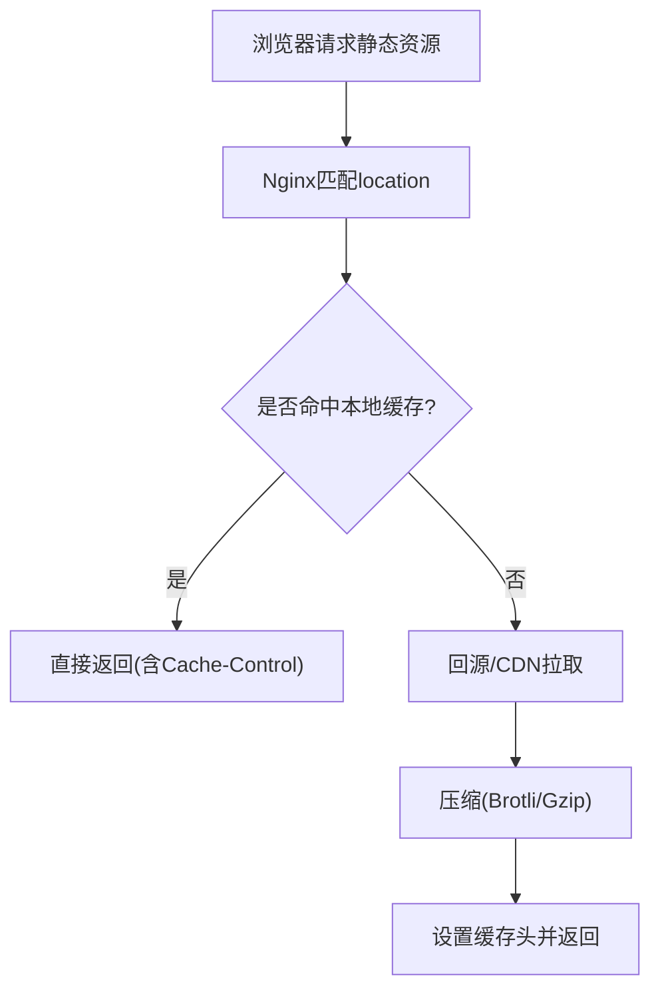
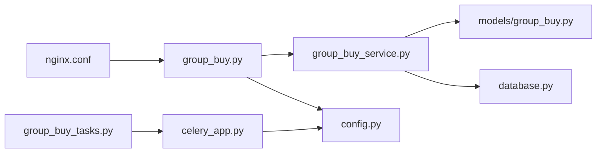

# 性能优化策略

<cite>
**本文引用的文件**
- [backend/app/config.py](file://backend/app/config.py)
- [backend/app/database.py](file://backend/app/database.py)
- [backend/app/main.py](file://backend/app/main.py)
- [backend/app/middleware.py](file://backend/app/middleware.py)
- [backend/app/api/v1/group_buy.py](file://backend/app/api/v1/group_buy.py)
- [backend/app/services/group_buy_service.py](file://backend/app/services/group_buy_service.py)
- [backend/app/models/group_buy.py](file://backend/app/models/group_buy.py)
- [backend/app/tasks/celery_app.py](file://backend/app/tasks/celery_app.py)
- [backend/app/tasks/group_buy_tasks.py](file://backend/app/tasks/group_buy_tasks.py)
- [nginx.conf](file://nginx.conf)
- [docker-compose.yml](file://docker-compose.yml)
</cite>

## 目录
1. [引言](#引言)
2. [项目结构](#项目结构)
3. [核心组件](#核心组件)
4. [架构总览](#架构总览)
5. [详细组件分析](#详细组件分析)
6. [依赖关系分析](#依赖关系分析)
7. [性能考虑](#性能考虑)
8. [故障排查指南](#故障排查指南)
9. [结论](#结论)
10. [附录](#附录)

## 引言
本文件面向AIxingmu项目的性能优化，覆盖数据库连接池与查询优化、Redis缓存策略、Celery任务队列调优、静态资源CDN与压缩、API响应时间优化、容器资源限制与监控指标采集。文档基于仓库现有实现进行深度分析与可落地的优化建议，并给出可视化架构图与流程图，帮助读者快速定位瓶颈并实施改进。

## 项目结构
后端采用FastAPI + SQLAlchemy异步引擎 + Celery异步任务 + Nginx反向代理的常见架构；数据层使用PostgreSQL，缓存使用Redis，消息中间件使用RabbitMQ，对象存储使用MinIO。关键入口与配置集中在应用启动、数据库会话管理、任务调度与Nginx转发等文件中。

图表来源
- [backend/app/main.py:34-67](file://backend/app/main.py#L34-L67)
- [backend/app/database.py:10-21](file://backend/app/database.py#L10-L21)
- [backend/app/tasks/celery_app.py:9-21](file://backend/app/tasks/celery_app.py#L9-L21)
- [nginx.conf:1-39](file://nginx.conf#L1-L39)
- [docker-compose.yml:52-96](file://docker-compose.yml#L52-L96)

章节来源
- [backend/app/main.py:1-73](file://backend/app/main.py#L1-L73)
- [backend/app/database.py:1-40](file://backend/app/database.py#L1-L40)
- [backend/app/tasks/celery_app.py:1-56](file://backend/app/tasks/celery_app.py#L1-L56)
- [nginx.conf:1-39](file://nginx.conf#L1-L39)
- [docker-compose.yml:1-111](file://docker-compose.yml#L1-L111)

## 核心组件
- 配置中心：集中管理数据库、Redis、Celery、CORS、业务常量等参数，便于按环境切换与容量规划。
- 数据库层：异步引擎与会话工厂，提供事务边界与连接复用。
- 业务服务：拼团核心流程（开团、参团、结算）涉及多表更新与并发控制。
- 任务系统：Celery负责定时创建场次、检查满员结算、过期清理、贡献值分红等。
- 网关层：Nginx统一入口，支持API代理、WebSocket预留、静态资源托管。

章节来源
- [backend/app/config.py:1-136](file://backend/app/config.py#L1-L136)
- [backend/app/database.py:10-40](file://backend/app/database.py#L10-L40)
- [backend/app/services/group_buy_service.py:17-348](file://backend/app/services/group_buy_service.py#L17-L348)
- [backend/app/tasks/celery_app.py:9-56](file://backend/app/tasks/celery_app.py#L9-L56)
- [nginx.conf:10-39](file://nginx.conf#L10-L39)

## 架构总览
下图展示请求从Nginx进入FastAPI，经中间件与路由到服务层，再访问数据库与缓存，以及后台任务通过Celery执行批处理与结算的流程。

图表来源
- [backend/app/main.py:44-67](file://backend/app/main.py#L44-L67)
- [backend/app/api/v1/group_buy.py:15-65](file://backend/app/api/v1/group_buy.py#L15-L65)
- [backend/app/services/group_buy_service.py:93-348](file://backend/app/services/group_buy_service.py#L93-L348)
- [backend/app/database.py:10-21](file://backend/app/database.py#L10-L21)
- [backend/app/tasks/celery_app.py:24-55](file://backend/app/tasks/celery_app.py#L24-L55)
- [nginx.conf:14-21](file://nginx.conf#L14-L21)

## 详细组件分析

### 数据库连接池与查询优化
- 连接池参数
  - 当前在配置中定义基础池大小与溢出上限，并在异步引擎创建时传入。生产环境需根据QPS、平均延迟与CPU核数评估调整。
  - 建议增加连接池最小空闲连接、超时回收、连接健康检查等参数，避免冷启动抖动与长事务占用连接。
- 会话与事务
  - 使用异步会话工厂，在依赖注入中开启事务并在异常时回滚，确保一致性。
  - 对热点写路径（如参团锁定余额、更新场次人数）应缩短事务范围，减少锁竞争。
- 查询与索引
  - 模型已为场次编号、订单号、用户ID、会话ID、状态等建立索引，利于高频过滤与分页。
  - 针对“获取活跃场次”“用户订单分页”等查询，建议在start_time/end_time、status、user_id上组合索引，避免全表扫描。
  - 结算流程读取整场订单并逐条更新，建议分批提交或批量更新以减少往返与锁持有时间。

图表来源
- [backend/app/api/v1/group_buy.py:26-38](file://backend/app/api/v1/group_buy.py#L26-L38)
- [backend/app/services/group_buy_service.py:93-181](file://backend/app/services/group_buy_service.py#L93-L181)
- [backend/app/models/group_buy.py:42-131](file://backend/app/models/group_buy.py#L42-L131)

章节来源
- [backend/app/config.py:16-20](file://backend/app/config.py#L16-L20)
- [backend/app/database.py:10-40](file://backend/app/database.py#L10-L40)
- [backend/app/services/group_buy_service.py:93-181](file://backend/app/services/group_buy_service.py#L93-L181)
- [backend/app/models/group_buy.py:42-131](file://backend/app/models/group_buy.py#L42-L131)

### Redis缓存优化方案
- 现状
  - 配置项定义了Redis URL，但当前代码未见显式缓存读写逻辑。
- 建议策略
  - 热点读缓存：场次列表、场次详情、用户订单分页结果可按短TTL缓存，降低DB压力。
  - 防重入与幂等：参团接口以“用户ID+场次ID”为键做短时去重，防止重复提交。
  - 分布式锁：结算与人数更新使用Redis原子操作或SETNX实现细粒度锁，避免并发竞态。
  - 内存管理：合理设置maxmemory与淘汰策略（如allkeys-lru），对大Key拆分或压缩，避免阻塞。
  - 持久化：按需启用AOF/RDB，结合备份策略保障数据安全。
- 监控指标
  - 命中率、内存使用率、慢查询、连接数、主从延迟（若集群）。

章节来源
- [backend/app/config.py:21-22](file://backend/app/config.py#L21-L22)

### Celery任务队列性能调优
- 现状
  - 使用RabbitMQ作为Broker，Redis作为结果后端；Beat定义多个定时任务（创建场次、检查结算、过期清理、分红核算等）。
  - Worker默认无并发参数配置，可能受限于GIL与I/O类型。
- 调优建议
  - Worker数量与并发
    - 对于I/O密集型任务（DB/网络），建议使用gevent/eventlet并发模式，提升吞吐。
    - Worker实例数建议按CPU核数与任务类型估算，并结合压测逐步扩容。
  - 任务优先级与队列隔离
    - 将高优任务（如结算）放入独立队列，单独扩缩容，避免被低优任务阻塞。
  - 重试与死信
    - 为易失败任务设置指数退避重试与最大重试次数，失败入死信队列以便人工干预。
  - 批处理与批量提交
    - 结算类任务尽量批量拉取、批量更新，减少事务与锁竞争。
  - 监控
    - 暴露队列长度、消费速率、任务耗时分布、失败率等指标。

图表来源
- [backend/app/tasks/celery_app.py:9-56](file://backend/app/tasks/celery_app.py#L9-L56)
- [backend/app/tasks/group_buy_tasks.py:17-54](file://backend/app/tasks/group_buy_tasks.py#L17-L54)

章节来源
- [backend/app/tasks/celery_app.py:9-56](file://backend/app/tasks/celery_app.py#L9-L56)
- [backend/app/tasks/group_buy_tasks.py:1-54](file://backend/app/tasks/group_buy_tasks.py#L1-L54)

### 静态资源CDN加速、Gzip压缩与浏览器缓存
- 现状
  - Nginx配置包含API代理、WebSocket预留与前端静态资源根目录，但未启用压缩与缓存头。
- 优化建议
  - CDN：将静态资源（JS/CSS/图片）部署至CDN，域名分离，减少源站带宽压力。
  - Gzip/Brotli：在Nginx启用压缩，优先Brotli，其次Gzip，对文本类资源生效。
  - 浏览器缓存：为静态资源设置长期缓存与版本化文件名，HTML设置较短缓存或no-cache。
  - 连接复用：保持上游keepalive，减少TCP握手开销。

图表来源
- [nginx.conf:31-36](file://nginx.conf#L31-L36)

章节来源
- [nginx.conf:1-39](file://nginx.conf#L1-L39)

### API响应时间优化
- 数据库侧
  - 利用已有索引与新增组合索引，减少慢查询。
  - 分页查询使用limit/offset或游标分页，避免深分页。
  - 结算等批量写入采用批量SQL或分批次提交，缩短事务窗口。
- 缓存侧
  - 热点读加缓存，写后失效或延迟双写，保证最终一致。
  - 热点Key打散与限流，避免雪崩。
- 异步处理
  - 非实时计算（统计、通知、报表）下沉到Celery，缩短请求链路。
  - 使用消息确认与幂等设计，保障可靠性。
- 网关与中间件
  - 在Nginx层做限流与熔断，保护后端。
  - 精简中间件逻辑，避免在请求路径中进行重型计算。

章节来源
- [backend/app/api/v1/group_buy.py:15-65](file://backend/app/api/v1/group_buy.py#L15-L65)
- [backend/app/services/group_buy_service.py:324-348](file://backend/app/services/group_buy_service.py#L324-L348)
- [backend/app/middleware.py:82-120](file://backend/app/middleware.py#L82-L120)

### 容器资源限制与监控指标采集
- 资源限制
  - 在编排层为各服务设置CPU与内存上下限，避免争抢与OOM。
  - 数据库与缓存容器建议独占磁盘I/O与内存，避免抖动。
- 监控指标
  - 应用：请求QPS、P95/P99延迟、错误率、GC/线程池/连接池使用率。
  - 数据库：连接池使用率、慢查询、锁等待、复制延迟。
  - 缓存：命中率、内存碎片、淘汰事件、主从延迟。
  - 队列：入队/出队速率、堆积量、任务耗时分布、失败率。
  - 基础设施：CPU/内存/磁盘/网络利用率。
- 可观测性
  - 结构化日志与Trace ID贯穿请求链路，配合APM工具进行端到端追踪。

章节来源
- [docker-compose.yml:4-96](file://docker-compose.yml#L4-L96)

## 依赖关系分析
- 模块耦合
  - API路由依赖服务层，服务层依赖数据库会话与模型；任务层通过共享配置与数据库会话访问数据。
  - Nginx仅做反向代理，不引入额外业务耦合。
- 外部依赖
  - PostgreSQL、Redis、RabbitMQ、MinIO均为外部服务，需在编排层做好健康检查与重启策略。
- 潜在循环依赖
  - 当前未发现循环导入；任务中通过延迟import避免启动期加载过重。

图表来源
- [backend/app/api/v1/group_buy.py:1-65](file://backend/app/api/v1/group_buy.py#L1-L65)
- [backend/app/services/group_buy_service.py:1-348](file://backend/app/services/group_buy_service.py#L1-L348)
- [backend/app/models/group_buy.py:1-158](file://backend/app/models/group_buy.py#L1-L158)
- [backend/app/database.py:1-40](file://backend/app/database.py#L1-L40)
- [backend/app/tasks/group_buy_tasks.py:1-54](file://backend/app/tasks/group_buy_tasks.py#L1-L54)
- [backend/app/tasks/celery_app.py:1-56](file://backend/app/tasks/celery_app.py#L1-L56)
- [backend/app/config.py:1-136](file://backend/app/config.py#L1-L136)
- [nginx.conf:1-39](file://nginx.conf#L1-L39)

章节来源
- [backend/app/api/v1/group_buy.py:1-65](file://backend/app/api/v1/group_buy.py#L1-L65)
- [backend/app/services/group_buy_service.py:1-348](file://backend/app/services/group_buy_service.py#L1-L348)
- [backend/app/models/group_buy.py:1-158](file://backend/app/models/group_buy.py#L1-L158)
- [backend/app/database.py:1-40](file://backend/app/database.py#L1-L40)
- [backend/app/tasks/group_buy_tasks.py:1-54](file://backend/app/tasks/group_buy_tasks.py#L1-L54)
- [backend/app/tasks/celery_app.py:1-56](file://backend/app/tasks/celery_app.py#L1-L56)
- [backend/app/config.py:1-136](file://backend/app/config.py#L1-L136)
- [nginx.conf:1-39](file://nginx.conf#L1-L39)

## 性能考虑
- 连接池容量与超时：依据峰值QPS与平均延迟设定pool_size/max_overflow，并配置连接空闲回收与超时。
- 查询计划与索引：定期分析慢查询，补充组合索引，避免SELECT *，只取必要字段。
- 缓存分层：本地内存缓存（进程级）+ Redis（分布式），注意一致性策略与失效风暴防护。
- 任务批量化：合并小任务，减少上下文切换与序列化开销。
- 静态资源：CDN+Brotli+强缓存，显著降低首屏与交互延迟。
- 网关限流：对热点接口进行令牌桶/漏桶限流，保护后端稳定。

[本节为通用指导，无需列出具体文件来源]

## 故障排查指南
- 常见问题
  - 连接池耗尽：观察连接池使用率与慢查询，必要时扩容或优化事务范围。
  - 缓存穿透/击穿：空值缓存、布隆过滤器、互斥锁重建。
  - 任务堆积：检查Worker并发与队列隔离，定位慢任务与失败重试风暴。
  - 静态资源404：确认Nginx静态路径与构建产物输出目录一致。
- 诊断手段
  - 使用中间件日志记录请求耗时与状态码，定位慢接口。
  - 数据库慢查询日志与索引缺失告警。
  - 队列监控面板查看入队/出队速率与失败率。
  - 容器资源监控与OOM事件排查。

章节来源
- [backend/app/middleware.py:82-120](file://backend/app/middleware.py#L82-L120)
- [backend/app/main.py:70-73](file://backend/app/main.py#L70-L73)

## 结论
通过对连接池、查询与索引、缓存策略、任务队列、静态资源与网关层的系统性优化，可显著提升AIxingmu平台的吞吐与稳定性。建议在生产环境逐步落地上述优化，并以压测与监控验证效果，持续迭代。

[本节为总结，无需列出具体文件来源]

## 附录
- 关键配置项参考
  - 数据库：DATABASE_URL、DATABASE_POOL_SIZE、DATABASE_MAX_OVERFLOW
  - 缓存：REDIS_URL
  - 任务：CELERY_BROKER_URL、CELERY_RESULT_BACKEND
  - 网关：Nginx upstream与location规则
- 建议的下一步
  - 引入APM与日志聚合平台，完善可观测性。
  - 对结算与热门查询进行专项压测与容量规划。
  - 制定灰度发布与回滚策略，保障变更安全。

章节来源
- [backend/app/config.py:16-26](file://backend/app/config.py#L16-L26)
- [nginx.conf:5-21](file://nginx.conf#L5-L21)