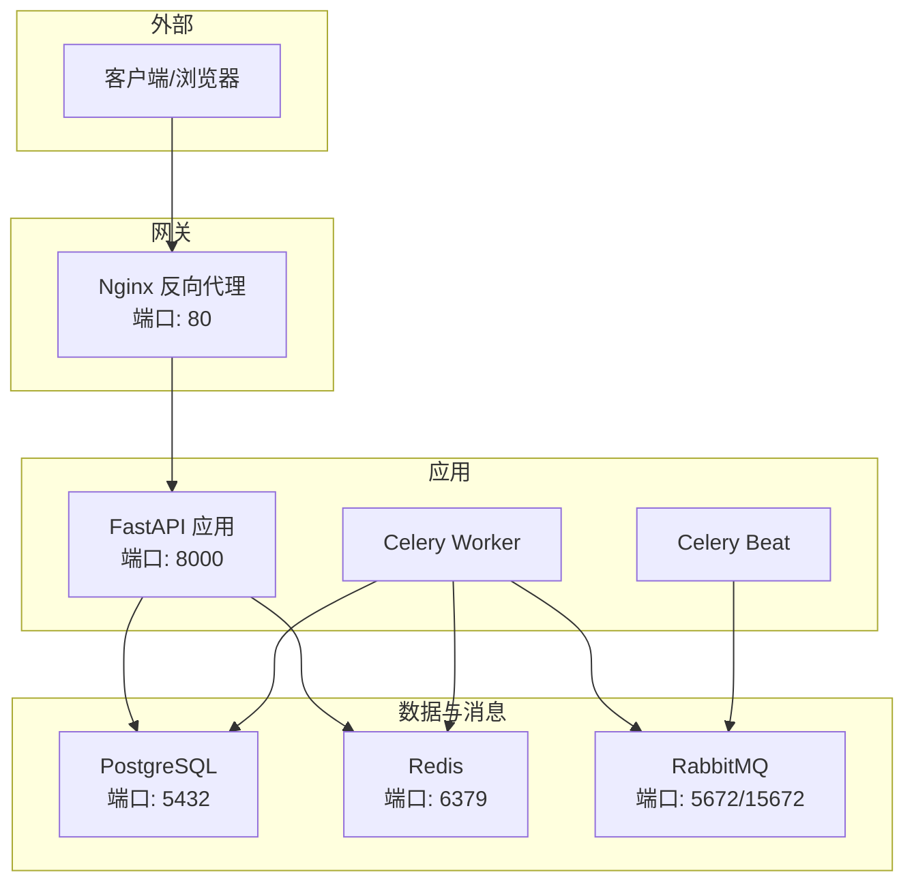
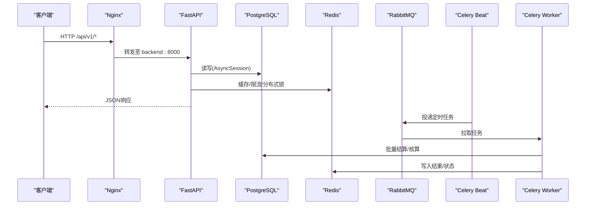
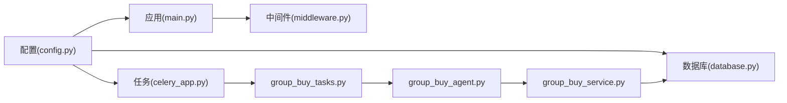

# 故障排查指南

<cite>
**本文引用的文件**   
- [backend/app/config.py](file://backend/app/config.py)
- [backend/app/database.py](file://backend/app/database.py)
- [backend/app/main.py](file://backend/app/main.py)
- [backend/app/middleware.py](file://backend/app/middleware.py)
- [backend/app/tasks/celery_app.py](file://backend/app/tasks/celery_app.py)
- [backend/app/tasks/group_buy_tasks.py](file://backend/app/tasks/group_buy_tasks.py)
- [backend/app/agents/base_agent.py](file://backend/app/agents/base_agent.py)
- [backend/app/agents/group_buy_agent.py](file://backend/app/agents/group_buy_agent.py)
- [backend/app/services/group_buy_service.py](file://backend/app/services/group_buy_service.py)
- [docker-compose.yml](file://docker-compose.yml)
- [nginx.conf](file://nginx.conf)
</cite>

## 目录
1. [简介](#简介)
2. [项目结构](#项目结构)
3. [核心组件](#核心组件)
4. [架构总览](#架构总览)
5. [详细组件分析](#详细组件分析)
6. [依赖关系分析](#依赖关系分析)
7. [性能考虑](#性能考虑)
8. [故障排查指南](#故障排查指南)
9. [结论](#结论)
10. [附录](#附录)

## 简介
本指南面向AIxingmu项目的运维与研发人员，聚焦于生产与容器化环境中的常见问题定位与恢复策略。内容覆盖数据库连接、Redis连接超时、Celery任务失败、日志分析方法、容器化问题、性能瓶颈诊断、网络连通性排查以及恢复与应急预案。所有建议均基于仓库中现有实现进行梳理，便于快速落地执行。

## 项目结构
后端采用FastAPI + SQLAlchemy异步引擎 + Celery（RabbitMQ为Broker，Redis为结果后端）+ Nginx反向代理的架构；配置集中管理，中间件统一处理异常与请求日志；定时任务通过Celery Beat调度，业务逻辑由服务层与Agent编排完成。

图示来源
- [docker-compose.yml:1-111](file://docker-compose.yml#L1-L111)
- [nginx.conf:1-39](file://nginx.conf#L1-L39)
- [backend/app/main.py:1-75](file://backend/app/main.py#L1-L75)
- [backend/app/tasks/celery_app.py:1-56](file://backend/app/tasks/celery_app.py#L1-L56)

章节来源
- [docker-compose.yml:1-111](file://docker-compose.yml#L1-L111)
- [nginx.conf:1-39](file://nginx.conf#L1-L39)
- [backend/app/main.py:1-75](file://backend/app/main.py#L1-L75)

## 核心组件
- 配置中心：集中管理数据库、Redis、Celery、CORS、MinIO等关键参数，支持环境变量注入。
- 数据库连接：异步SQLAlchemy引擎与会话工厂，提供依赖注入式会话获取与事务回滚。
- 中间件：全局异常处理、请求耗时记录、CORS。
- 任务系统：Celery应用、Beat调度、业务任务封装。
- Agent与服务：拼团Agent协调开团、结算、过期清理；服务层实现具体业务规则。

章节来源
- [backend/app/config.py:1-136](file://backend/app/config.py#L1-L136)
- [backend/app/database.py:1-40](file://backend/app/database.py#L1-L40)
- [backend/app/middleware.py:1-121](file://backend/app/middleware.py#L1-L121)
- [backend/app/tasks/celery_app.py:1-56](file://backend/app/tasks/celery_app.py#L1-L56)
- [backend/app/agents/group_buy_agent.py:1-67](file://backend/app/agents/group_buy_agent.py#L1-L67)
- [backend/app/services/group_buy_service.py:1-348](file://backend/app/services/group_buy_service.py#L1-L348)

## 架构总览
下图展示从HTTP请求到数据库/缓存/消息队列的调用链，以及定时任务的触发路径。

图示来源
- [nginx.conf:1-39](file://nginx.conf#L1-L39)
- [backend/app/main.py:1-75](file://backend/app/main.py#L1-L75)
- [backend/app/database.py:1-40](file://backend/app/database.py#L1-L40)
- [backend/app/tasks/celery_app.py:1-56](file://backend/app/tasks/celery_app.py#L1-L56)
- [backend/app/tasks/group_buy_tasks.py:1-54](file://backend/app/tasks/group_buy_tasks.py#L1-L54)

## 详细组件分析

### 配置模块（Settings）
- 作用：集中定义数据库URL、连接池大小、Redis/Celery地址、JWT、CORS、MinIO及业务常量。
- 关键点：
  - 数据库连接池大小与溢出上限需结合并发量调优。
  - Redis用于缓存与Celery结果后端，注意区分DB索引避免冲突。
  - CORS在生产环境应限制来源。
  - LLM相关键为空字符串，若启用需正确配置。

章节来源
- [backend/app/config.py:1-136](file://backend/app/config.py#L1-L136)

### 数据库连接与会话管理
- 作用：创建异步引擎、会话工厂、提供依赖注入get_db。
- 关键点：
  - 连接池参数来自配置，DEBUG模式下开启SQL日志便于调试。
  - get_db在异常时自动回滚并关闭会话，确保资源释放。

章节来源
- [backend/app/database.py:1-40](file://backend/app/database.py#L1-L40)

### 全局异常与请求日志中间件
- 作用：统一捕获验证错误、数据库错误、业务错误、权限错误与未处理异常；记录请求开始/结束与耗时。
- 关键点：
  - 返回标准化JSON结构，包含code/message/detail。
  - 对慢请求可通过响应头X-Process-Time或日志耗时定位。

章节来源
- [backend/app/middleware.py:1-121](file://backend/app/middleware.py#L1-L121)
- [backend/app/main.py:44-56](file://backend/app/main.py#L44-L56)

### Celery应用与定时任务
- 作用：定义Broker与结果后端、时区与序列化策略；注册每日/每小时/每周/每月定时任务。
- 关键点：
  - Broker使用RabbitMQ，结果后端使用Redis不同DB索引。
  - Beat负责调度，Worker执行具体任务。
  - 任务内通过async_session_factory运行异步代码。

章节来源
- [backend/app/tasks/celery_app.py:1-56](file://backend/app/tasks/celery_app.py#L1-L56)
- [backend/app/tasks/group_buy_tasks.py:1-54](file://backend/app/tasks/group_buy_tasks.py#L1-L54)

### 拼团Agent与服务
- Agent职责：根据action分发到“创建场次/检查并结算/检查过期”等流程。
- 服务职责：实现开团、参团、满员判定、结果结算、权益发放等核心规则。
- 关键点：
  - 结算过程涉及多表更新与用户资产变动，需保证事务一致性与幂等。
  - 随机抽选与补贴计算遵循配置比例。

章节来源
- [backend/app/agents/group_buy_agent.py:1-67](file://backend/app/agents/group_buy_agent.py#L1-L67)
- [backend/app/agents/base_agent.py:1-47](file://backend/app/agents/base_agent.py#L1-L47)
- [backend/app/services/group_buy_service.py:1-348](file://backend/app/services/group_buy_service.py#L1-L348)

## 依赖关系分析
- 应用入口依赖配置、数据库、路由与中间件。
- 任务模块依赖配置与数据库会话工厂。
- Agent依赖服务层与模型枚举。
- 容器编排声明了服务间健康检查与启动顺序。

图示来源
- [backend/app/config.py:1-136](file://backend/app/config.py#L1-L136)
- [backend/app/main.py:1-75](file://backend/app/main.py#L1-L75)
- [backend/app/database.py:1-40](file://backend/app/database.py#L1-L40)
- [backend/app/middleware.py:1-121](file://backend/app/middleware.py#L1-L121)
- [backend/app/tasks/celery_app.py:1-56](file://backend/app/tasks/celery_app.py#L1-L56)
- [backend/app/tasks/group_buy_tasks.py:1-54](file://backend/app/tasks/group_buy_tasks.py#L1-L54)
- [backend/app/agents/group_buy_agent.py:1-67](file://backend/app/agents/group_buy_agent.py#L1-L67)
- [backend/app/services/group_buy_service.py:1-348](file://backend/app/services/group_buy_service.py#L1-L348)

## 性能考虑
- 数据库连接池：根据并发与查询复杂度调整pool_size与max_overflow，避免连接耗尽。
- SQL日志：开发阶段开启echo以便定位慢查询；生产建议按需开启或使用专用审计插件。
- 中间件耗时：关注X-Process-Time与请求日志耗时，识别热点接口。
- 任务批处理：结算类任务尽量分批提交，减少单次事务体量。
- 缓存命中：合理设置Redis键空间与TTL，降低热点读放大。

[本节为通用指导，不直接分析具体文件]

## 故障排查指南

### 一、数据库连接问题
常见症状
- 接口频繁报“数据库操作失败”。
- 应用启动时报连接拒绝或认证失败。
- 高并发下出现连接池耗尽导致请求阻塞。

排查步骤
- 检查配置项DATABASE_URL、DATABASE_POOL_SIZE、DATABASE_MAX_OVERFLOW是否正确。
- 确认PostgreSQL服务可达（端口、用户名、密码、库名）。
- 查看数据库错误日志与慢查询日志。
- 观察应用日志中SQL语句与异常堆栈。
- 评估是否需要扩容连接池或优化SQL。

参考位置
- [backend/app/config.py:16-20](file://backend/app/config.py#L16-L20)
- [backend/app/database.py:10-21](file://backend/app/database.py#L10-L21)
- [backend/app/middleware.py:39-48](file://backend/app/middleware.py#L39-L48)

章节来源
- [backend/app/config.py:16-20](file://backend/app/config.py#L16-L20)
- [backend/app/database.py:10-21](file://backend/app/database.py#L10-L21)
- [backend/app/middleware.py:39-48](file://backend/app/middleware.py#L39-L48)

### 二、Redis连接超时
常见症状
- 缓存读取/写入失败。
- Celery任务结果无法获取或任务堆积。
- 分布式锁失效导致重复执行。

排查步骤
- 检查REDIS_URL与CELERY_RESULT_BACKEND是否指向正确的Redis实例与DB索引。
- 确认Redis服务端口可达且无内存/持久化异常。
- 查看应用日志中Redis相关错误。
- 必要时增加重试与降级逻辑，避免雪崩。

参考位置
- [backend/app/config.py:21-26](file://backend/app/config.py#L21-L26)
- [backend/app/tasks/celery_app.py:9-21](file://backend/app/tasks/celery_app.py#L9-L21)

章节来源
- [backend/app/config.py:21-26](file://backend/app/config.py#L21-L26)
- [backend/app/tasks/celery_app.py:9-21](file://backend/app/tasks/celery_app.py#L9-L21)

### 三、Celery任务失败
常见症状
- 定时任务未执行或执行报错。
- Worker进程崩溃或长时间无日志。
- 任务结果不可用。

排查步骤
- 确认RabbitMQ与Redis可用，且Celery配置中的Broker与Backend一致。
- 检查celery-worker与celery-beat容器状态与日志。
- 核对任务名称与注册路径是否匹配。
- 针对异步任务封装方式，确认事件循环创建与关闭正常。
- 对结算类任务增加幂等与重试策略。

参考位置
- [docker-compose.yml:72-96](file://docker-compose.yml#L72-L96)
- [backend/app/tasks/celery_app.py:1-56](file://backend/app/tasks/celery_app.py#L1-L56)
- [backend/app/tasks/group_buy_tasks.py:1-54](file://backend/app/tasks/group_buy_tasks.py#L1-L54)

章节来源
- [docker-compose.yml:72-96](file://docker-compose.yml#L72-L96)
- [backend/app/tasks/celery_app.py:1-56](file://backend/app/tasks/celery_app.py#L1-L56)
- [backend/app/tasks/group_buy_tasks.py:1-54](file://backend/app/tasks/group_buy_tasks.py#L1-L54)

### 四、日志分析方法
- 请求级日志：通过RequestLoggingMiddleware记录的请求开始/结束与耗时，定位慢接口。
- 异常级日志：GlobalExceptionMiddleware统一捕获并输出结构化错误信息。
- Agent日志：BaseAgent与GroupBuyAgent内部logger输出执行上下文与失败原因。
- 数据库日志：DEBUG模式下SQL语句可辅助定位慢查询与异常SQL。

参考位置
- [backend/app/middleware.py:82-121](file://backend/app/middleware.py#L82-L121)
- [backend/app/middleware.py:16-80](file://backend/app/middleware.py#L16-L80)
- [backend/app/agents/base_agent.py:31-41](file://backend/app/agents/base_agent.py#L31-L41)
- [backend/app/agents/group_buy_agent.py:40-46](file://backend/app/agents/group_buy_agent.py#L40-L46)
- [backend/app/database.py:10-15](file://backend/app/database.py#L10-L15)

章节来源
- [backend/app/middleware.py:16-121](file://backend/app/middleware.py#L16-L121)
- [backend/app/agents/base_agent.py:31-41](file://backend/app/agents/base_agent.py#L31-L41)
- [backend/app/agents/group_buy_agent.py:40-46](file://backend/app/agents/group_buy_agent.py#L40-L46)
- [backend/app/database.py:10-15](file://backend/app/database.py#L10-L15)

### 五、容器化环境故障排查
- 容器启动失败
  - 检查depends_on与健康检查条件，确保依赖服务先就绪。
  - 查看各服务日志，确认环境变量与镜像构建无误。
- 端口冲突
  - 核对宿主机端口映射是否与本地服务冲突。
  - 修改docker-compose.yml中的端口映射。
- 资源不足
  - 监控CPU/内存/磁盘I/O，适当调整容器资源限制。
  - 增大数据库连接池或优化SQL以减少资源占用。

参考位置
- [docker-compose.yml:1-111](file://docker-compose.yml#L1-L111)

章节来源
- [docker-compose.yml:1-111](file://docker-compose.yml#L1-L111)

### 六、性能问题诊断
- CPU占用过高
  - 定位热点接口（请求日志耗时），分析业务逻辑复杂度。
  - 检查Agent与结算任务是否存在密集计算。
- 内存泄漏
  - 关注长生命周期对象与未释放资源（如事件循环、数据库会话）。
  - 监控容器内存曲线，结合GC日志定位异常增长。
- 数据库慢查询
  - 开启SQL日志或数据库侧慢查询日志。
  - 优化索引与分页查询，减少全表扫描。

参考位置
- [backend/app/middleware.py:82-121](file://backend/app/middleware.py#L82-L121)
- [backend/app/database.py:10-15](file://backend/app/database.py#L10-L15)
- [backend/app/services/group_buy_service.py:1-348](file://backend/app/services/group_buy_service.py#L1-L348)

章节来源
- [backend/app/middleware.py:82-121](file://backend/app/middleware.py#L82-L121)
- [backend/app/database.py:10-15](file://backend/app/database.py#L10-L15)
- [backend/app/services/group_buy_service.py:1-348](file://backend/app/services/group_buy_service.py#L1-L348)

### 七、网络问题排查
- 服务间通信
  - 确认Nginx upstream指向backend:8000，且容器网络互通。
  - 检查防火墙与安全组放行80/8000/5432/6379/5672等端口。
- 外部API调用
  - 检查域名解析与证书配置，必要时添加重试与熔断。
- 反向代理
  - 校验proxy_pass与WebSocket升级配置。

参考位置
- [nginx.conf:1-39](file://nginx.conf#L1-L39)
- [docker-compose.yml:97-106](file://docker-compose.yml#L97-L106)

章节来源
- [nginx.conf:1-39](file://nginx.conf#L1-L39)
- [docker-compose.yml:97-106](file://docker-compose.yml#L97-L106)

### 八、恢复策略与应急预案
- 数据备份恢复
  - 定期备份PostgreSQL与MinIO数据卷，制定恢复演练计划。
- 服务降级
  - 当Redis不可用时，降级非关键缓存逻辑；当外部API不可用时，返回兜底数据。
- 熔断机制
  - 对外部依赖增加熔断器与退避重试，防止雪崩。
- 任务补偿
  - 对结算类任务设计幂等与补偿脚本，支持人工干预。

[本节为通用指导，不直接分析具体文件]

## 结论
通过对配置、连接、中间件、任务与Agent的深入分析，可以系统化地定位与解决数据库、缓存、消息队列、容器与网络层面的问题。结合日志分析与性能指标，能够快速识别瓶颈并实施优化。同时，建立完善的备份、降级与熔断策略，有助于提升系统的稳定性与可恢复性。

[本节为总结性内容，不直接分析具体文件]

## 附录

### A. 关键配置清单（示例字段）
- 数据库：DATABASE_URL、DATABASE_POOL_SIZE、DATABASE_MAX_OVERFLOW
- 缓存：REDIS_URL
- 任务：CELERY_BROKER_URL、CELERY_RESULT_BACKEND
- 安全：SECRET_KEY、ALGORITHM、ACCESS_TOKEN_EXPIRE_MINUTES
- 跨域：CORS_ORIGINS
- 存储：MINIO_ENDPOINT、MINIO_ACCESS_KEY、MINIO_SECRET_KEY、MINIO_BUCKET

章节来源
- [backend/app/config.py:16-41](file://backend/app/config.py#L16-L41)

### B. 常用命令与定位要点
- 查看容器日志：按服务名过滤关键字（如“数据库错误”、“未处理的异常”）。
- 检查端口占用：对比docker-compose.yml中的端口映射。
- 验证健康检查：确认PostgreSQL healthcheck通过后再启动后端。
- 任务状态：查看Worker与Beat日志，确认任务注册与执行。

章节来源
- [docker-compose.yml:1-111](file://docker-compose.yml#L1-L111)
- [backend/app/middleware.py:16-80](file://backend/app/middleware.py#L16-L80)