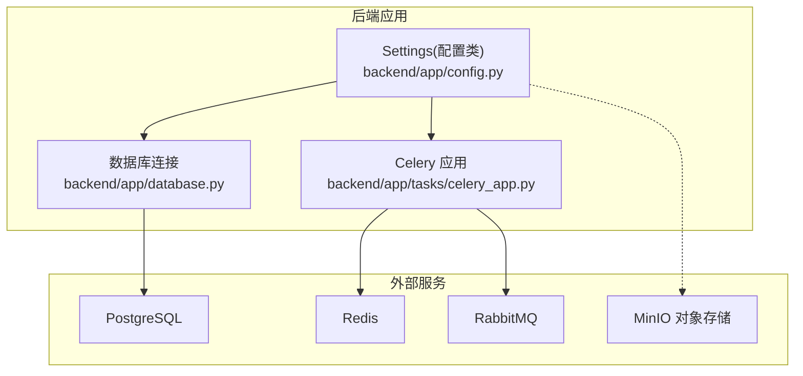
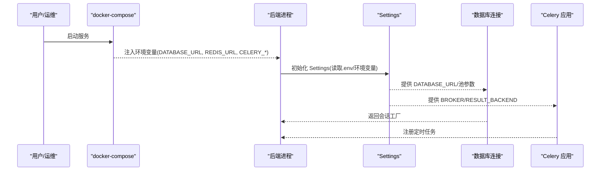
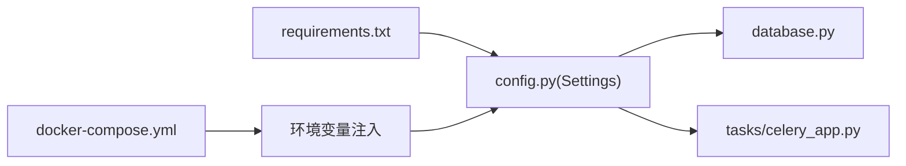

# 环境配置管理

<cite>
**本文引用的文件**   
- [backend/app/config.py](file://backend/app/config.py)
- [backend/app/database.py](file://backend/app/database.py)
- [backend/app/tasks/celery_app.py](file://backend/app/tasks/celery_app.py)
- [docker-compose.yml](file://docker-compose.yml)
- [backend/Dockerfile](file://backend/Dockerfile)
- [backend/requirements.txt](file://backend/requirements.txt)
</cite>

## 目录
1. [简介](#简介)
2. [项目结构](#项目结构)
3. [核心组件](#核心组件)
4. [架构总览](#架构总览)
5. [详细组件分析](#详细组件分析)
6. [依赖关系分析](#依赖关系分析)
7. [性能与容量规划](#性能与容量规划)
8. [故障排查指南](#故障排查指南)
9. [结论](#结论)
10. [附录：多环境与迁移策略](#附录多环境与迁移策略)

## 简介
本文件面向 AIxingmu 项目的“环境配置管理”，围绕 Pydantic Settings 的配置结构，覆盖数据库连接、Redis、Celery、第三方服务（MinIO、LLM）等关键配置项；提供开发、测试、生产环境的差异化配置建议；说明敏感信息管理、环境变量注入、配置文件权限控制；并给出配置热重载机制、验证规则、默认值设置、Docker 环境变量注入以及配置中心集成方案。文档同时包含配置迁移策略与版本兼容性处理建议，帮助团队在演进中保持配置一致性与可维护性。

## 项目结构
后端采用 FastAPI + SQLAlchemy(asyncpg) + Celery(RabbitMQ) + Redis + MinIO 的常见组合。配置集中通过 Pydantic Settings 加载，支持从 .env 与环境变量注入。容器编排由 docker-compose 完成，各服务通过环境变量对接。

图表来源
- [backend/app/config.py:1-136](file://backend/app/config.py#L1-L136)
- [backend/app/database.py:1-40](file://backend/app/database.py#L1-L40)
- [backend/app/tasks/celery_app.py:1-56](file://backend/app/tasks/celery_app.py#L1-L56)

章节来源
- [backend/app/config.py:1-136](file://backend/app/config.py#L1-L136)
- [backend/app/database.py:1-40](file://backend/app/database.py#L1-L40)
- [backend/app/tasks/celery_app.py:1-56](file://backend/app/tasks/celery_app.py#L1-L56)
- [docker-compose.yml:1-111](file://docker-compose.yml#L1-L111)

## 核心组件
- 全局配置类 Settings：集中定义所有运行期配置，包括应用基础信息、数据库、缓存、消息队列、认证、CORS、对象存储、业务参数、AI Agent 等。
- 数据库连接：基于 asyncpg 创建异步引擎与会话工厂，读取 Settings 中的数据库 URL 与池大小。
- Celery 应用：使用 Settings 中的 Broker 与结果后端地址初始化 Celery，并注册定时任务调度。
- Docker 编排：通过 docker-compose 为各服务注入环境变量，使后端与 Worker/Beat 共享同一套配置源。

章节来源
- [backend/app/config.py:1-136](file://backend/app/config.py#L1-L136)
- [backend/app/database.py:1-40](file://backend/app/database.py#L1-L40)
- [backend/app/tasks/celery_app.py:1-56](file://backend/app/tasks/celery_app.py#L1-L56)
- [docker-compose.yml:52-96](file://docker-compose.yml#L52-L96)

## 架构总览
下图展示了配置加载与运行时依赖关系：Settings 作为唯一配置入口，被数据库模块与 Celery 模块消费；容器编排将环境变量注入到后端与 Celery 进程。

图表来源
- [docker-compose.yml:52-96](file://docker-compose.yml#L52-L96)
- [backend/app/config.py:1-136](file://backend/app/config.py#L1-L136)
- [backend/app/database.py:1-40](file://backend/app/database.py#L1-L40)
- [backend/app/tasks/celery_app.py:1-56](file://backend/app/tasks/celery_app.py#L1-L56)

## 详细组件分析

### 配置模型与字段分组
- 应用基础：名称、调试开关、API 前缀
- 数据库：URL、连接池大小、溢出上限
- 缓存：Redis URL
- 任务队列：Broker URL、结果后端 URL
- 认证：密钥、算法、令牌过期时间
- CORS：允许的来源列表
- 对象存储：MinIO 端点、访问密钥、桶名
- 业务参数：拼团定价、倍数、场次人数、开始结束时间、单ID订单上限等
- 贡献值与积分：分配比例、乘数、结算周期、总量与通缩比例
- 门店分红：阶梯阈值与分润比例
- AI Agent：LLM API Key/Base/Model

上述字段均提供默认值，便于本地快速启动；在生产环境中应通过环境变量覆盖。

章节来源
- [backend/app/config.py:1-136](file://backend/app/config.py#L1-L136)

### 数据库连接配置
- 使用 Settings.DATABASE_URL 构建异步引擎，结合池大小与溢出上限进行资源控制。
- 调试模式下开启 SQL 日志输出，便于定位问题。
- 提供 get_db 依赖注入函数，自动提交或回滚并在 finally 中关闭会话。

章节来源
- [backend/app/database.py:1-40](file://backend/app/database.py#L1-L40)
- [backend/app/config.py:16-19](file://backend/app/config.py#L16-L19)

### Redis 配置
- 统一通过 Settings.REDIS_URL 指定连接串，供缓存与 Celery 结果后端复用不同库号。
- 建议在多环境隔离时使用不同库号或独立实例。

章节来源
- [backend/app/config.py:21-22](file://backend/app/config.py#L21-L22)
- [backend/app/tasks/celery_app.py:11-13](file://backend/app/tasks/celery_app.py#L11-L13)

### Celery 配置与定时任务
- 使用 Settings.CELERY_BROKER_URL 与 CELERY_RESULT_BACKEND 初始化 Celery。
- 已内置多条定时任务：每日创建场次、每小时检查结算、每日检查过期、每周贡献值分红、每日贡献值递减核算、每月门店排名与分红。
- 时区设置为 Asia/Shanghai，启用 UTC 兼容。

章节来源
- [backend/app/tasks/celery_app.py:1-56](file://backend/app/tasks/celery_app.py#L1-L56)
- [backend/app/config.py:24-26](file://backend/app/config.py#L24-L26)

### 第三方服务集成配置
- MinIO：端点、访问密钥、桶名用于对象存储（图片、附件等）。
- LLM：API Key、Base、Model 用于 AI Agent 调用。
- 这些配置在生产环境必须通过安全渠道注入，避免硬编码。

章节来源
- [backend/app/config.py:36-40](file://backend/app/config.py#L36-L40)
- [backend/app/config.py:125-128](file://backend/app/config.py#L125-L128)

### 配置加载与校验
- Settings 继承自 BaseSettings，默认从 .env 文件与环境变量加载，且区分大小写。
- 类型提示驱动自动类型转换与基本校验（如 bool/int/float/List[str]），缺失必填项会在初始化时报错。
- 当前未显式声明必填字段，但可通过自定义 validator 增强约束（见“配置验证规则”小节）。

章节来源
- [backend/app/config.py:130-133](file://backend/app/config.py#L130-L133)

### 配置热重载机制
- 开发阶段可通过 uvicorn --reload 实现代码级热重载；但 Settings 仅在进程启动时加载一次，修改 .env 不会自动生效。
- 若需配置热更新，可在中间件或生命周期钩子中重新构造 Settings 实例，或使用支持动态更新的配置中心（见“配置中心集成方案”）。

章节来源
- [backend/Dockerfile:12](file://backend/Dockerfile#L12)
- [backend/app/config.py:130-133](file://backend/app/config.py#L130-L133)

### 默认值与业务常量
- 大量业务参数（拼团定价、倍数、场次人数、贡献值比例、积分总量、门店分红阶梯等）以默认值形式内嵌于 Settings，便于本地开发与演示。
- 生产环境建议将这些常量外置至配置中心或环境变量，以便灰度与回滚。

章节来源
- [backend/app/config.py:42-123](file://backend/app/config.py#L42-L123)

## 依赖关系分析
- Settings 是单一事实源，被 database.py 与 celery_app.py 直接依赖。
- docker-compose 负责将环境变量注入到 backend、celery-worker、celery-beat 三个进程，确保三者配置一致。
- requirements.txt 引入 pydantic-settings、asyncpg、redis、minio、celery 等依赖，支撑配置与运行时能力。

图表来源
- [backend/requirements.txt:1-34](file://backend/requirements.txt#L1-L34)
- [backend/app/config.py:1-136](file://backend/app/config.py#L1-L136)
- [backend/app/database.py:1-40](file://backend/app/database.py#L1-L40)
- [backend/app/tasks/celery_app.py:1-56](file://backend/app/tasks/celery_app.py#L1-L56)
- [docker-compose.yml:52-96](file://docker-compose.yml#L52-L96)

章节来源
- [backend/requirements.txt:1-34](file://backend/requirements.txt#L1-L34)
- [docker-compose.yml:1-111](file://docker-compose.yml#L1-L111)

## 性能与容量规划
- 数据库连接池：根据并发量调整 DATABASE_POOL_SIZE 与 DATABASE_MAX_OVERFLOW，避免连接耗尽或过度占用内存。
- Redis：缓存与任务结果后端分离库号，避免键冲突；生产建议使用独立实例或 VPC 内网访问。
- RabbitMQ：Broker 与 Web 管理端口分离，限制公网暴露；合理设置队列持久化与消费者并发。
- MinIO：对象存储按桶隔离业务域，配合 CDN 加速静态资源。
- 定时任务：根据业务规模调整 beat 调度频率与 worker 并发度。

[本节为通用指导，不直接分析具体文件]

## 故障排查指南
- 启动失败：检查 .env 是否存在且格式正确；确认环境变量是否被 compose 正确注入。
- 数据库连接错误：核对 DATABASE_URL、用户名密码、端口与网络连通性；查看 DEBUG 模式下的 SQL 日志。
- Redis/Celery 不可用：确认 REDIS_URL、CELERY_BROKER_URL、CELERY_RESULT_BACKEND 指向可达地址；检查防火墙与安全组。
- MinIO 上传失败：核对 MINIO_ENDPOINT、MINIO_ACCESS_KEY、MINIO_SECRET_KEY、MINIO_BUCKET；确认桶存在且权限正确。
- 鉴权异常：检查 SECRET_KEY 是否与前端/网关一致；ALGORITHM 与过期时间是否符合预期。

章节来源
- [backend/app/config.py:16-40](file://backend/app/config.py#L16-L40)
- [backend/app/database.py:10-15](file://backend/app/database.py#L10-L15)
- [backend/app/tasks/celery_app.py:9-21](file://backend/app/tasks/celery_app.py#L9-L21)

## 结论
本项目通过 Pydantic Settings 实现了统一的配置管理，结合 docker-compose 的环境变量注入，形成了清晰的配置边界与可移植性。建议在生产环境强化敏感信息管理、完善配置验证与热更新机制，并通过配置中心提升变更效率与一致性。

[本节为总结性内容，不直接分析具体文件]

## 附录：多环境与迁移策略

### 多环境配置模板（建议）
- 开发环境
  - 目标：本地快速启动与调试
  - 要点：
    - 使用本地 PostgreSQL/Redis/RabbitMQ/MinIO 默认地址
    - DEBUG=True，SQL 日志开启
    - CORS 允许本地域名
    - JWT 使用短过期时间
- 测试环境
  - 目标：自动化测试与回归
  - 要点：
    - 使用独立数据库与 Redis 库号
    - 禁用不必要的对外访问
    - 固定业务常量，保证用例稳定
- 生产环境
  - 目标：高可用与安全合规
  - 要点：
    - 所有敏感信息通过环境变量或配置中心注入
    - 严格最小权限原则，仅开放必要端口
    - 连接池与超时参数按压测结果调优
    - 定时任务与 Worker 水平扩展

[本节为概念性建议，不直接分析具体文件]

### 敏感信息安全管理
- 密钥管理
  - 禁止在代码与仓库中硬编码密钥；使用环境变量或配置中心注入。
  - 对 SECRET_KEY、MINIO_*、LLM_API_KEY 等实施轮换策略。
- 环境变量加密
  - 在 CI/CD 中使用密钥管理服务（如 KMS/Secrets Manager）解密后注入。
  - 容器镜像不包含任何敏感数据。
- 配置文件权限控制
  - .env 文件仅本地开发使用，加入 .gitignore；服务器端避免落盘明文。
  - 容器内以只读方式挂载必要配置，限制写入权限。

[本节为通用实践，不直接分析具体文件]

### 配置热重载机制
- 开发模式：uvicorn --reload 仅重载代码，不重载配置。
- 运行时重载：
  - 方案一：在中间件或健康检查接口中按需重建 Settings 实例并刷新依赖。
  - 方案二：接入配置中心，监听变更事件后触发局部重连（如数据库连接池、Redis 客户端）。
- 注意：频繁重载可能影响稳定性，建议限流与灰度发布。

[本节为通用实践，不直接分析具体文件]

### 配置验证规则与默认值
- 现有默认值：Settings 为多数字段提供默认值，便于本地运行。
- 推荐增强：
  - 使用 @field_validator 或 model_validator 增加范围校验（如端口、百分比之和=1.0、URL 格式）。
  - 对必填字段使用 Field(..., required=True) 或在初始化后断言。
  - 对敏感字段做脱敏日志处理。

[本节为通用实践，不直接分析具体文件]

### Docker 环境变量注入
- docker-compose 已在 backend、celery-worker、celery-beat 中注入 DATABASE_URL、REDIS_URL、CELERY_* 等变量，确保三进程配置一致。
- 建议：
  - 将敏感变量抽离至 .env 文件或 secrets 文件，避免硬编码。
  - 使用 depends_on 与健康检查保障依赖就绪。

章节来源
- [docker-compose.yml:52-96](file://docker-compose.yml#L52-L96)

### 配置中心集成方案
- 可选方案：Consul、Nacos、Apollo、Kubernetes ConfigMap/Secrets、云厂商 KV/Secrets 服务。
- 集成步骤：
  - 启动时拉取远程配置，合并本地默认值。
  - 监听变更事件，触发局部重连与缓存刷新。
  - 提供回滚与审计能力。
- 注意事项：
  - 网络隔离与鉴权
  - 降级策略（本地缓存兜底）
  - 幂等与一致性

[本节为通用实践，不直接分析具体文件]

### 配置迁移策略与版本兼容性
- 向后兼容：新增字段提供默认值，旧部署不受影响。
- 废弃字段：标记弃用并保留一段时间，逐步清理引用。
- 迁移脚本：对需要变更的业务常量，提供一次性迁移工具或脚本，记录变更日志。
- 灰度发布：先小流量验证新配置，再全量切换。
- 回滚策略：保留上一版本配置快照，支持一键回滚。

[本节为通用实践，不直接分析具体文件]