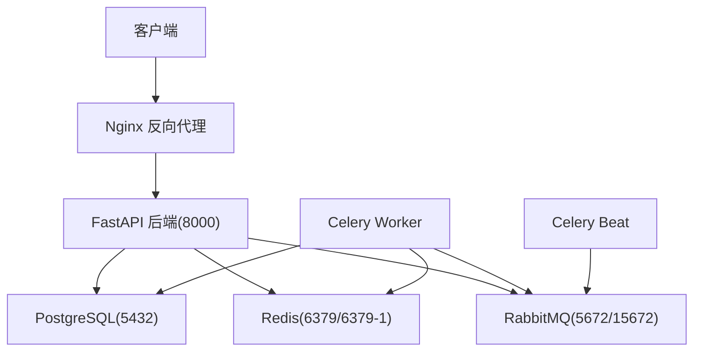
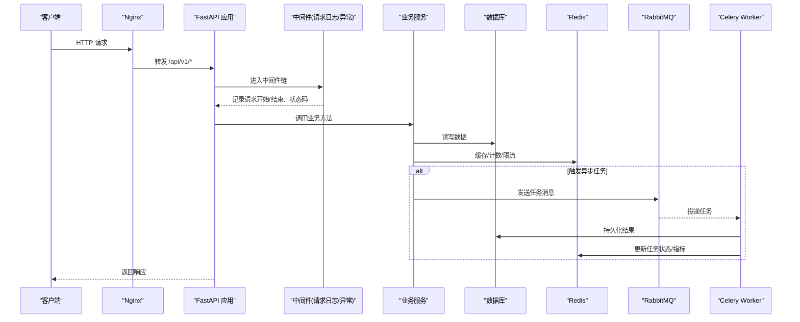
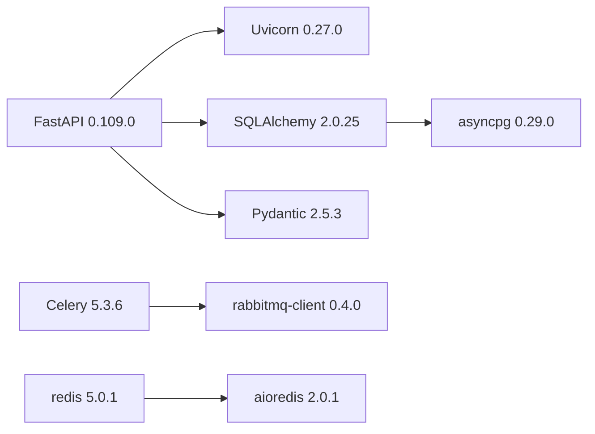
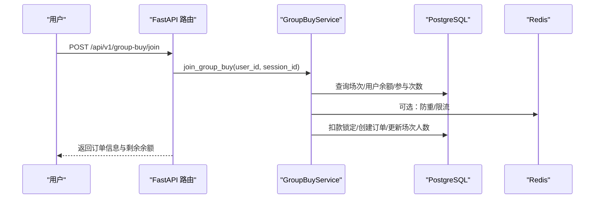
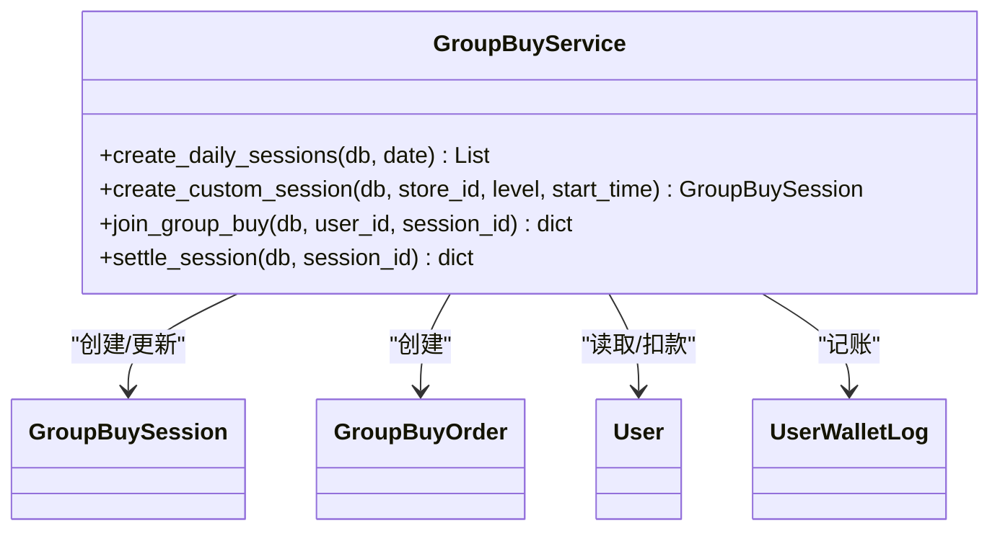

# 监控告警体系

<cite>
**本文引用的文件**   
- [backend/app/main.py](file://backend/app/main.py)
- [backend/app/config.py](file://backend/app/config.py)
- [backend/app/database.py](file://backend/app/database.py)
- [backend/app/tasks/celery_app.py](file://backend/app/tasks/celery_app.py)
- [backend/app/tasks/group_buy_tasks.py](file://backend/app/tasks/group_buy_tasks.py)
- [backend/app/services/group_buy_service.py](file://backend/app/services/group_buy_service.py)
- [docker-compose.yml](file://docker-compose.yml)
- [nginx.conf](file://nginx.conf)
- [backend/requirements.txt](file://backend/requirements.txt)
</cite>

## 目录
1. [引言](#引言)
2. [项目结构](#项目结构)
3. [核心组件](#核心组件)
4. [架构总览](#架构总览)
5. [详细组件分析](#详细组件分析)
6. [依赖分析](#依赖分析)
7. [性能考虑](#性能考虑)
8. [故障排查指南](#故障排查指南)
9. [结论](#结论)
10. [附录](#附录)

## 引言
本文件为 AIxingmu 项目的“监控与告警体系”完整方案，覆盖应用性能监控（API 响应时间、错误率、吞吐量）、数据库监控（慢查询、连接池、锁等待）、Redis 监控（内存、命中率、键空间统计）、Celery 任务监控（执行时间、失败重试、队列积压）、日志收集与分析（结构化日志、聚合、异常追踪），以及告警规则配置（阈值、通知渠道、升级策略）。方案基于现有代码与容器编排进行设计，确保可落地、可扩展。

## 项目结构
后端采用 FastAPI + SQLAlchemy(asyncpg) + Celery(RabbitMQ) + Redis 的异步架构；通过 Nginx 反向代理对外暴露 API；使用 docker-compose 编排服务。当前已具备健康检查端点、基础日志输出、中间件挂载位置、Celery Beat 调度等基础设施，便于接入统一监控与告警。

**图示来源**
- [docker-compose.yml:1-111](file://docker-compose.yml#L1-L111)
- [nginx.conf:1-39](file://nginx.conf#L1-L39)
- [backend/app/main.py:34-67](file://backend/app/main.py#L34-L67)
- [backend/app/database.py:10-21](file://backend/app/database.py#L10-L21)
- [backend/app/tasks/celery_app.py:9-21](file://backend/app/tasks/celery_app.py#L9-L21)

**章节来源**
- [backend/app/main.py:1-73](file://backend/app/main.py#L1-L73)
- [docker-compose.yml:1-111](file://docker-compose.yml#L1-L111)
- [nginx.conf:1-39](file://nginx.conf#L1-L39)

## 核心组件
- 应用入口与中间件：在应用启动时注册请求日志中间件、全局异常处理中间件、CORS 中间件，并暴露健康检查端点，便于探针与负载均衡探测。
- 数据库连接池：基于 asyncpg 创建异步引擎与会话工厂，提供依赖注入获取会话，支持事务提交/回滚与资源释放。
- Celery 任务系统：定义 Broker/Backend、序列化与时区，集中管理定时任务调度（Beat）与任务执行（Worker）。
- 业务服务层：拼团服务等核心逻辑涉及大量数据库读写与状态变更，是监控指标采集的关键落点。

**章节来源**
- [backend/app/main.py:43-72](file://backend/app/main.py#L43-L72)
- [backend/app/database.py:10-40](file://backend/app/database.py#L10-L40)
- [backend/app/tasks/celery_app.py:9-55](file://backend/app/tasks/celery_app.py#L9-L55)
- [backend/app/services/group_buy_service.py:17-200](file://backend/app/services/group_buy_service.py#L17-L200)

## 架构总览
下图展示从请求进入、到业务处理、再到异步任务执行的端到端链路，以及各组件的监控埋点建议位置。

**图示来源**
- [backend/app/main.py:43-67](file://backend/app/main.py#L43-L67)
- [backend/app/database.py:29-40](file://backend/app/database.py#L29-L40)
- [backend/app/tasks/celery_app.py:9-21](file://backend/app/tasks/celery_app.py#L9-L21)
- [docker-compose.yml:52-95](file://docker-compose.yml#L52-L95)

## 详细组件分析

### 应用性能监控（APM）
目标指标
- API 响应时间：P50/P90/P99、平均耗时
- 错误率：按路由/状态码维度统计
- 吞吐量：QPS、并发数、活跃连接
- 关键路径耗时：DB 查询、外部调用、缓存命中

采集与实现要点
- 在中间件层统一采集请求开始/结束时间、方法、路径、状态码、耗时，形成标准访问日志或时序指标。
- 对关键业务方法（如参团、结算）增加耗时打点，区分成功/失败分支。
- 将指标导出至 Prometheus/Grafana 或 APM 平台（如 SkyWalking、OpenTelemetry Collector）。

可视化与告警
- 仪表盘：接口耗时分布、错误率趋势、QPS 曲线、热点接口 TopN。
- 告警：P99 超过阈值、错误率突增、QPS 断崖式下跌。

**章节来源**
- [backend/app/main.py:43-72](file://backend/app/main.py#L43-L72)

### 数据库监控（PostgreSQL）
目标指标
- 慢查询：超过阈值的 SQL 执行时间与频率
- 连接池：活跃连接、空闲连接、溢出连接、等待队列
- 锁等待：锁冲突次数、最长等待时间、阻塞链
- 表/索引：扫描行数、命中率、膨胀率

采集与实现要点
- 开启 PostgreSQL 慢查询日志（statement_timeout/log_min_duration_statement），结合 pg_stat_statements 扩展统计高频慢语句。
- 监控连接池参数（pool_size/max_overflow）与实际连接数，避免耗尽。
- 使用 pg_locks/pg_stat_activity 检测锁等待与长事务。
- 通过 exporter（如 postgres_exporter）将指标暴露给 Prometheus。

可视化与告警
- 仪表盘：慢查询 TopSQL、连接池水位、锁等待热力图、IOPS/吞吐。
- 告警：慢查询数量激增、连接池接近上限、锁等待超时。

**章节来源**
- [backend/app/database.py:10-21](file://backend/app/database.py#L10-L21)
- [docker-compose.yml:4-20](file://docker-compose.yml#L4-L20)

### Redis 监控
目标指标
- 内存使用：used_memory、maxmemory、碎片率
- 命中率：keyspace_hits/keyspace_misses
- 键空间统计：db0/db1 键数量、过期键回收
- 网络与命令：ops/sec、延迟分布

采集与实现要点
- 启用 INFO 与 MONITOR（谨慎使用），通过 redis_exporter 暴露指标。
- 针对业务场景（如拼团场次计数、分布式锁）设置键前缀与过期策略，便于键空间统计与清理。
- 关注大键与热键，避免单键热点导致抖动。

可视化与告警
- 仪表盘：内存曲线、命中率趋势、键数量变化、命令延迟。
- 告警：内存超阈值、命中率骤降、键数量异常增长。

**章节来源**
- [backend/app/config.py:21-26](file://backend/app/config.py#L21-L26)
- [docker-compose.yml:21-28](file://docker-compose.yml#L21-L28)

### Celery 任务监控
目标指标
- 任务执行时间：P50/P90/P99、失败率
- 失败重试：重试次数、死信队列长度
- 队列积压：待处理任务数、消费者空闲比例
- 定时任务：调度成功率、最近一次执行时间

采集与实现要点
- 使用 Flower 或自定义指标上报（Prometheus client）采集任务状态、耗时、重试信息。
- 在任务前后打点，记录入队时间、开始时间、完成时间、异常类型。
- 对关键任务（每日开团、结算、分红）设置独立队列与优先级，避免相互影响。

可视化与告警
- 仪表盘：任务执行时长分布、失败率、队列深度、消费者负载。
- 告警：队列积压超过阈值、连续失败、长时间无消费。

**章节来源**
- [backend/app/tasks/celery_app.py:9-55](file://backend/app/tasks/celery_app.py#L9-L55)
- [backend/app/tasks/group_buy_tasks.py:17-54](file://backend/app/tasks/group_buy_tasks.py#L17-L54)
- [docker-compose.yml:72-95](file://docker-compose.yml#L72-L95)

### 日志收集与分析
目标
- 结构化日志：统一字段（trace_id、user_id、service、level、msg、latency_ms、status_code）
- 日志聚合：集中存储与检索（ELK/Loki）
- 异常追踪：跨进程/线程关联（Trace ID）

采集与实现要点
- 在应用入口配置日志格式，包含必要上下文；在中间件中注入 trace_id 并贯穿请求链路。
- 将 API 访问日志、业务日志、错误堆栈分别输出到不同通道，便于分类检索。
- 结合 Nginx 访问日志与上游 X-Forwarded-* 头，统一归集。

可视化与告警
- 仪表盘：错误日志占比、Top 异常、慢请求日志。
- 告警：错误日志突增、特定异常频繁出现。

**章节来源**
- [backend/app/main.py:15-20](file://backend/app/main.py#L15-L20)
- [nginx.conf:14-21](file://nginx.conf#L14-L21)

### 告警规则配置
原则
- 分层分级：应用层、中间件层、数据层分别制定阈值
- 多通道通知：企业微信/钉钉/邮件/短信，重要告警电话
- 升级策略：静默期→警告→严重→紧急，持续未恢复自动升级

示例规则（建议值，可按实际压测调整）
- API 响应时间：P99 > 1s 持续 5 分钟
- 错误率：HTTP 5xx 占比 > 1% 持续 5 分钟
- 吞吐量：QPS 下降 > 50% 对比基线
- 数据库：慢查询 > 100 条/分钟、连接池使用率 > 85%、锁等待 > 30 秒
- Redis：内存使用 > 80%、命中率 < 85%、键数量异常增长
- Celery：队列积压 > 1000、任务失败率 > 5%、消费者空闲 > 10 分钟

**章节来源**
- [backend/app/main.py:70-72](file://backend/app/main.py#L70-L72)
- [docker-compose.yml:15-19](file://docker-compose.yml#L15-L19)

## 依赖分析
运行时依赖与版本关系如下，确保监控组件与主应用兼容。

**图示来源**
- [backend/requirements.txt:1-34](file://backend/requirements.txt#L1-L34)

**章节来源**
- [backend/requirements.txt:1-34](file://backend/requirements.txt#L1-L34)

## 性能考虑
- 中间件开销：尽量轻量，避免在中间件中做重 IO；必要时异步化。
- 数据库：合理设置 pool_size/max_overflow，配合连接复用与批量操作；对热点查询建立合适索引。
- Redis：控制键大小与数量，避免大键；使用 pipeline 与脚本减少往返。
- Celery：按业务拆分队列，限制并发度，避免雪崩；对长耗时任务使用幂等设计。
- 日志：采样与轮转，避免磁盘写放大；生产环境关闭 DEBUG 模式下的 SQL 回显。

[本节为通用指导，不直接分析具体文件]

## 故障排查指南
常见问题与定位步骤
- API 高延迟：查看中间件记录的请求耗时与状态码，定位慢接口；进一步下钻到 DB 慢查询与 Redis 命中率。
- 数据库连接耗尽：检查连接池使用率与长事务；确认是否有未释放会话或未提交事务。
- Redis 内存飙升：检查键空间统计与大键；评估是否缺少过期策略或清理任务。
- Celery 任务堆积：观察队列深度与消费者状态；检查 Worker 日志与依赖服务可用性。
- 认证失败增多：核对 JWT 配置与密钥轮换；检查用户输入与密码校验流程。

**章节来源**
- [backend/app/database.py:29-40](file://backend/app/database.py#L29-L40)
- [backend/app/config.py:28-31](file://backend/app/config.py#L28-L31)
- [backend/app/tasks/celery_app.py:23-55](file://backend/app/tasks/celery_app.py#L23-L55)

## 结论
通过在中间件与业务关键路径统一埋点，结合数据库、Redis、Celery 的指标采集与集中日志，构建覆盖全链路的监控与告警体系。建议优先落地以下三件事：
- 接入 Prometheus/Grafana 或 APM 平台，补齐 API 与中间件指标
- 启用 PostgreSQL 慢查询与连接池监控，配置告警阈值
- 部署 Celery 任务监控（Flower 或自研指标），完善队列积压与失败告警

[本节为总结性内容，不直接分析具体文件]

## 附录

### 关键流程时序（以参团为例）

**图示来源**
- [backend/app/services/group_buy_service.py:92-181](file://backend/app/services/group_buy_service.py#L92-L181)

### 类关系概览（业务服务）

**图示来源**
- [backend/app/services/group_buy_service.py:17-200](file://backend/app/services/group_buy_service.py#L17-L200)