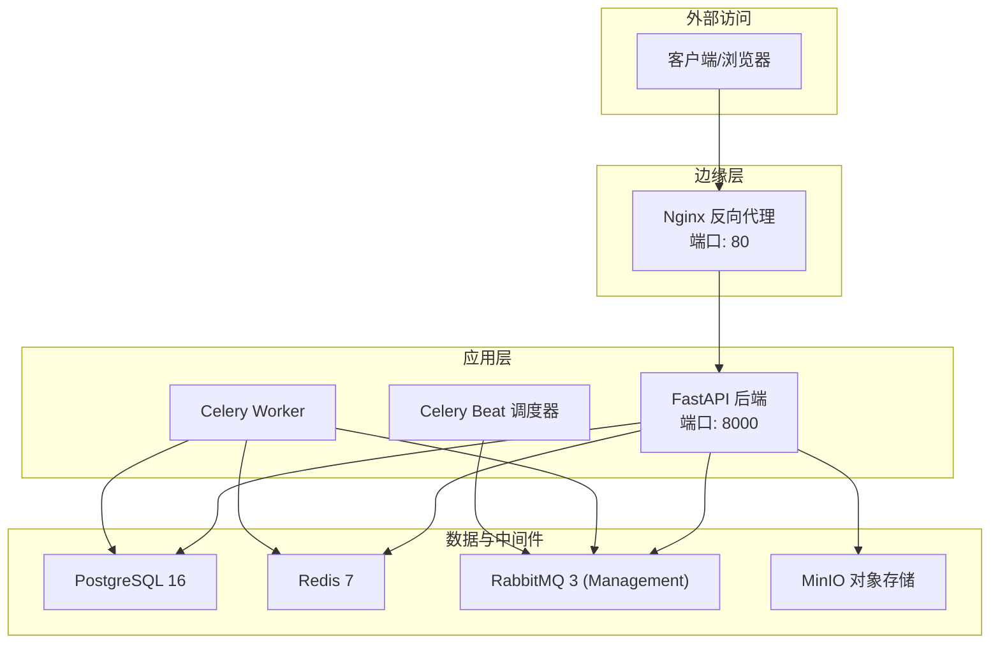
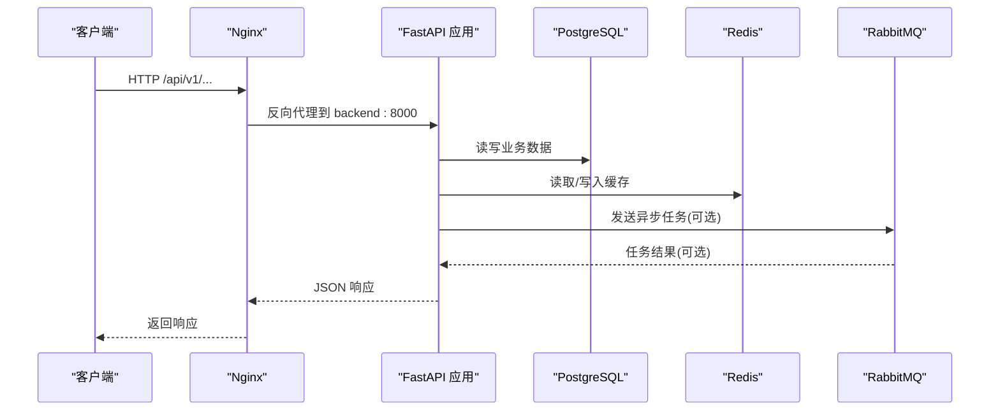
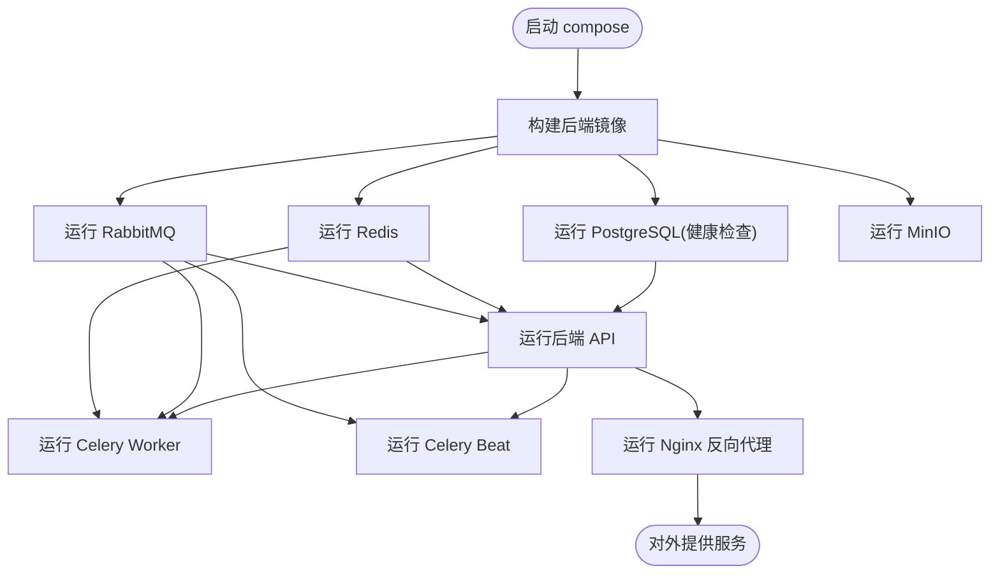
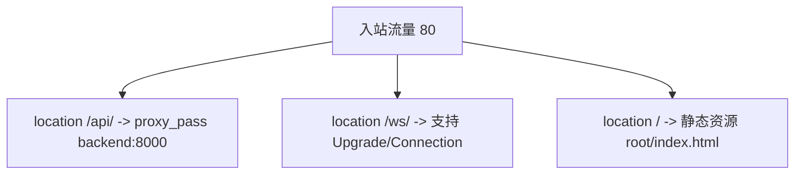
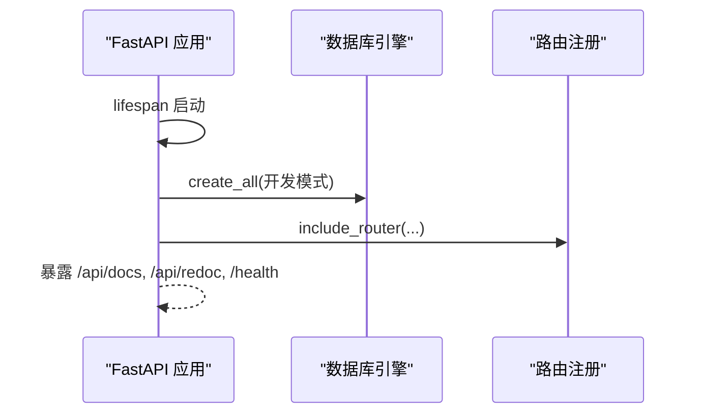
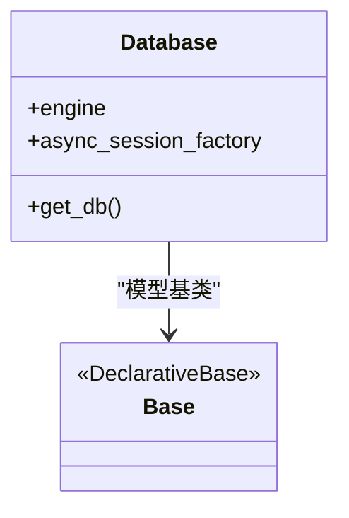
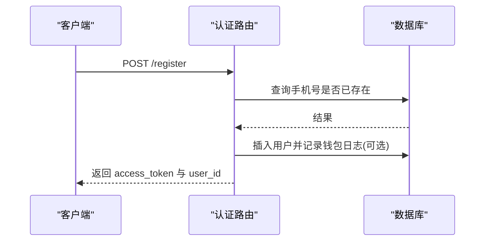
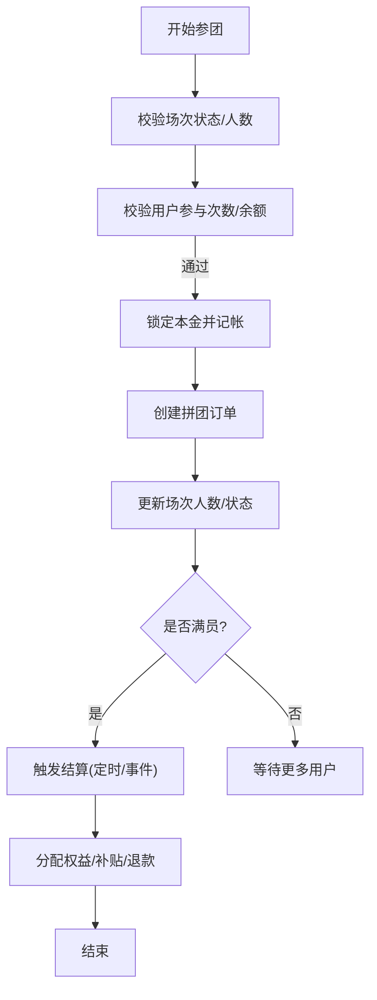
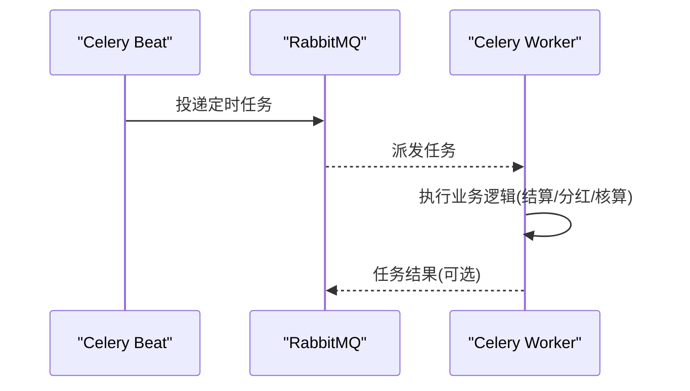
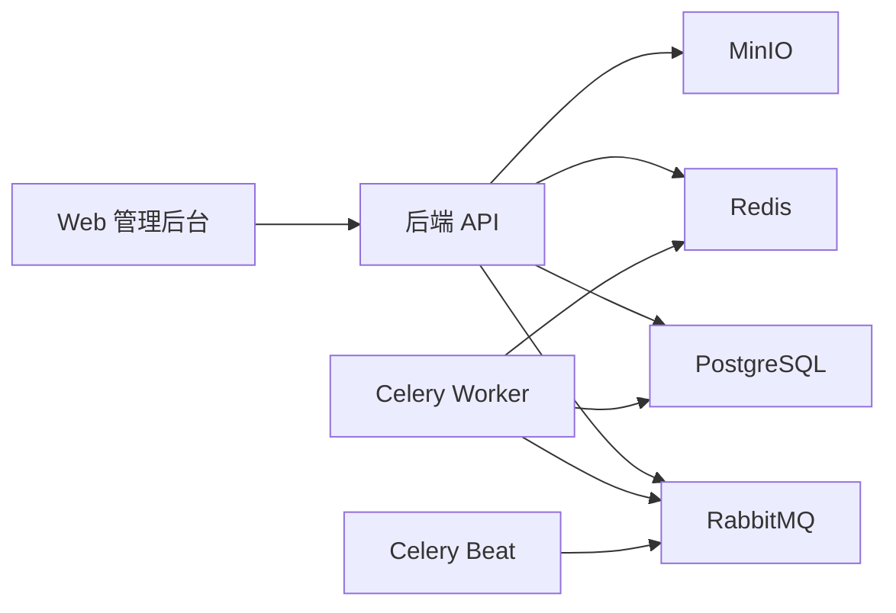

# 部署与运维

<cite>
**本文引用的文件**
- [docker-compose.yml](file://docker-compose.yml)
- [nginx.conf](file://nginx.conf)
- [backend/Dockerfile](file://backend/Dockerfile)
- [backend/requirements.txt](file://backend/requirements.txt)
- [backend/app/config.py](file://backend/app/config.py)
- [backend/app/main.py](file://backend/app/main.py)
- [backend/app/database.py](file://backend/app/database.py)
- [backend/app/tasks/celery_app.py](file://backend/app/tasks/celery_app.py)
- [backend/app/api/v1/auth.py](file://backend/app/api/v1/auth.py)
- [backend/app/services/group_buy_service.py](file://backend/app/services/group_buy_service.py)
- [frontend/web-admin/package.json](file://frontend/web-admin/package.json)
</cite>

## 目录
1. [简介](#简介)
2. [项目结构](#项目结构)
3. [核心组件](#核心组件)
4. [架构总览](#架构总览)
5. [详细组件分析](#详细组件分析)
6. [依赖关系分析](#依赖关系分析)
7. [性能优化策略](#性能优化策略)
8. [监控与告警体系](#监控与告警体系)
9. [故障排查指南](#故障排查指南)
10. [备份与灾难恢复](#备份与灾难恢复)
11. [CI/CD 流水线与发布流程](#cicd-流水线与发布流程)
12. [结论](#结论)

## 简介
本文件面向生产环境，提供 AIxingmu 项目的完整部署与运维方案。内容覆盖容器化编排、Nginx 反向代理、多服务管理、环境变量与密钥管理、性能调优（数据库连接池、Redis、静态资源 CDN）、监控告警、日志收集、故障排查、备份恢复与灾难恢复、以及 CI/CD 自动化测试与发布流程。文档基于仓库现有配置与代码进行说明，确保可落地执行。

## 项目结构
AIxingmu 采用前后端分离与微服务化思路：后端 FastAPI + SQLAlchemy Async + Celery/RabbitMQ + Redis；前端包含移动端与 Web 管理后台；基础设施通过 docker-compose 统一编排，Nginx 作为统一入口。

图表来源
- [docker-compose.yml:1-110](file://docker-compose.yml#L1-L110)
- [nginx.conf:1-39](file://nginx.conf#L1-L39)
- [backend/app/main.py:1-59](file://backend/app/main.py#L1-L59)

章节来源
- [docker-compose.yml:1-110](file://docker-compose.yml#L1-L110)
- [nginx.conf:1-39](file://nginx.conf#L1-L39)
- [backend/Dockerfile:1-13](file://backend/Dockerfile#L1-L13)
- [backend/requirements.txt:1-34](file://backend/requirements.txt#L1-L34)

## 核心组件
- 后端 API 服务：FastAPI 应用，暴露 RESTful 接口，集成 CORS、健康检查、路由注册。
- 数据库：PostgreSQL，使用 asyncpg 异步驱动，SQLAlchemy 异步引擎与会话工厂。
- 缓存与任务：Redis 用于缓存与结果后端；RabbitMQ 作为消息代理；Celery Worker 处理异步任务，Beat 负责定时任务。
- 对象存储：MinIO 提供图片/文件等静态资源存储。
- 反向代理：Nginx 将 /api/ 转发到后端，预留 WebSocket 与静态资源路径。
- 前端：Web 管理后台基于 Vite/Vue3 构建，移动端为 uni-app 工程。

章节来源
- [backend/app/main.py:1-59](file://backend/app/main.py#L1-L59)
- [backend/app/database.py:1-40](file://backend/app/database.py#L1-L40)
- [backend/app/tasks/celery_app.py:1-56](file://backend/app/tasks/celery_app.py#L1-L56)
- [frontend/web-admin/package.json:1-28](file://frontend/web-admin/package.json#L1-L28)

## 架构总览
下图展示请求从 Nginx 进入，经 FastAPI 路由分发至业务服务，再访问数据库、缓存与消息队列的端到端流程。

图表来源
- [nginx.conf:14-21](file://nginx.conf#L14-L21)
- [backend/app/main.py:44-53](file://backend/app/main.py#L44-L53)
- [backend/app/database.py:10-21](file://backend/app/database.py#L10-L21)
- [backend/app/tasks/celery_app.py:9-21](file://backend/app/tasks/celery_app.py#L9-L21)

## 详细组件分析

### 容器化与编排
- Dockerfile：基于 python:3.11-slim，安装依赖并启动 uvicorn，监听 8000 端口。
- docker-compose：定义 PostgreSQL、Redis、RabbitMQ、MinIO、后端、Worker、Beat、Nginx 等服务，设置环境变量、端口映射、卷持久化与健康检查。
- 依赖顺序：后端依赖数据库健康、Redis 与 RabbitMQ 启动完成；Worker/Beat 依赖后端与中间件。

图表来源
- [docker-compose.yml:1-110](file://docker-compose.yml#L1-L110)
- [backend/Dockerfile:1-13](file://backend/Dockerfile#L1-L13)

章节来源
- [backend/Dockerfile:1-13](file://backend/Dockerfile#L1-L13)
- [docker-compose.yml:1-110](file://docker-compose.yml#L1-L110)

### Nginx 反向代理
- 将 /api/ 请求转发到后端 upstream backend:8000，并透传 Host、X-Real-IP、X-Forwarded-For、X-Forwarded-Proto。
- 预留 /ws/ 支持 WebSocket 升级。
- 预留 / 静态资源根目录，便于后续接入前端构建产物或 CDN。

图表来源
- [nginx.conf:1-39](file://nginx.conf#L1-L39)

章节来源
- [nginx.conf:1-39](file://nginx.conf#L1-L39)

### 应用生命周期与路由
- 应用启动时创建数据库表（开发阶段），关闭时释放引擎资源。
- 注册多个 v1 路由模块，包括认证、用户、商品、拼团、贡献值、积分、消费券、门店、管理后台。
- 提供 /health 健康检查接口。

图表来源
- [backend/app/main.py:14-59](file://backend/app/main.py#L14-L59)

章节来源
- [backend/app/main.py:1-59](file://backend/app/main.py#L1-L59)

### 数据库连接与会话管理
- 使用 asyncpg 异步引擎，按配置初始化 pool_size 与 max_overflow。
- 提供 get_db 依赖注入，自动提交/回滚与关闭会话。

图表来源
- [backend/app/database.py:1-40](file://backend/app/database.py#L1-L40)

章节来源
- [backend/app/database.py:1-40](file://backend/app/database.py#L1-L40)

### 认证与鉴权
- 提供注册与登录接口，校验手机号唯一性，密码哈希与验证，签发 JWT。
- 依赖数据库会话与工具函数。

图表来源
- [backend/app/api/v1/auth.py:14-43](file://backend/app/api/v1/auth.py#L14-L43)

章节来源
- [backend/app/api/v1/auth.py:1-43](file://backend/app/api/v1/auth.py#L1-L43)

### 拼团核心业务流程
- 每日固定场次创建、自定义开团、参团校验（人数上限、单组参与次数、余额充足）、本金锁定、订单创建、满员判定与结算。
- 结算逻辑：随机抽取 1 人拼中，发放商品权益、贡献值、积分；失败者退回本金并发放广告补贴与推荐人补贴。

图表来源
- [backend/app/services/group_buy_service.py:28-348](file://backend/app/services/group_buy_service.py#L28-L348)

章节来源
- [backend/app/services/group_buy_service.py:1-348](file://backend/app/services/group_buy_service.py#L1-L348)

### 定时任务与调度
- Celery Beat 配置了多项定时任务：每日创建场次、每小时检查结算、过期场次清理、每周贡献值分红、每日贡献值递减核算、每月门店排名与分红。
- Worker 消费任务，Beat 负责调度。

图表来源
- [backend/app/tasks/celery_app.py:23-55](file://backend/app/tasks/celery_app.py#L23-L55)

章节来源
- [backend/app/tasks/celery_app.py:1-56](file://backend/app/tasks/celery_app.py#L1-L56)

## 依赖关系分析
- 后端依赖：PostgreSQL、Redis、RabbitMQ、MinIO。
- 任务系统：Worker 依赖 MQ 与 Redis；Beat 依赖 MQ。
- 前端：Web 管理后台依赖 Node 生态（Vite、Vue3、Element Plus、ECharts）。

图表来源
- [docker-compose.yml:1-110](file://docker-compose.yml#L1-L110)
- [frontend/web-admin/package.json:1-28](file://frontend/web-admin/package.json#L1-L28)

章节来源
- [docker-compose.yml:1-110](file://docker-compose.yml#L1-L110)
- [backend/requirements.txt:1-34](file://backend/requirements.txt#L1-L34)
- [frontend/web-admin/package.json:1-28](file://frontend/web-admin/package.json#L1-L28)

## 性能优化策略
- 数据库连接池调优
  - 依据负载调整 DATABASE_POOL_SIZE 与 DATABASE_MAX_OVERFLOW，避免连接耗尽或过度占用。
  - 参考位置：[backend/app/config.py:17-19](file://backend/app/config.py#L17-L19)、[backend/app/database.py:10-15](file://backend/app/database.py#L10-L15)。
- Redis 缓存配置
  - 合理划分 DB 索引（如 0 用于通用缓存，1 用于 Celery 结果），在压测场景下考虑持久化开关与内存淘汰策略。
  - 参考位置：[backend/app/config.py:22](file://backend/app/config.py#L22)、[docker-compose.yml:58-61](file://docker-compose.yml#L58-L61)。
- 静态资源 CDN 加速
  - 将前端构建产物与图片等资源托管至 CDN，Nginx 仅做反向代理与缓存控制。
  - 参考位置：[nginx.conf:31-36](file://nginx.conf#L31-L36)、[frontend/web-admin/package.json:6-10](file://frontend/web-admin/package.json#L6-L10)。
- 异步与任务分流
  - 将耗时操作（结算、分红、通知）下沉至 Celery Worker，提升 API 响应时间。
  - 参考位置：[backend/app/tasks/celery_app.py:23-55](file://backend/app/tasks/celery_app.py#L23-L55)。

章节来源
- [backend/app/config.py:17-26](file://backend/app/config.py#L17-L26)
- [backend/app/database.py:10-15](file://backend/app/database.py#L10-L15)
- [docker-compose.yml:58-61](file://docker-compose.yml#L58-L61)
- [nginx.conf:31-36](file://nginx.conf#L31-L36)
- [frontend/web-admin/package.json:6-10](file://frontend/web-admin/package.json#L6-L10)
- [backend/app/tasks/celery_app.py:23-55](file://backend/app/tasks/celery_app.py#L23-L55)

## 监控与告警体系
- 应用健康检查
  - 提供 /health 接口，供负载均衡与健康探针使用。
  - 参考位置：[backend/app/main.py:56-59](file://backend/app/main.py#L56-L59)。
- 指标采集建议
  - 在后端增加 Prometheus 指标导出（如请求延迟、错误率、数据库连接池使用率、任务队列长度）。
  - 在 Nginx 启用访问日志与状态页，结合日志采集器统一汇聚。
- 日志收集
  - 容器标准输出日志由编排平台收集；建议结构化日志格式，包含 trace_id、user_id、session_id 等上下文。
- 告警规则建议
  - 服务不可用、错误率突增、数据库连接池耗尽、任务积压、关键定时任务失败等阈值告警。

章节来源
- [backend/app/main.py:56-59](file://backend/app/main.py#L56-L59)

## 故障排查指南
- 服务无法启动
  - 检查环境变量是否正确注入（数据库、Redis、RabbitMQ、MinIO）。
  - 参考位置：[docker-compose.yml:57-61](file://docker-compose.yml#L57-L61)、[backend/app/config.py:17-41](file://backend/app/config.py#L17-L41)。
- 数据库连接失败
  - 确认 PostgreSQL 健康检查通过，网络可达，账号权限正确。
  - 参考位置：[docker-compose.yml:15-19](file://docker-compose.yml#L15-L19)、[backend/app/database.py:10-15](file://backend/app/database.py#L10-L15)。
- 任务未执行
  - 检查 Celery Worker/Beat 日志，确认 Broker 与 Backend 连通性。
  - 参考位置：[docker-compose.yml:72-95](file://docker-compose.yml#L72-L95)、[backend/app/tasks/celery_app.py:9-21](file://backend/app/tasks/celery_app.py#L9-L21)。
- 认证失败
  - 核对 SECRET_KEY 与算法配置，确认密码哈希与验证流程。
  - 参考位置：[backend/app/config.py:29-31](file://backend/app/config.py#L29-L31)、[backend/app/api/v1/auth.py:14-43](file://backend/app/api/v1/auth.py#L14-L43)。
- 静态资源 404
  - 检查 Nginx 静态资源路径与 try_files 配置。
  - 参考位置：[nginx.conf:31-36](file://nginx.conf#L31-L36)。

章节来源
- [docker-compose.yml:15-19](file://docker-compose.yml#L15-L19)
- [docker-compose.yml:57-61](file://docker-compose.yml#L57-L61)
- [docker-compose.yml:72-95](file://docker-compose.yml#L72-L95)
- [backend/app/config.py:29-31](file://backend/app/config.py#L29-L31)
- [backend/app/config.py:17-41](file://backend/app/config.py#L17-L41)
- [backend/app/database.py:10-15](file://backend/app/database.py#L10-L15)
- [backend/app/api/v1/auth.py:14-43](file://backend/app/api/v1/auth.py#L14-L43)
- [nginx.conf:31-36](file://nginx.conf#L31-L36)

## 备份与灾难恢复
- 数据持久化
  - PostgreSQL、Redis、MinIO 均通过卷持久化数据，防止容器重建丢失。
  - 参考位置：[docker-compose.yml:13-14](file://docker-compose.yml#L13-L14)、[docker-compose.yml:26-27](file://docker-compose.yml#L26-L27)、[docker-compose.yml:48-49](file://docker-compose.yml#L48-L49)。
- 备份策略
  - 定期导出 PostgreSQL 快照与增量 WAL；对 Redis 开启 AOF 或定期 RDB 快照；对 MinIO 对象桶进行跨地域复制。
- 恢复流程
  - 先恢复数据库与对象存储，再启动应用服务；校验健康检查与关键任务是否正常。
- 演练与验证
  - 定期进行恢复演练，验证 RTO/RPO 目标达成。

章节来源
- [docker-compose.yml:13-14](file://docker-compose.yml#L13-L14)
- [docker-compose.yml:26-27](file://docker-compose.yml#L26-L27)
- [docker-compose.yml:48-49](file://docker-compose.yml#L48-L49)

## CI/CD 流水线与发布流程
- 构建与测试
  - 后端：安装依赖、运行单元测试与集成测试、生成覆盖率报告。
  - 前端：安装依赖、类型检查、构建产物。
  - 参考位置：[backend/requirements.txt:1-34](file://backend/requirements.txt#L1-L34)、[frontend/web-admin/package.json:6-10](file://frontend/web-admin/package.json#L6-L10)。
- 镜像构建与推送
  - 使用 Dockerfile 构建后端镜像，推送至镜像仓库。
  - 参考位置：[backend/Dockerfile:1-13](file://backend/Dockerfile#L1-L13)。
- 部署与滚动更新
  - 通过 docker-compose 或编排平台拉取最新镜像，逐步替换旧实例，确保零停机。
  - 参考位置：[docker-compose.yml:52-70](file://docker-compose.yml#L52-L70)。
- 灰度与回滚
  - 引入蓝绿或金丝雀发布策略，快速回滚至上一稳定版本。
- 安全扫描
  - 对镜像与依赖进行漏洞扫描，阻断高危风险。

章节来源
- [backend/Dockerfile:1-13](file://backend/Dockerfile#L1-L13)
- [backend/requirements.txt:1-34](file://backend/requirements.txt#L1-L34)
- [frontend/web-admin/package.json:6-10](file://frontend/web-admin/package.json#L6-L10)
- [docker-compose.yml:52-70](file://docker-compose.yml#L52-L70)

## 结论
本方案以容器化为基石，结合 Nginx 反向代理与 Celery 异步任务，构建了可扩展、可观测、易维护的生产环境。通过完善的环境变量与密钥管理、性能调优、监控告警、备份恢复与 CI/CD 自动化，保障系统在高峰期的稳定性与可靠性。建议在上线前完成容量规划、压测与演练，持续迭代优化。