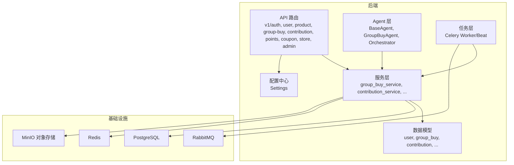
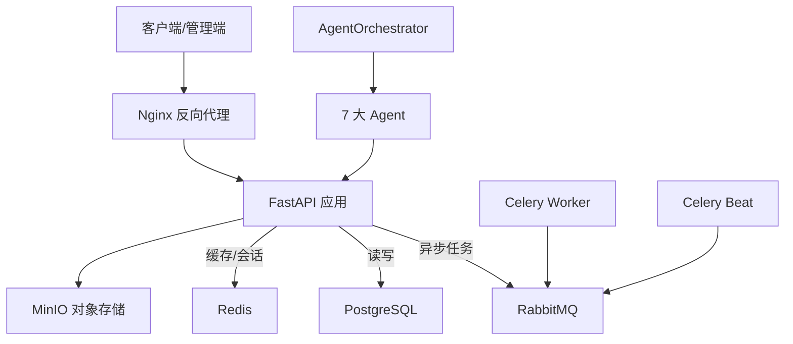
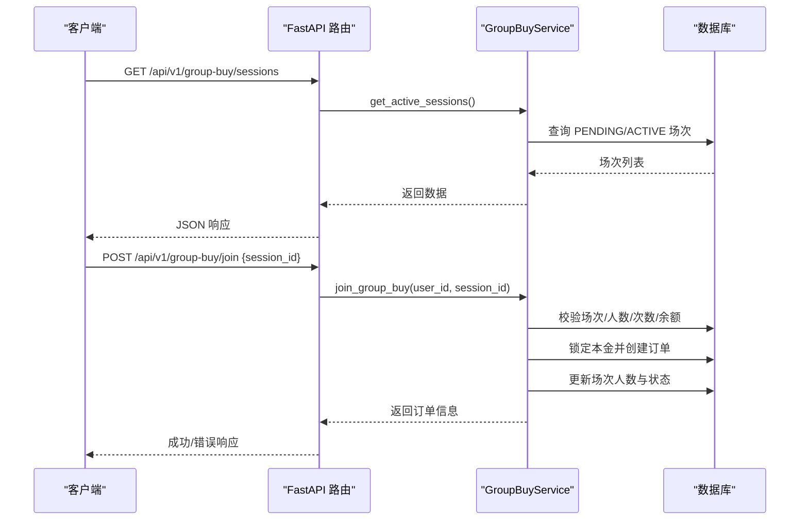
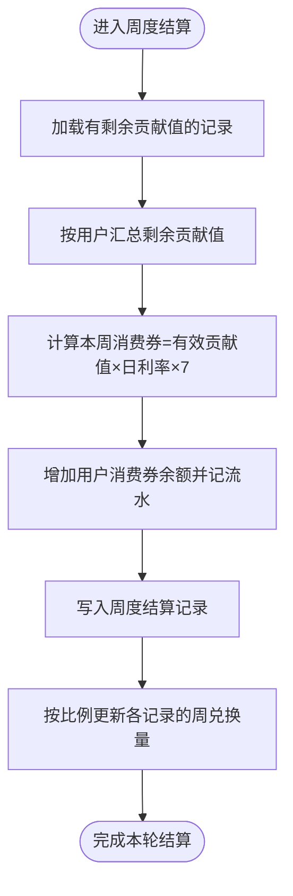
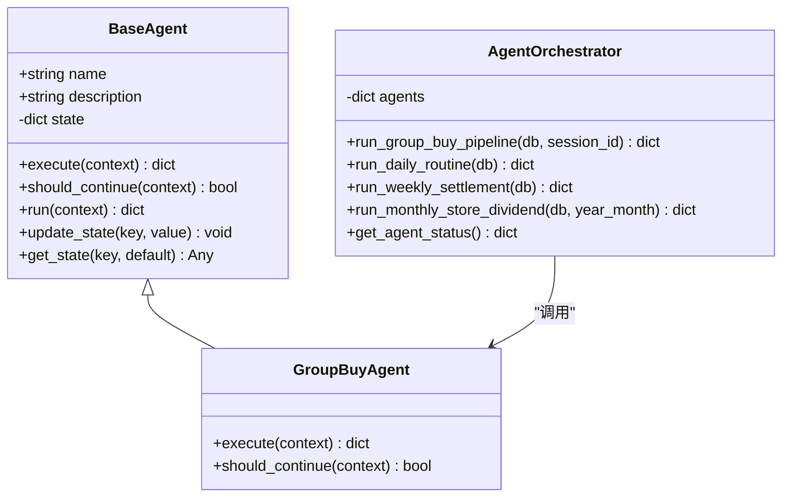
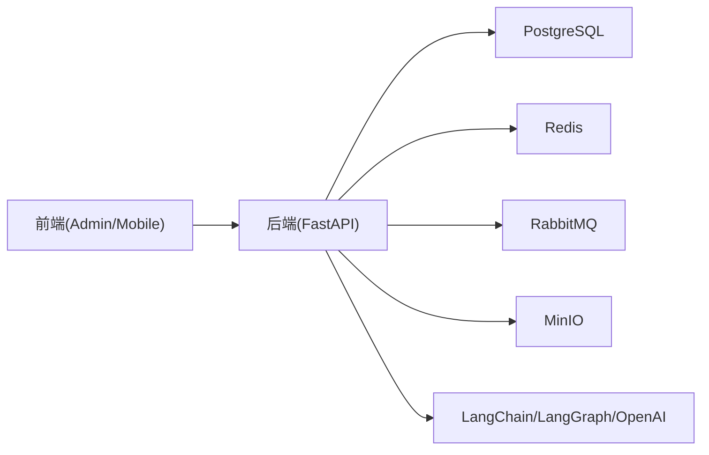

# 项目概述

<cite>
**本文引用的文件**   
- [backend/app/main.py](file://backend/app/main.py)
- [backend/app/config.py](file://backend/app/config.py)
- [backend/requirements.txt](file://backend/requirements.txt)
- [docker-compose.yml](file://docker-compose.yml)
- [backend/app/agents/base_agent.py](file://backend/app/agents/base_agent.py)
- [backend/app/agents/agent_orchestrator.py](file://backend/app/agents/agent_orchestrator.py)
- [backend/app/agents/group_buy_agent.py](file://backend/app/agents/group_buy_agent.py)
- [backend/app/models/user.py](file://backend/app/models/user.py)
- [backend/app/models/group_buy.py](file://backend/app/models/group_buy.py)
- [backend/app/services/group_buy_service.py](file://backend/app/services/group_buy_service.py)
- [backend/app/api/v1/group_buy.py](file://backend/app/api/v1/group_buy.py)
- [backend/app/services/contribution_service.py](file://backend/app/services/contribution_service.py)
- [backend/app/models/contribution.py](file://backend/app/models/contribution.py)
- [frontend/web-admin/package.json](file://frontend/web-admin/package.json)
- [frontend/web-admin/src/views/Dashboard.vue](file://frontend/web-admin/src/views/Dashboard.vue)
</cite>

## 目录
1. [简介](#简介)
2. [项目结构](#项目结构)
3. [核心组件](#核心组件)
4. [架构总览](#架构总览)
5. [详细组件分析](#详细组件分析)
6. [依赖关系分析](#依赖关系分析)
7. [性能与扩展性](#性能与扩展性)
8. [故障排查指南](#故障排查指南)
9. [结论](#结论)
10. [附录：快速开始](#附录快速开始)

## 简介
AIxingmu 是一个基于 AI Agent 的“共享商城 + 拼团生态平台”。项目以 FastAPI 异步框架为核心，结合 LangGraph 智能体编排，构建由 7 大专业 Agent 协作的业务流水线；配套四级代理分销体系与贡献值经济模型，形成“线上零售 + 线下门店 + 拼团”的全链路商业闭环。系统提供用户认证、拼团电商、贡献值管理、门店分销、积分系统等核心能力，并通过 Celery 任务调度与 Redis/RabbitMQ 中间件实现高并发与可观测性。

核心价值与创新点
- 7 大专业 Agent 协作：风控、结算、权益、分红、用户运营、团队、拼团调度等分工明确、可插拔编排。
- 四级代理分销：省/市/区县/门店分层分润，配合推荐机制放大网络效应。
- 贡献值经济模型：全网统一公式，按角色分配让利，周度递减兑换消费券，兼顾激励与通缩平衡。
- 技术选型优势：FastAPI 高性能异步、LangGraph 状态机驱动的智能体编排、Vue3 前端工程化与可视化。

## 项目结构
后端采用分层架构：API 层 → 服务层 → 数据模型层；Agent 层作为跨域业务编排器；任务层通过 Celery 执行定时与异步任务；配置集中管理，容器化部署。

图表来源
- [backend/app/main.py:1-59](file://backend/app/main.py#L1-L59)
- [backend/app/config.py:1-136](file://backend/app/config.py#L1-L136)
- [docker-compose.yml:1-111](file://docker-compose.yml#L1-L111)

章节来源
- [backend/app/main.py:1-59](file://backend/app/main.py#L1-L59)
- [backend/app/config.py:1-136](file://backend/app/config.py#L1-L136)
- [docker-compose.yml:1-111](file://docker-compose.yml#L1-L111)

## 核心组件
- 应用入口与生命周期：初始化 FastAPI、注册路由、CORS、健康检查、数据库表创建（开发期）。
- 全局配置：数据库、缓存、消息队列、JWT、对象存储、拼团规则、贡献值比例、积分总量等。
- 数据模型：用户与钱包流水、拼团场次与订单、贡献值记录与周度结算、统计聚合。
- 服务层：拼团全流程（开团、参团、满员判定、结果结算、权益发放）、贡献值核算与周度兑换。
- Agent 编排：基类抽象、拼团调度 Agent、编排器串联风控→结算→权益→通知等流程。
- 前端管理：Vue3 + Element Plus 仪表盘，展示实时场次与 Agent 运行状态。

章节来源
- [backend/app/main.py:1-59](file://backend/app/main.py#L1-L59)
- [backend/app/config.py:1-136](file://backend/app/config.py#L1-L136)
- [backend/app/models/user.py:1-93](file://backend/app/models/user.py#L1-L93)
- [backend/app/models/group_buy.py:1-158](file://backend/app/models/group_buy.py#L1-L158)
- [backend/app/models/contribution.py:1-115](file://backend/app/models/contribution.py#L1-L115)
- [backend/app/services/group_buy_service.py:1-348](file://backend/app/services/group_buy_service.py#L1-L348)
- [backend/app/services/contribution_service.py:1-261](file://backend/app/services/contribution_service.py#L1-L261)
- [backend/app/agents/base_agent.py:1-47](file://backend/app/agents/base_agent.py#L1-L47)
- [backend/app/agents/agent_orchestrator.py:1-94](file://backend/app/agents/agent_orchestrator.py#L1-L94)
- [backend/app/agents/group_buy_agent.py:1-67](file://backend/app/agents/group_buy_agent.py#L1-L67)
- [frontend/web-admin/src/views/Dashboard.vue:1-109](file://frontend/web-admin/src/views/Dashboard.vue#L1-L109)

## 架构总览
系统采用“API + 服务 + 模型 + Agent + 任务”的分层设计，结合容器化编排一键拉起数据库、缓存、消息队列与对象存储，前后端分离，管理端与移动端并行演进。

图表来源
- [docker-compose.yml:1-111](file://docker-compose.yml#L1-L111)
- [backend/app/main.py:1-59](file://backend/app/main.py#L1-L59)
- [backend/app/agents/agent_orchestrator.py:1-94](file://backend/app/agents/agent_orchestrator.py#L1-L94)

## 详细组件分析

### 应用入口与路由注册
- 使用 lifespan 钩子在启动时创建数据库表（开发阶段），关闭时释放引擎连接。
- 统一前缀 /api/v1，按模块注册认证、用户、商品、拼团、贡献值、积分、券、门店、管理等路由。
- 提供 /health 健康检查接口，便于容器编排与健康探测。

章节来源
- [backend/app/main.py:1-59](file://backend/app/main.py#L1-L59)

### 全局配置与业务参数
- 集中管理数据库、Redis、RabbitMQ、MinIO、JWT、CORS 等环境参数。
- 定义拼团固定参数（价格、倍数、人数、时段、单组上限）与贡献值分配比例、积分总量、门店阶梯分红等关键业务常量。
- 支持 .env 环境变量覆盖，便于多环境部署。

章节来源
- [backend/app/config.py:1-136](file://backend/app/config.py#L1-L136)

### 数据模型与领域实体
- 用户与钱包流水：支持消费者、推荐人、门店、各级代理与管理者角色；余额、贡献值、积分、消费券四大资产及变动流水。
- 拼团领域：场次（级别、人数、时间窗、状态）、订单（金额、状态、权益与补贴明细）、每日统计。
- 贡献值领域：来源场景、归属角色、计算明细、周度结算与全网统计。

章节来源
- [backend/app/models/user.py:1-93](file://backend/app/models/user.py#L1-L93)
- [backend/app/models/group_buy.py:1-158](file://backend/app/models/group_buy.py#L1-L158)
- [backend/app/models/contribution.py:1-115](file://backend/app/models/contribution.py#L1-L115)

### 拼团服务与业务流程
- 开团：按小时批量创建初级/高级/SVIP 三档场次，或门店自定义开团。
- 参团：校验场次状态与人数上限、用户参与次数限制与余额锁定，生成订单并更新场次人数。
- 结算：满员后随机抽取 1 名拼中，其余 30 名失败；为拼中用户发放商品权益、贡献值与积分；为失败用户退回本金并发放广告补贴与推荐人补贴。
- 查询：提供活跃场次列表、用户订单分页与场次详情。

图表来源
- [backend/app/api/v1/group_buy.py:1-65](file://backend/app/api/v1/group_buy.py#L1-L65)
- [backend/app/services/group_buy_service.py:1-348](file://backend/app/services/group_buy_service.py#L1-L348)

章节来源
- [backend/app/api/v1/group_buy.py:1-65](file://backend/app/api/v1/group_buy.py#L1-L65)
- [backend/app/services/group_buy_service.py:1-348](file://backend/app/services/group_buy_service.py#L1-L348)

### 贡献值核算与周度兑换
- 统一公式：贡献值 = 让利金额 × 分配比例 × 乘数；让利金额 = 消费金额 × 整体让利比例。
- 六大角色分配：消费者、合作商家、推荐商家、推荐消费者、代理（省/市/区县合计）、平台。
- 周度结算：每周一按有效贡献值 × 日利率 × 7 兑换消费券，剩余贡献值继续参与下期。

图表来源
- [backend/app/services/contribution_service.py:1-261](file://backend/app/services/contribution_service.py#L1-L261)
- [backend/app/models/contribution.py:1-115](file://backend/app/models/contribution.py#L1-L115)

章节来源
- [backend/app/services/contribution_service.py:1-261](file://backend/app/services/contribution_service.py#L1-L261)
- [backend/app/models/contribution.py:1-115](file://backend/app/models/contribution.py#L1-L115)

### AI Agent 系统与编排
- 基类抽象：统一的 execute/should_continue/run 接口与日志、状态管理。
- 拼团调度 Agent：负责创建场次、检查过期、满员结算等动作。
- 编排器：串联风控→结算→权益→通知等步骤，并提供每日例行、每周结算、月度门店分红等流水线。

图表来源
- [backend/app/agents/base_agent.py:1-47](file://backend/app/agents/base_agent.py#L1-L47)
- [backend/app/agents/group_buy_agent.py:1-67](file://backend/app/agents/group_buy_agent.py#L1-L67)
- [backend/app/agents/agent_orchestrator.py:1-94](file://backend/app/agents/agent_orchestrator.py#L1-L94)

章节来源
- [backend/app/agents/base_agent.py:1-47](file://backend/app/agents/base_agent.py#L1-L47)
- [backend/app/agents/group_buy_agent.py:1-67](file://backend/app/agents/group_buy_agent.py#L1-L67)
- [backend/app/agents/agent_orchestrator.py:1-94](file://backend/app/agents/agent_orchestrator.py#L1-L94)

### 前端管理端概览
- 技术栈：Vue3 + Vue Router + Pinia + Element Plus + ECharts。
- 仪表盘：展示今日场次、交易金额、全网贡献值、积分池剩余，以及场次实时状态与 Agent 运行状态。

章节来源
- [frontend/web-admin/package.json:1-28](file://frontend/web-admin/package.json#L1-L28)
- [frontend/web-admin/src/views/Dashboard.vue:1-109](file://frontend/web-admin/src/views/Dashboard.vue#L1-L109)

## 依赖关系分析
- 后端依赖：FastAPI、SQLAlchemy(async)、asyncpg、Alembic、Pydantic v2、Celery、RabbitMQ、Redis、MinIO、LangChain/LangGraph、OpenAI SDK、HTTPX、python-dotenv。
- 前端依赖：Vue3、TypeScript、Vite、Element Plus、ECharts。
- 容器编排：PostgreSQL、Redis、RabbitMQ、MinIO、Nginx、后端镜像、Celery Worker/Beat。

图表来源
- [backend/requirements.txt:1-34](file://backend/requirements.txt#L1-L34)
- [frontend/web-admin/package.json:1-28](file://frontend/web-admin/package.json#L1-L28)
- [docker-compose.yml:1-111](file://docker-compose.yml#L1-L111)

章节来源
- [backend/requirements.txt:1-34](file://backend/requirements.txt#L1-L34)
- [frontend/web-admin/package.json:1-28](file://frontend/web-admin/package.json#L1-L28)
- [docker-compose.yml:1-111](file://docker-compose.yml#L1-L111)

## 性能与扩展性
- 异步 I/O：FastAPI + asyncpg 提升并发处理能力，适合高吞吐的拼团与结算场景。
- 任务解耦：Celery + RabbitMQ 将耗时操作（如周度结算、通知）异步化，避免阻塞请求。
- 缓存与限流：Redis 可用于热点数据缓存与会话管理，降低数据库压力。
- 水平扩展：无状态 API 服务可横向扩容；Worker/Beat 独立扩缩容；对象存储与数据库通过容器卷持久化。
- 可观测性：统一日志与 Agent 状态输出，便于监控与排障。

[本节为通用指导，不直接分析具体文件]

## 故障排查指南
- 健康检查：访问 /api/health 确认服务可用。
- 数据库连通：检查 DATABASE_URL、端口映射与容器健康状态。
- 缓存与队列：确认 Redis、RabbitMQ 服务已启动且凭据一致。
- 对象存储：验证 MinIO 端点、密钥与桶名称配置正确。
- 任务执行：查看 Celery Worker/Beat 日志，确认任务入队与执行是否异常。
- 权限与鉴权：核对 JWT 密钥、过期时间与 CORS 白名单。

章节来源
- [backend/app/main.py:1-59](file://backend/app/main.py#L1-L59)
- [backend/app/config.py:1-136](file://backend/app/config.py#L1-L136)
- [docker-compose.yml:1-111](file://docker-compose.yml#L1-L111)

## 结论
AIxingmu 以“AI Agent 编排 + 异步高并发 + 清晰业务分层”为核心，构建了可扩展、可观测、可运营的共享商城与拼团生态。通过贡献值经济模型与四级代理分销，平台在激励用户与商户的同时，保持资金与权益流转的可控性与透明度。建议在生产环境完善 Alembic 迁移、引入限流熔断与审计日志，并持续优化 Agent 决策策略与风控规则。

[本节为总结性内容，不直接分析具体文件]

## 附录：快速开始
- 环境准备
  - 安装 Docker 与 docker-compose。
  - 克隆仓库到本地目录 。
- 启动基础设施与服务
  - 在项目根目录执行：docker-compose up -d
  - 等待 PostgreSQL、Redis、RabbitMQ、MinIO 就绪。
- 后端运行
  - 进入 backend 目录，安装依赖：pip install -r requirements.txt
  - 设置环境变量（参考 config.py 默认值），或直接使用 docker-compose 提供的配置。
  - 启动服务：uvicorn app.main:app --reload --host 0.0.0.0 --port 8000
  - 访问文档：http://localhost:8000/api/docs
- 前端管理端
  - 进入 frontend/web-admin，安装依赖：npm install
  - 启动开发服务器：npm run dev
  - 打开浏览器访问 Vite 默认地址，登录后可查看仪表盘与业务页面。
- 常用命令
  - 停止所有服务：docker-compose down
  - 重建并启动：docker-compose up --build -d
  - 查看日志：docker-compose logs -f backend/celery-worker/celery-beat/nginx

章节来源
- [docker-compose.yml:1-111](file://docker-compose.yml#L1-L111)
- [backend/requirements.txt:1-34](file://backend/requirements.txt#L1-L34)
- [backend/app/config.py:1-136](file://backend/app/config.py#L1-L136)
- [frontend/web-admin/package.json:1-28](file://frontend/web-admin/package.json#L1-L28)